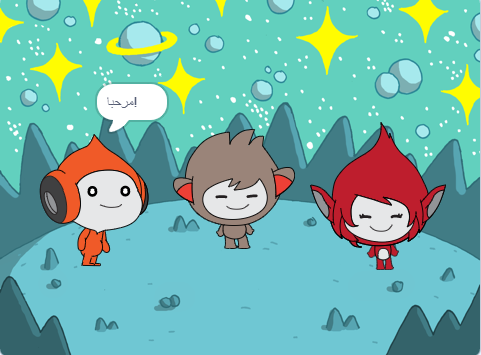

## المقدمة

في هذا المشروع ، ستنشئ مشهدًا فضائيًا بشخصيات "معبرة" لمشاركة أفكارهم أو مشاعرهم.

**التعابير** هي طريقة لإظهار شخصية الشخصية في اللعبة. يمكنهم استخدام الكلام، الأصوات، الحركة والمؤثرات الرسومية ، تمامًا كما هو الحال في Scratch. هل تلعب أي ألعاب تستخدم التعابير؟

في Scratch ، تسمى الشخصيات والكائنات **بالكائنات**، وتظهر في **المنصة**.

سوف تقوم بمايلي:
+ اضافة كائنات و**خلفية** لإعداد مشروعك
+ النقر على الكائنات لجعلها تتواصل باستخدام الكتل البرمجية `الهيئة`
{class="block3looks":} و `الصوت`{class="block3sound":}
+ استخدم **محرر الرسام** لتغيير **مظهر**

--- no-print --- --- task ---
### جربها

  
انقر فوق كل كائن لمعرفة ما يفعلونه. 

ماذا يحدث إذا نقرت على أحد الكائنات ثم نقرت بسرعة على كائن آخر؟

  <iframe allowtransparency="true" width="485" height="402" src="https://scratch.mit.edu/projects/embed/599512566/?autostart=false" frameborder="0"></iframe>

--- /task --- --- /no-print ---

--- print-only ---

--- /print-only ---

