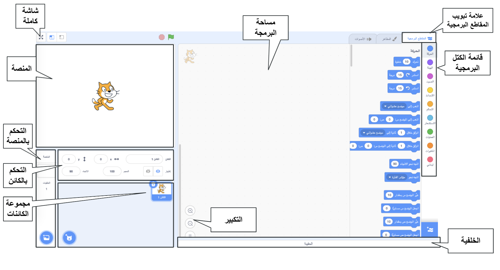
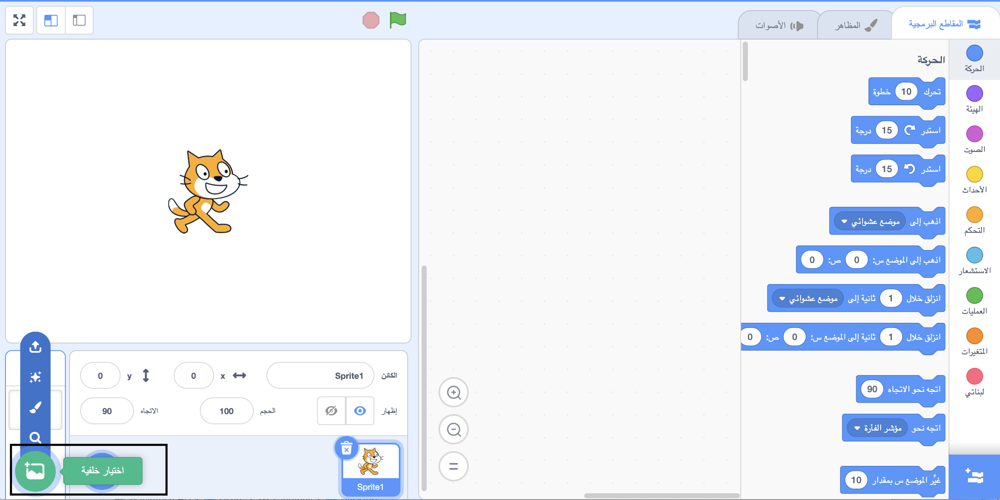
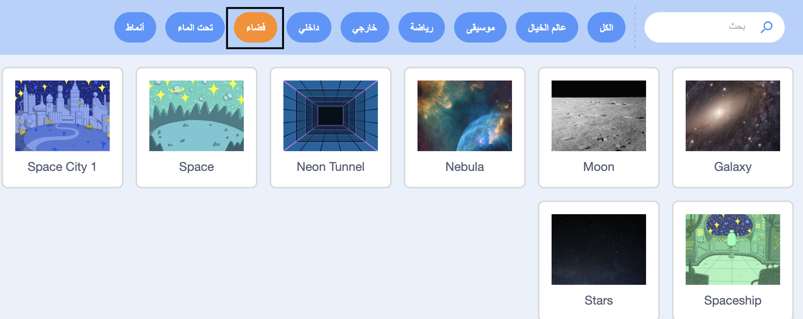
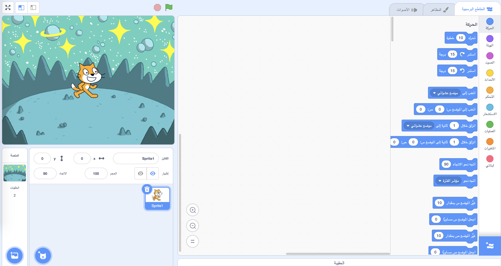
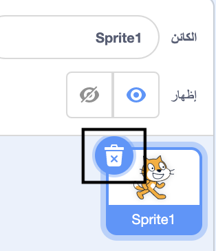
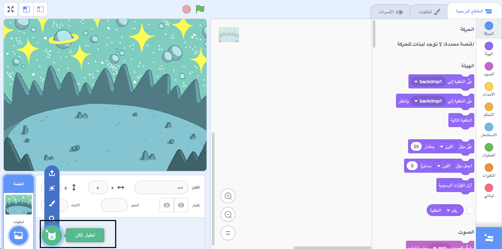
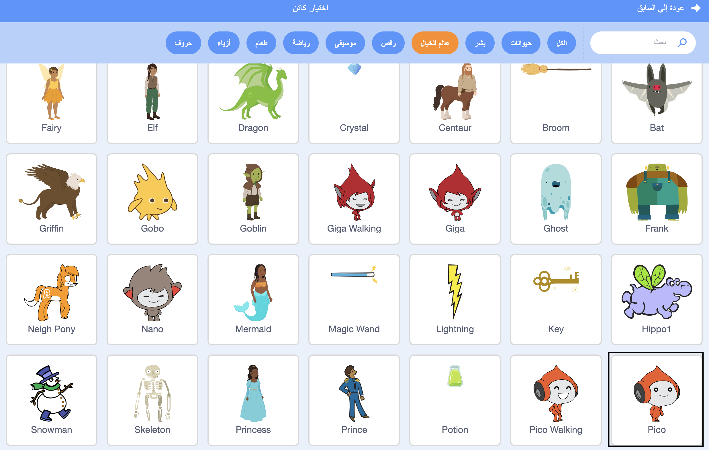
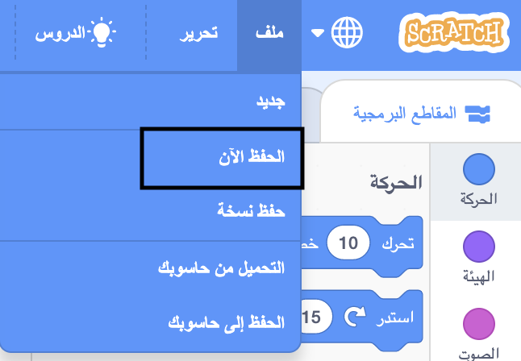

## Create your scene

In this step, you will set up your project with a space backdrop and the first sprite. 

{:width="300px"}

--- task ---

Open a [new Scratch project](http://rpf.io/scratch-new){:target="_blank"}. Scratch will open in another browser tab.

[[[working-offline]]]

--- /task ---

The Scratch editor looks like this:

The **Stage** is where your project runs. A **backdrop** changes the way that the Stage looks.

--- task ---

Click (or on a tablet, tap) on **Choose a Backdrop** in the Stage pane:

--- /task ---

--- task ---

Click on the **Space** category or type `space` in the search box:

--- /task ---

In our example, we have chosen the **Space** backdrop, but choose the one that you like the most.

--- task ---

Click on your chosen backdrop to add it to your project. The Stage should show the backdrop that you chose:

--- /task ---

Can you find a sprite that has already been included in your project? That is the Scratch Cat.

--- task ---

Delete the **Sprite1** (cat) sprite. Select the **Sprite1** sprite under the stage and click on the **Delete** icon.

--- /task ---

--- task ---

Click on **Choose a Sprite** in the Sprite list.

--- /task ---

--- task ---

Select the **Fantasy** category. Click on the **Pico** sprite to add it to your project.

--- /task ---

--- task ---

Drag the Pico sprite to position it on the left-hand side of the Stage. Your Stage should look something like this:

--- /task ---

--- task ---

Type the title of your project into the project title box at the top of the screen.

**Tip:** Give your projects helpful names so that you can easily find them when you have lots of projects.

Next, click on **File**, and then on **Save now** to save your project.

If you are not online or you do not have a Scratch account, you can click on **Save to your computer** to save a copy of your project.

--- /task ---

