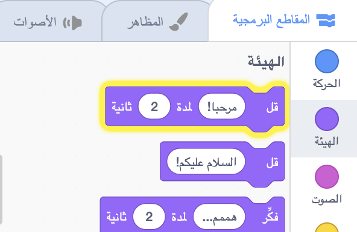
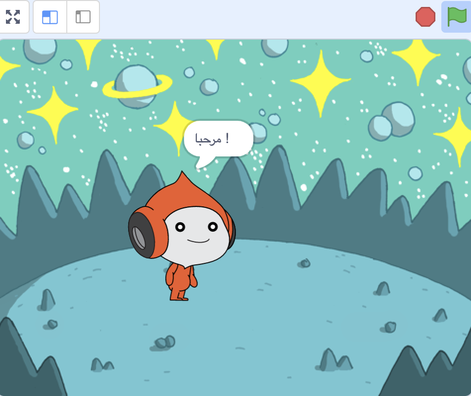
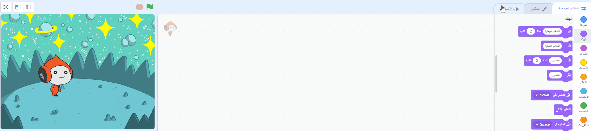
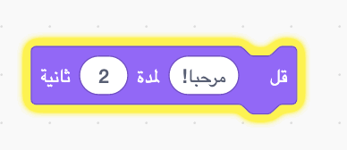
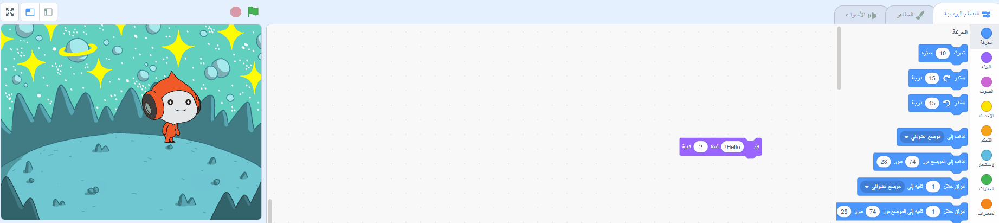
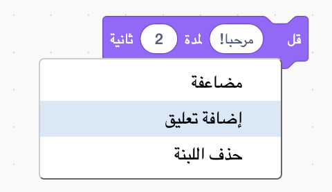

## Pico يقول مرحبًا

<div style="display: flex; flex-wrap: wrap">
<div style="flex-basis: 200px; flex-grow: 1; margin-right: 15px;">
يمكن أن يكون للكائن تعليمة برمجية، مظاهر، وأصوات لتغيير الطريقة التي يظهر بها وما يفعله. 
  
ستضيف كتل برمجية لجعل Pico يعبر بالكلمات والصوت عند النقر فوق الكائن.
</div>
<div>

{:width="300px"}

</div>
</div>

<p style="border-left: solid; border-width:10px; border-color: #0faeb0; background-color: aliceblue; padding: 10px;">
<span style="color: #0faeb0">**التعابير**</span> هي طريقة لإظهار الصفات الشخصية للشخصية في اللعبة. يمكنهم استخدام الكلام، الأصوات، الحركة والمؤثرات الرسومية ، تمامًا كما هو الحال في Scratch. هل تلعب أي ألعاب تستخدم التعابير؟
</p>

### استخدم الكتلة قُل

--- task ---

افتح قائمة الكتل البرمجية `الهيئة`{:class="block3looks"}.

انقر على كتلة `قل`{:class="block3looks"} `السلام عليكم!` `لـمدة`{:class="block3looks"} `2` `ثانية`{:class="block3looks"}.



الكائن **Pico** سيُظهر فقاعة كلامية لمدة ثانيتين.



**نصيحة:** الكتل البرمجية في Scratch تتوهج بخط عريض أصفر عند تشغيلها.

--- /task ---

--- task ---

اسحب كتلة `قل`{:class="block3looks"} `السلام عليكم!` `لمدة`{:class="block3looks"} `2` `ثانية`{:class="block3looks"} إلى منطقة التعليمة البرمجية. اضغط عليها مرة أخرى.





--- /task ---

### أجعل الكائن بيكو يتحدث عند النقر عليه (أو القرع عليه)

--- task ---

اسحب كتلة `عند نقر هذا الكائن`{:class="block3events"} من `الأحداث`{:class="block3events"} في قائمة الكتل وقم بتوصيله إلى أعلى كتلة `قل`{:class="block3looks"}في منطقة التعليمة البرمجية. الكتل سوف تلتصق ببعضها البعض.




```blocks3
+when this sprite clicked
say [Hello!] for [2] seconds // hide speech after 2 seconds
```

--- /task ---

### تعليقات على التعليمات البرمجية

```blocks3
say [Hello!] for [2] seconds // hide speech after 2 seconds
```
سترى التعليقات في أمثلة التعليمة البرمجية. لست بحاجة إلى إضافة التعليقات عند إضافة التعليمة البرمجية إلى مشروعك.

إذا كان لديك وقت عند الانتهاء من مشروعك، فأنها فكرة جيدة لإضافة تعليقات إلى التعليمة البرمجية الخاصة بك حتى يسهل فهمها لاحقًا. لإضافة تعليق ، انقر بزر الماوس الأيمن (أو على الجهاز اللوحي، انقر مع الاستمرار) على كتلة في منطقة التعليمة البرمجية واختر **إضافة تعليق**.



### أختبار

--- task ---

**اختبار:** انقر فوق الكائن **Pico** على المنصة وتحقق من ظهور فقاعة الكلام لمدة ثانيتين. من المهم اختبار التعليمة البرمجية الخاص بك للتأكد من أنها تفعل ما تتوقعه.

--- /task ---

--- task ---

لقد قمت بالفعل بحفظ مشروعك ومنحته اسمًا. سوف Scratch الآن **تلقائيًا** حفظ لك.

لا يزال بإمكانك النقر فوق "حفظ" إذا أردت ، فقط للتأكد.

--- /task ---
