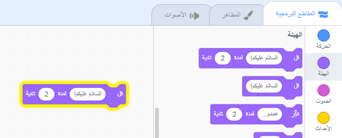

## Pico يقول مرحبًا

<div style="display: flex; flex-wrap: wrap">
<div style="flex-basis: 200px; flex-grow: 1; margin-right: 15px;">
يمكن أن يكون للكائن تعليمة برمجية، مظاهر، وأصوات لتغيير الطريقة التي يظهر بها وما يفعله. 
  
ستضيف كتل برمجية لجعل Pico يعبر بالكلمات والصوت عند النقر فوق الكائن.
</div>
<div>

{:width="300px"}

</div>
</div>

لاستخدام الكتل البرمجية، يمكنك النقر عليهم في قائمة الكتل.

--- task ---

افتح قائمة الكتل البرمجية `الهيئة`{:class="block3looks"}.

انقر على كتلة `قل`{:class="block3looks"} `السلام عليكم!` `لـمدة`{:class="block3looks"} `2` `ثانية`{:class="block3looks"}.


الكائن **Pico** سيُظهر فقاعة كلامية لمدة ثانيتين.


**نصيحة:** الكتل البرمجية في Scratch تتوهج بخط عريض أصفر عند تشغيلها.

--- /task ---

يمكنك سحب الكتل البرمجية إلى منطقة التعليمة البرمجية، ويمكن استخدامهم من هناك.

--- task ---

اسحب كتلة `قل`{:class="block3looks"} `السلام عليكم!` `لمدة`{:class="block3looks"} `2` `ثانية`{:class="block3looks"} إلى منطقة التعليمة البرمجية. اضغط عليها مرة أخرى.




--- /task ---

يمكن توصيل الكتل معًا في منطقة التعليمات البرمجية لتشغيل أكثر من كتلة في وقت واحد. سيتم تشغيل الكتل المتصلة بالترتيب من أعلى إلى أسفل.

--- task ---

اسحب كتلة `عند نقر هذا الكائن`{:class="block3events"} من `الأحداث`{:class="block3events"} في قائمة الكتل وقم بتوصيله إلى أعلى كتلة `قل`{:class="block3looks"}في منطقة التعليمة البرمجية. الكتل سوف تلتصق ببعضها البعض.


```blocks3
+when this sprite clicked
say [مرحباً!] for [2] seconds // إخفاء الكلام بعد ثانيتين
```

--- /task ---

التعليق هو شرح لما تفعله التعليمة البرمجية الخاصة بك.

```blocks3
say [مرحباً!] for [2] seconds // إخفاء الكلام بعد ثانيتين
```
سترى التعليقات في أمثلة التعليمة البرمجية. لست بحاجة إلى إضافة التعليقات عند إضافة التعليمة البرمجية إلى مشروعك.

إذا كان لديك وقت عند الانتهاء من مشروعك، فأنها فكرة جيدة لإضافة تعليقات إلى التعليمة البرمجية الخاصة بك حتى يسهل فهمها لاحقًا. لإضافة تعليق ، انقر بزر الماوس الأيمن (أو على الجهاز اللوحي، انقر مع الاستمرار) على كتلة في منطقة التعليمة البرمجية واختر **إضافة تعليق**.


--- task ---

**اختبار:** انقر فوق الكائن **Pico** على المنصة وتحقق من ظهور فقاعة الكلام لمدة ثانيتين. من المهم اختبار التعليمة البرمجية الخاص بك للتأكد من أنها تفعل ما تتوقعه.

--- /task ---

--- save ---
