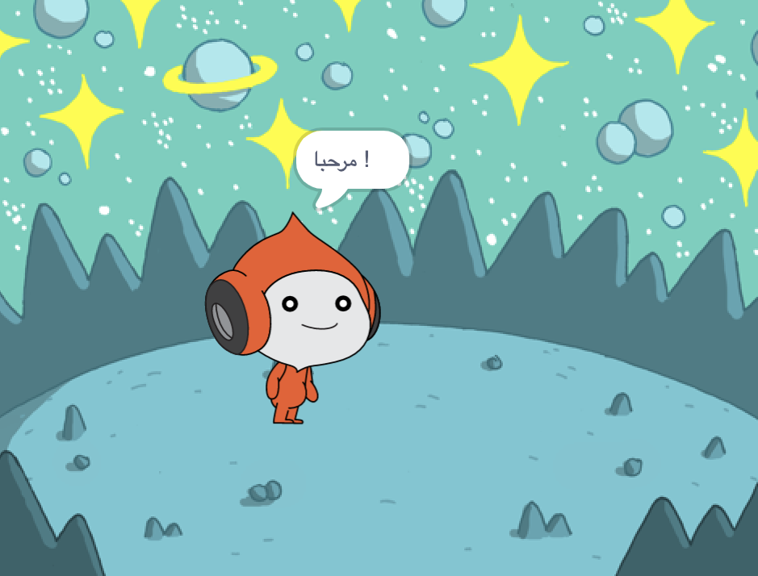
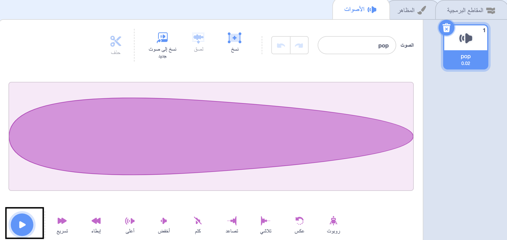
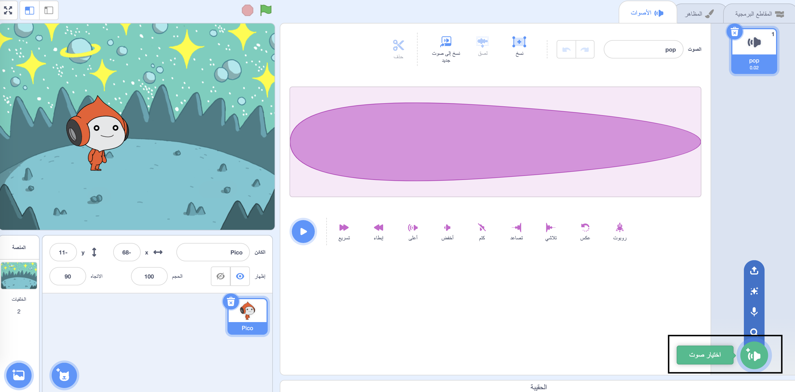
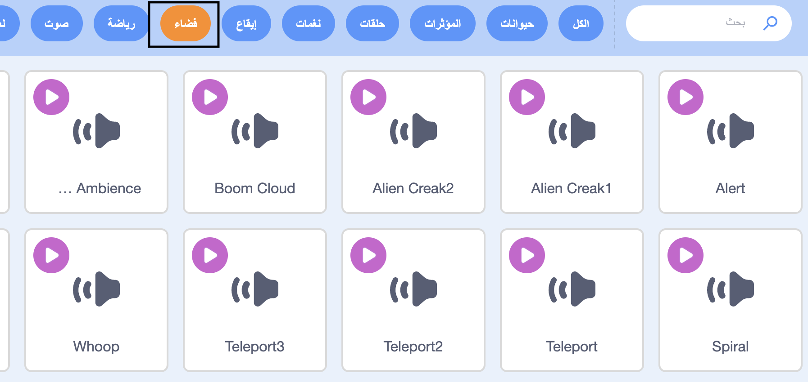
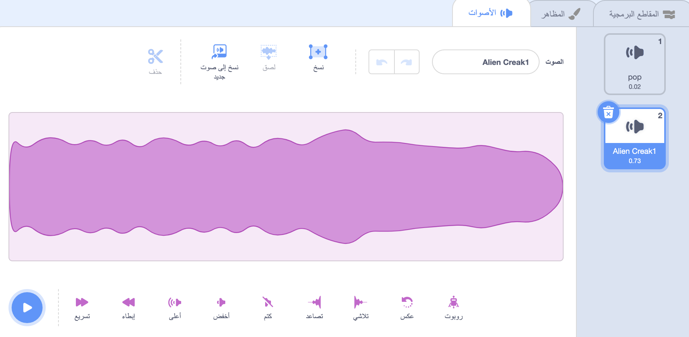
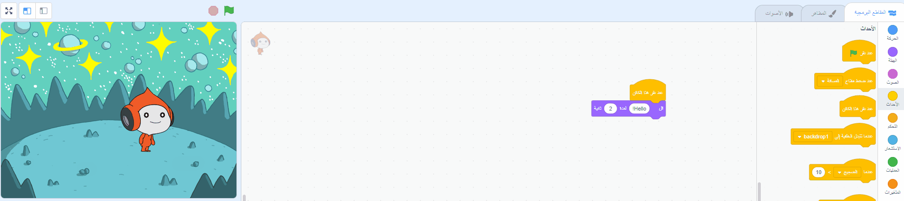
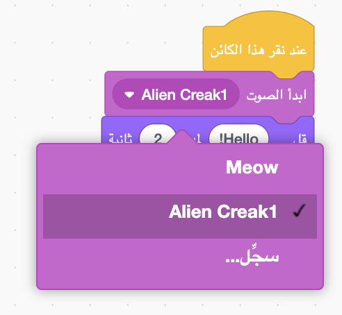

## Pico يشغل صوت

<div style="display: flex; flex-wrap: wrap">
<div style="flex-basis: 200px; flex-grow: 1; margin-right: 15px;">
طريقة أخرى للتواصل هي استخدام الصوت.
</div>
<div>

{:width="300px"}

</div>
</div>

--- task ---

أنقر على تبويب **الأصوات** للكائن Pico وستجد صوت **pop**. أنقر على أيقونة **التشغيل** لسماع صوت **pop**.



--- /task ---

هناك بعض الأصوات الغريبة الرائعة في Scratch والتي يمكنك إضافتها إلى كائنك.

--- task ---

لاختيار صوت جديد، أنقرعلى أيقونة **اختيار صوت** وأختر فئة **فضاء** أو اكتب `space` في مربع البحث.






--- /task ---

--- task ---

قم بتشغيل بعض الأصوات المختلفة باستخدام أيقونات **التشغيل**. بمجرد العثور على الصوت الذي تريد استخدامه، انقر فوقه لإضافته إلى مشروعك.



--- /task ---

--- task ---

انقر على تبويب **المقاطع البرمجية**. في قائمة كتل `الصوت`{:class="block3sound"} جد كتلة `بداية الصوت`{:class="block3sound"}.

اسحب الكتلة إلى منطقة التعليمة البرمجية، بين كتلة `عند نقر هذا الكائن`{: class = "block3events"} وكتلة `قل`{: class = "block3looks"}. ستفتح فجوة وستثبت الكتلة في مكانها.



يجب أن تبدو التعليمة البرمجية الخاص بك بالشكل التالي:


```blocks3
when this sprite clicked
+start sound [Alien Creak1 v] 
say [Hello!] for [2] seconds // hide speech after 2 seconds
```

--- /task ---

--- task ---

تحقق من أن كتلة `ابدأ الصوت`{:class="block3sound"} تحتوي على الصوت الذي اخترته فيها. إذا لم يكن كذلك، فأنت بحاجة إلى النقر فوق الصوت في كتلة`ابدأ الصوت`{:class="block3sound"}، ثم حدد الصوت الذي اخترته في القائمة المنسدلة.



--- /task ---

--- task ---

**اختبار:** انقر فوق الكائن **Pico** وتحقق من ظهور فقاعة الكلام ويمكنك سماع الصوت. إذا كنت لا تسمع الصوت، تأكد من أنك قمت بإضافة كتلة `ابدأ الصوت`{:class="block3sound"} تحت كتلة `عند نقر هذا الكائن`{:class="block3events"}. تحقق أيضًا من أن الصوت يعمل على جهاز الكمبيوتر أو الجهاز اللوحي.

--- /task ---

--- save ---

