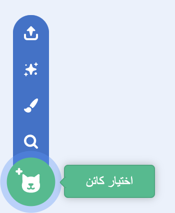
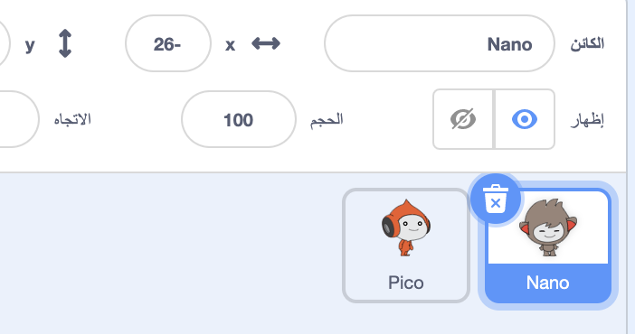
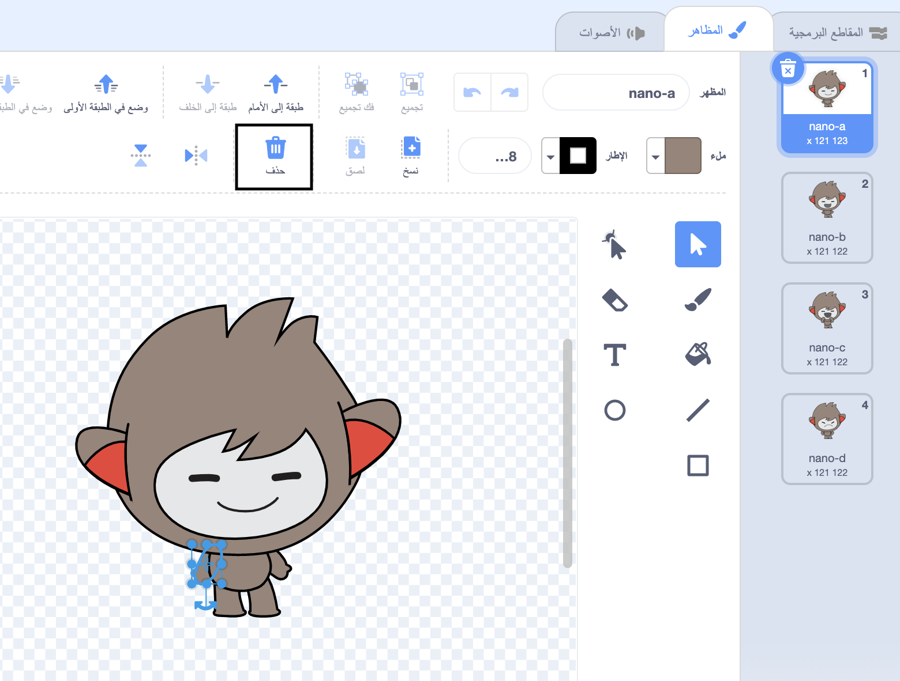
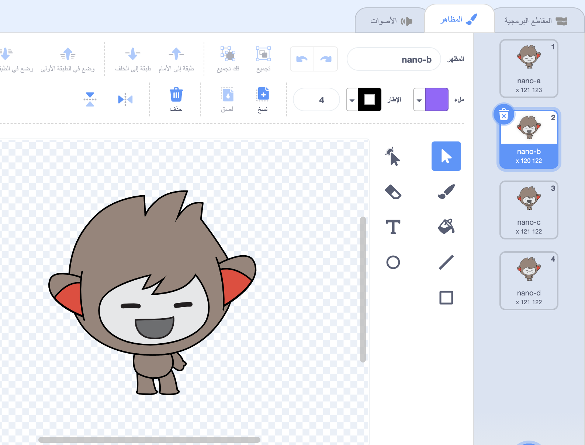
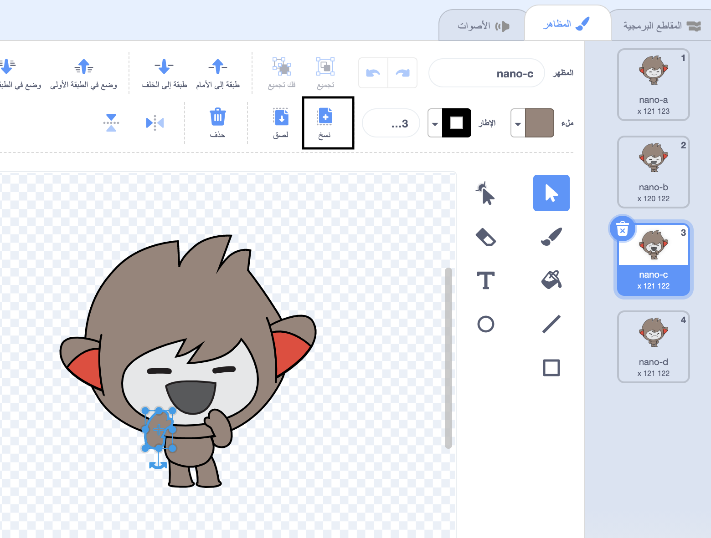
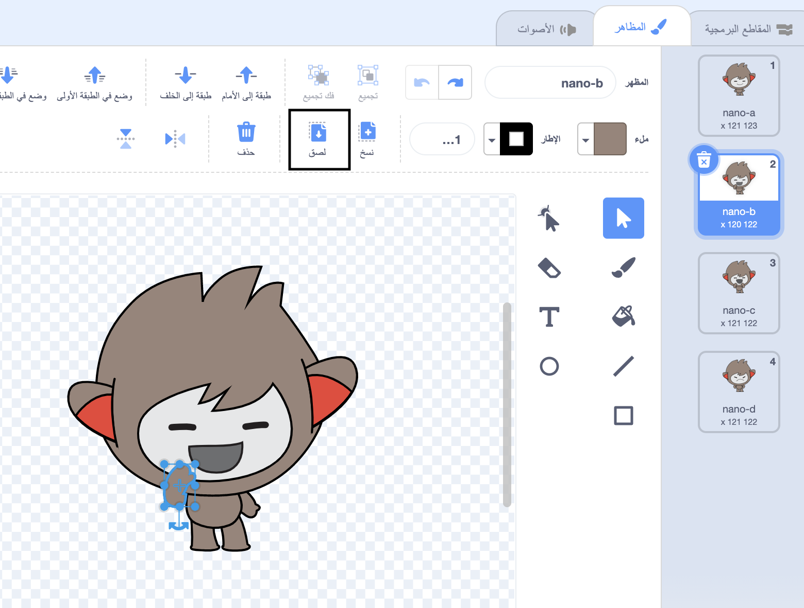

## Nano يبدل المظاهر

<div style="display: flex; flex-wrap: wrap">
<div style="flex-basis: 200px; flex-grow: 1; margin-right: 15px;">

ستجعل Nano يعبر عن مشاعره عن طريق تبديل مظهره **الهيئة**.

الكائنات تمتلك **المظاهر** لتغيير الطريقة التي تظهر بها. They are usually slightly different images of the same sprite. لتحريك كائن ما، يمكنك تغيير مظهره.

</div>
<div>

{:width="300px"}

</div>
</div>

### Nano يقول "شكرًا!" بلغة الاشارة

--- task ---

أضف الكائن **Nano** إلى مشروعك من فئة **عالم الخيال**.



--- /task ---

--- task ---

تأكد من تحديد الكائن **Nano** في قائمة الكائن أسفل المنصة.



ارجع إلى مظهر **nano-b** وانقر على **لصق**. Use the drop down menu to switch between `nano-b`{:class="block3looks"} and `nano-a`{:class="block3looks"}:


```blocks3
when this sprite clicked // when Nano is clicked
switch costume to [nano-b v] // Nano talking
wait (0.5) seconds // try 0.25 instead of 0.5
switch costume to [nano-a v] // Nano smiling
```
--- /task ---

**نصيحة:** جميع الكتل البرمجية مميزة بالألوان، لذلك ستجد كتلة`غير المظهر الى `في قائمة الكتل`الهيئة`{:class="block3looks"} وستجد كتلة `انتظر` في قائمة الكتل`التحكم`{:class="block3control"} blocks menu.

--- task ---

**اختبار:** انقر فوق **Nano** sprite على المنصة وتأكد من أن مظهر Nano قد تغير.

--- /task ---

### Nano يستخدم لغة الإشارة

<p style="border-left: solid; border-width:10px; border-color: #0faeb0; background-color: aliceblue; padding: 10px;">يستخدم الملايين من الناس لغة الإشارة للتواصل. الطريقة الشائعة لتوقيع "شكرًا لك" هي وضع أصابعك على ذقنك مع وضع يدك بشكل مسطح قدر الإمكان. ثم تحرك يدك للأمام بعيدًا عن ذقنك ولأسفل قليلاً. 
</p>

<!-- Add a video of someone signing -->

سيستخدم Nano لغة الإشارة عن طريق تبديل المظاهر.

يمكنك تعديل المظاهر للكائنات الخاصة بك باستخدام محرر الرسام. ستقوم بتعديل مظهر Nano لجعلهم يلوحون ب "شكرًا لك".

--- task ---

انقر فوق تبويب **المظاهر** لرؤية مظاهر الكائن **Nano**:


--- /task ---

--- task ---

أنقر على مظهر **nano-b**. أنقر فوق الذراع الموجود على الجانب الأيسر، ثم أنقر فوق **مسح**.



المظهر يجب أن يبدو كما يلي:



--- /task ---

**نصيحة:** إذا قمت بخطأ ما في محرر الرسام ، يمكنك النقر فوق **تراجع**.


--- task ---

اذهب إلى مظهر **nano-c** وانقر على الذراع التي على الجانب الأيسر، ثم انقر على **نسخ**.



--- /task ---

--- task ---

ارجع إلى مظهر **nano-b** وانقر على **لصق**. المظهر يجب أن يبدو كما يلي:



--- /task ---

--- task ---

**اختبار:** انقر فوق الكائن **Nano** على المنصة وتحقق من ظهور فقاعة الكلام وتغيير مظهر Nano إلى المظهر الذي قمت بتعديله.

--- /task ---

<p style="border-left: solid; border-width:10px; border-color: #0faeb0; background-color: aliceblue; padding: 10px;">لقد تعلمت كيفية التلويح بـ "شكرًا". في المرة القادمة التي تشكر فيها شخصًا ما، لماذا لا تستخدم مهارتك الجديدة؟
</p>

