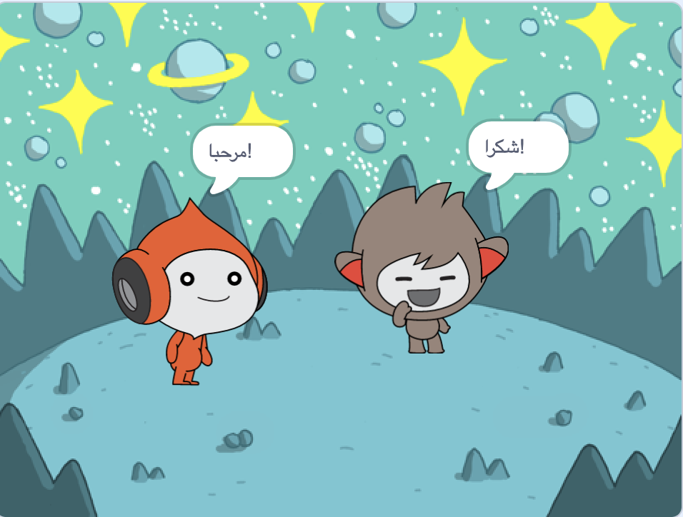

## Nano switches costume

<div style="display: flex; flex-wrap: wrap">
<div style="flex-basis: 200px; flex-grow: 1; margin-right: 15px;">

Get Nano to emote by switching **costumes**.

الكائنات تمتلك **المظاهر** لتغيير الطريقة التي تظهر بها. To animate a sprite, you can change its costume.

</div>
<div>

{:width="300px"}

</div>
</div>

### Nano signs "Thanks!"

--- task ---

أضف الكائن **Nano** إلى مشروعك من فئة **عالم الخيال**.


--- /task ---

--- task ---

تأكد من تحديد الكائن **Nano** في قائمة الكائن أسفل المنصة.


Click on the **Code** tab and add a script to get the **Nano** sprite to sign 'Thanks' using `switch costume to`{:class="block3looks"} and `wait`{:class="block3control"}:


```blocks3
when this sprite clicked // when Nano is clicked
switch costume to [nano-b v] // Nano talking
wait (0.5) seconds // try 0.25 instead of 0.5
switch costume to [nano-a v] // Nano smiling
```
--- /task ---

**Tip:** All the blocks are colour-coded, so you will find the `switch costume to`{:class="block3looks"} block in the `Looks`{:class="block3looks"} blocks menu and the `wait`{:class="block3control"} block in the `Looks`{:class="block3control"} blocks menu.

--- task ---

**Test:** Click on the **Nano** sprite on the Stage and check that Nano's costume changes.

--- /task ---

### Nano يستخدم لغة الإشارة

<p style="border-left: solid; border-width:10px; border-color: #0faeb0; background-color: aliceblue; padding: 10px;">يستخدم الملايين من الناس لغة الإشارة للتواصل. A common way to sign 'Thank you' is to place your fingers on your chin with your hand as flat as possible. You then move your hand forwards, away from your chin and slightly down. 
</p>

<!-- Add a video of someone signing -->

سيستخدم Nano لغة الإشارة عن طريق تبديل المظاهر.

يمكنك تعديل المظاهر للكائنات الخاصة بك باستخدام محرر الرسام. ستقوم بتعديل مظهر Nano لجعلهم يلوحون ب "شكرًا لك".

--- task ---

انقر فوق تبويب **المظاهر** لرؤية مظاهر الكائن **Nano**:


--- /task ---

--- task ---

أنقر على مظهر **nano-b**. أنقر فوق الذراع الموجود على الجانب الأيسر، ثم أنقر فوق **مسح**.


المظهر يجب أن يبدو كما يلي:


--- /task ---

**نصيحة:** إذا قمت بخطأ ما في محرر الرسام ، يمكنك النقر فوق **تراجع**.


--- task ---

اذهب إلى مظهر **nano-c** وانقر على الذراع التي على الجانب الأيسر، ثم انقر على **نسخ**.


--- /task ---

--- task ---

ارجع إلى مظهر **nano-b** وانقر على **لصق**. المظهر يجب أن يبدو كما يلي:


--- /task ---

--- task ---

**اختبار:** انقر فوق الكائن **Nano** على المنصة وتحقق من ظهور فقاعة الكلام وتغيير مظهر Nano إلى المظهر الذي قمت بتعديله.

--- /task ---

<p style="border-left: solid; border-width:10px; border-color: #0faeb0; background-color: aliceblue; padding: 10px;">لقد تعلمت كيفية التلويح بـ "شكرًا". في المرة القادمة التي تشكر فيها شخصًا ما، لماذا لا تستخدم مهارتك الجديدة؟
</p>

