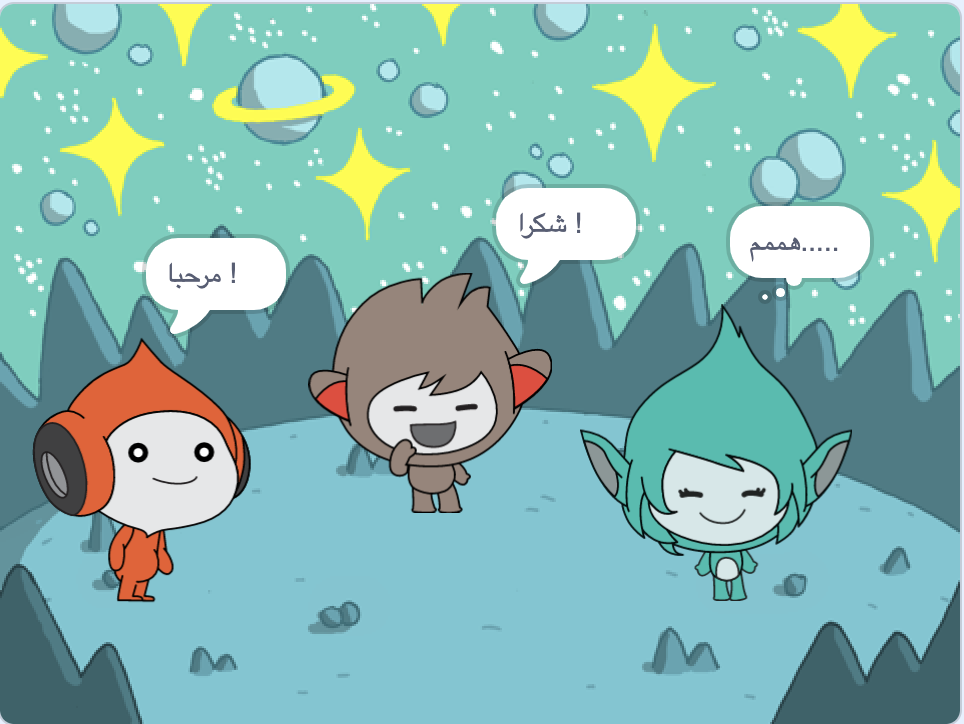

## Giga يغير اللون

<div style="display: flex; flex-wrap: wrap">
<div style="flex-basis: 200px; flex-grow: 1; margin-right: 15px;">
يمكن للكائنات أيضًا استخدام فقاعات التفكير وتغيير الألوان لإظهار شخصيتها. سوف تحصل على Giga للقيام بذلك.
</div>
<div>

{:width="300px"}

</div>
</div>

### Make Giga change colour

--- task ---

أضف الكائن **Giga**.

اسحب الكائن **Giga** إلى الجانب الأيمن من المنصة.

--- /task ---

--- task ---

تأكد من تحديد الكائن **Giga** في قائمة الكائن أسفل المنصة. أضف هذه التعليمة البرمجية لجعل الكائن **Giga** يتواصل عن طريق تغيير اللون:


```blocks3
when this sprite clicked
set [color v] effect to [0] // 0 is the starting colour
think [Hmm...] for [2] seconds 
clear graphic effects // back to the starting colour
```

--- /task ---

**نصيحة:** انقر فوق الكائن في قائمة الكائن أسفل المنصة قبل إضافة أو تغيير التعليمة البرمجية، المظاهر، أو الصوت. تأكد من قيامك بالنقر فوق الكائن الصحيح.

--- task ---

حاول بأرقام مختلفة من `1` الى `200` في كتلة `أجعل مؤثر اللون مساوياً` {:class="block3looks"} حتى تجد اللون الذي تحبه.

--- /task ---

--- task ---

قم بتغيير الكلمات وعدد الثواني في كتلة `فكر`{:class="block3looks"}.

--- /task ---

--- task ---

**اختبار:** انقر فوق الكائن**Giga** على المنصة وتحقق من أن الكائن يغير لونه ويظهر فقاعة تفكير.

--- /task ---

