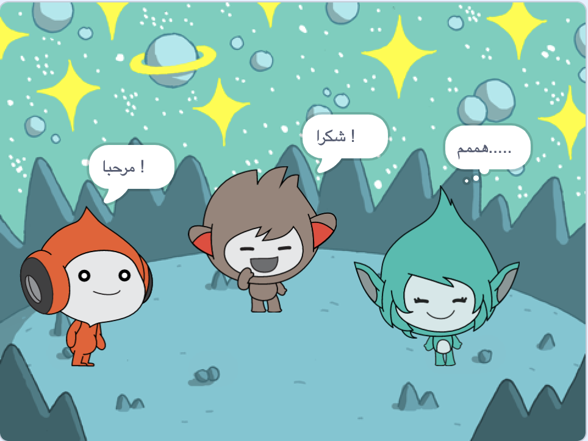

## Giga يغير اللون

<div style="display: flex; flex-wrap: wrap">
<div style="flex-basis: 200px; flex-grow: 1; margin-right: 15px;">
يمكن للكائنات أيضًا استخدام فقاعات التفكير وتغيير الألوان لإظهار شخصيتها. سوف تحصل على Giga للقيام بذلك.
</div>
<div>

{:width="300px"}

</div>
</div>

> [!TASK]
>
> أضف الكائن **Giga**.
>
> اسحب الكائن **Giga** إلى الجانب الأيمن من المنصة.

> [!TASK]
>
> تأكد من تحديد الكائن **Giga** في قائمة الكائن أسفل المنصة. أضف هذه التعليمة البرمجية لجعل الكائن **Giga** يتواصل عن طريق تغيير اللون:
>
> 
>
> ```blocks3
> when this sprite clicked
> set [color v] effect to [0] // الصفر هو لون البداية
> think [همم...] for [2] seconds
> clear graphic effects // العودة إلى لون البداية
> ```

**نصيحة:** انقر فوق الكائن في قائمة الكائن أسفل المنصة قبل إضافة أو تغيير التعليمة البرمجية، المظاهر، أو الصوت. تأكد من قيامك بالنقر فوق الكائن الصحيح.

> [!TASK]
>
> حاول بأرقام مختلفة من `1` الى `200` في كتلة `أجعل مؤثر اللون مساوياً`{:class="block3looks"} حتى تجد اللون الذي تحبه.

> [!TASK]
>
> قم بتغيير الكلمات وعدد الثواني في كتلة `فكر`{:class="block3looks"}.

> [!TASK]
>
> **اختبار:** انقر فوق الكائن**Giga** على المنصة وتحقق من أن الكائن يغير لونه ويظهر فقاعة تفكير.

> [!SAVE]
