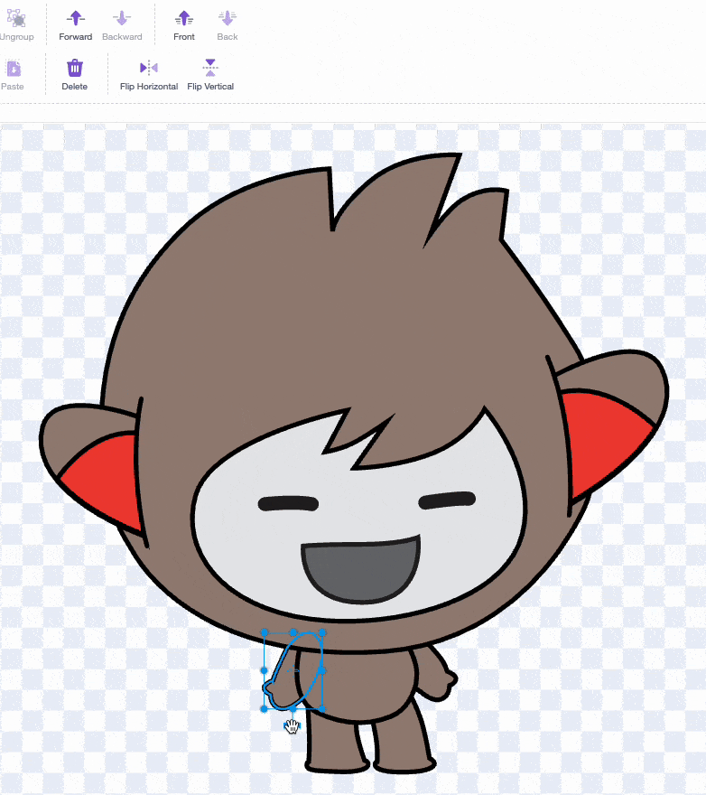

## Nano signs "Thanks!"

Get Nano to sign by editing a costume.

Millions of people use sign language to communicate. A common way to sign 'Thank you' is to place your fingers on your chin with your hand as flat as possible. You then move your hand forwards, away from your chin and slightly down. 

{:width="300px"}

### Nano uses sign language

You will edit a costume of Nano to get them to sign "thank you".

You can edit costumes for sprites with the Paint editor.

--- task ---

Click on the **Costumes** tab to see the costumes for the **Nano** sprite:

--- /task ---

--- task ---

Click on the **nano-b** costume. Click on the arm on the left-hand side.

--- /task ---

--- task ---

Select the double-headed 'rotate' arrow and drag the mouse up to rotate the arm.

The costume should look like this:

--- /task ---

--- task ---

Select the 'Front' tool to make the arm the front layer.

--- /task ---

**Tip:** If you make a mistake in the Paint editor, you can click on **Undo**.

--- no-print ---

--- /no-print ---

--- task ---

**اختبار:** انقر فوق الكائن**Giga** على المنصة وتحقق من أن الكائن يغير لونه ويظهر فقاعة تفكير.

--- /task ---

You have learned how to sign "thank you". Next time you thank someone, why not use your new skill?

