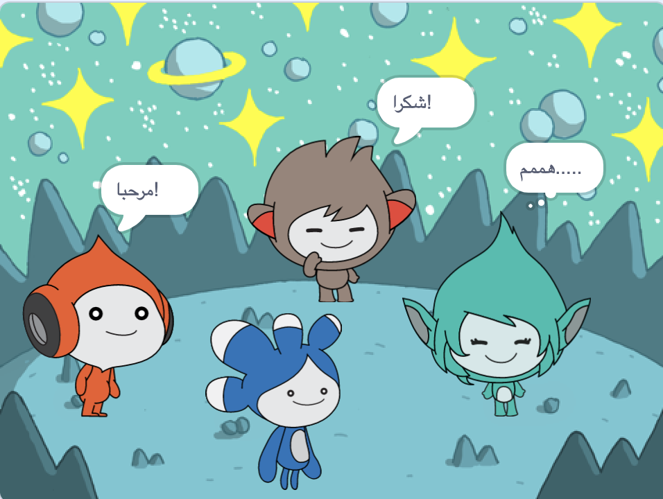

## قم بترقية مشروعك

<div style="display: flex; flex-wrap: wrap">
<div style="flex-basis: 200px; flex-grow: 1; margin-right: 15px;">
أضف الكائن ** Tera ** واستخدم أيًا من الكتل البرمجية التي تعلمتها لعمل "تعبير" للكائن ** Tera **.
</div>
<div>

{:width="300px"}

</div>
</div>

شخصية الكائن **Tera**هي اختيارك ، لذا استمتع باستخدام أفكارك الإبداعية الخاصة.

```blocks3
when this sprite clicked

say [Hello!] for [2] seconds

say [Hello!]

say [] // hide speech bubble

think [Hmm...] for [2] seconds

switch costume to [tera-d v]

set [color v] effect to [0] // number up to 200

clear graphic effects

play sound [pop v] until done

start sound [pop v]
```

يمكنك أيضًا "إعادة عمل" المشروع لإجراء أي تغييرات تريدها. يمكنك تغيير الخلفية، وكيفية تعبير الكائنات، وحتى اختيار كائنات مختلفة ومنحهم المشاعر.

**نصيحة:** انقر فوق الكائن في قائمة الكائن أسفل المنصة لتغيير التعليمة البرمجية، المظاهر، أو الصوت.

--- collapse ---
---
title: شهادة حديث الفضاء
---

أحسنت! لقد أكملت مشروع حديث الفضاء. هنا [شهادة](https://drive.google.com/file/d/18xx4uNIyRSty_2ujHkGDzGwTgfSGC1AF/view?usp=sharing){:target="_ blank"} للاحتفال بمهاراتك الجديدة. قم بتنزيل نسخة ثم افتحها لإضافة اسمك.

--- /collapse ---

--- collapse ---
---
title: مشروع مكتمل
---

يمكنك عرض [المشروع المكتمل هنا](https://scratch.mit.edu/projects/485673032/){:target="_ blank"}.

--- /collapse ---

--- save ---
