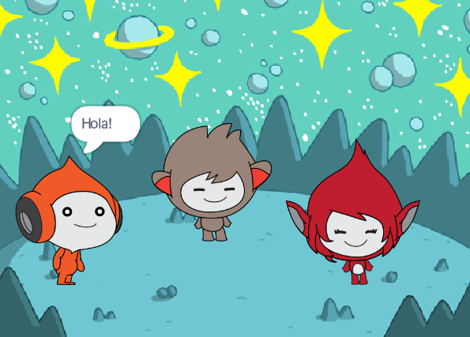

## Tu faràs

Crea una escena espacial amb personatges 👾 que cobrin vida i comparteixin els seus pensaments o sentiments.

A Scratch, els personatges i els objectes s'anomenen **personatges**i apareixen a **l'escenari**.

Tu faràs:
+ Afegeix personatges i un **teló de fons** per configurar el teu projecte
+ Feu clic als personatges per fer-los comunicar mitjançant blocs de codi `Aspecte`{:class="block3looks"} i `So`{:class="block3sound"}
+ Utilitzeu l' **Editor gràfic** per canviar un **vestit**

--- no-print ---
--- task ---
### Reproduir ▶️

  
Feu clic a cada personatge per veure què fan. 

Què passa si feu clic a un personatge i després feu clic ràpidament a un altre personatge?

  <iframe allowtransparency="true" width="485" height="402" src="https://scratch.mit.edu/projects/embed/1081645263/?autostart=false" frameborder="0"></iframe>

--- /task ---
--- /no-print ---

--- print-only ---

--- /print-only ---

