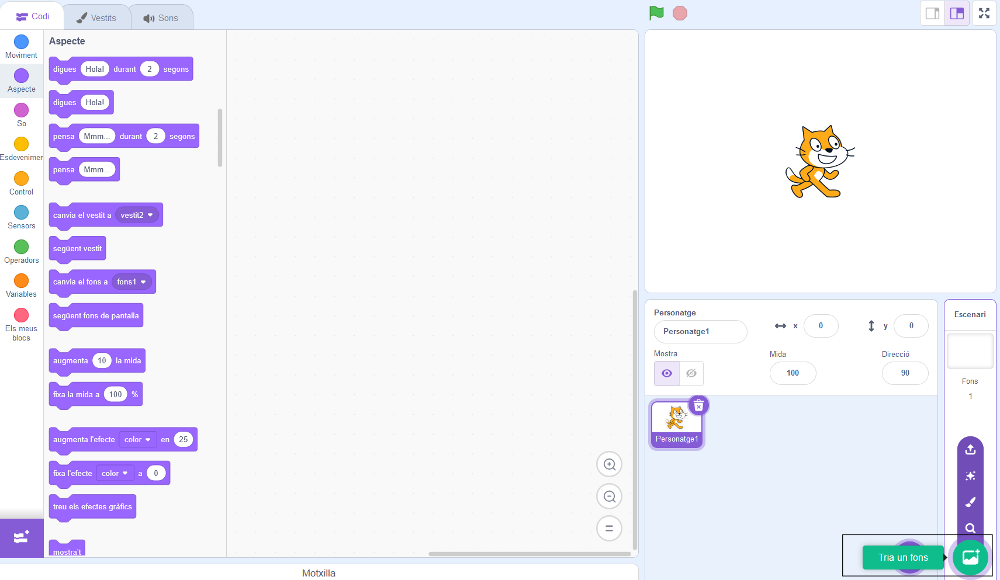

## Crea la teva escena

Configureu el vostre projecte amb un teló de fons espacial i el primer personatge. 

{:width="300px"}

### Obriu el projecte inicial

--- task ---

Obriu el projecte inicial [Xerrada espacial](https://scratch.mit.edu/projects/582213331/editor){:target="_blank"}. Scratch s'obrirà en una altra pestanya del navegador.

[[[working-offline]]]

--- /task ---

### L'editor Scratch

### Afegeix un fons

L'etapa **Escenari** és on s'executa el vostre projecte. Un **ons** canvia l'aspecte de l'escenari.

--- task ---

Feu clic (o en una tauleta, toqueu) a **Trieu un fons** al panell de l'escenari:

--- /task ---

--- task ---

Feu clic a la categoria **Espai** o escriviu `espai` al quadre de cerca:

--- /task ---

Al nostre exemple, hem triat el fons **Espai** , però trieu el que més us agradi.

--- task ---

Feu clic al fons escollit per afegir-lo al vostre projecte. L'escenari hauria de mostrar el fons que heu triat:

--- /task ---

### Afegeix un Personatge

Pots veure el personatge que ja està inclòs al teu projecte? Aquest és el gat de Scratch.

--- task ---

Suprimeix el personatge **Personatge1** (Gat de Scratch): seleccioneu el personatge **Personatge1** a la llista de Personatges a sota de l'escenari i feu clic a l'icona de **Esborrar** .

--- /task ---

--- task ---

Feu clic a **Trieu un Personatge** a la llista de Personatges:

--- /task ---

--- task ---

Seleccioneu la categoria **Fantasia** . Feu clic al personatge **Pico** per afegir-lo al vostre projecte.

--- /task ---

--- task ---

Arrossegueu el personatge d'en **Pico** per situar-lo a la part esquerra de l'escenari. El vostre escenari hauria de semblar-se a això:

--- /task ---

--- task ---

**Desa**: si heu iniciat la sessió al vostre compte de Scratch, feu clic al botó verd Reinventa. Això desarà una còpia del projecte al vostre compte de Scratch.

Escriviu el nom del vostre projecte a la caixa de nom del projecte a la part superior de la pantalla.

**Consell:** Doneu noms útils als vostres projectes perquè els pugueu trobar fàcilment quan tingueu molts projectes.

A continuació, feu clic a **Fitxer** i després a **Desa ara** per desar el vostre projecte.

Si no esteu en línia o no teniu un compte de Scratch, podeu fer clic a **Desa al vostre ordinador** per desar una còpia del vostre projecte.

--- /task ---

