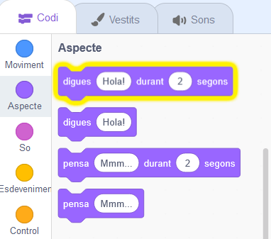
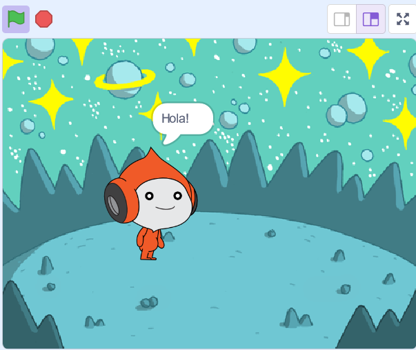
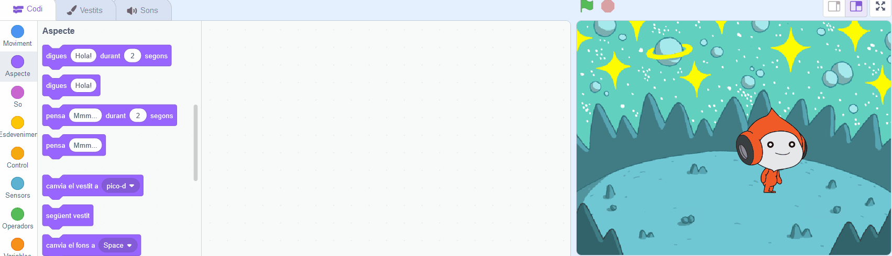
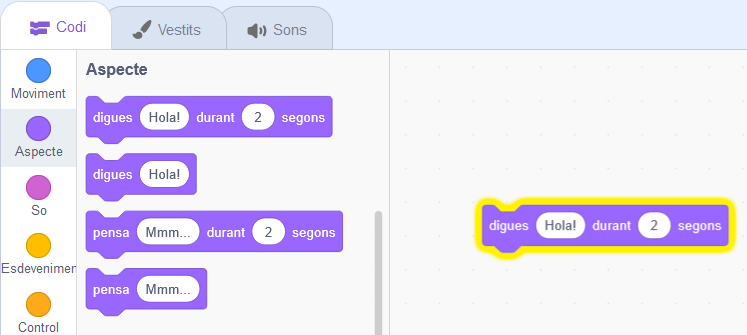
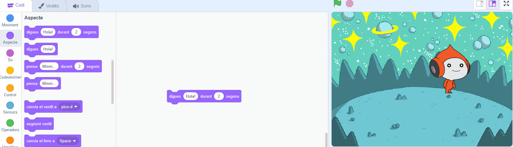
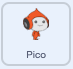
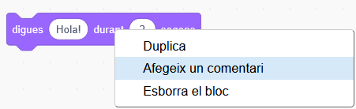

## En Pico diu hola

<div style="display: flex; flex-wrap: wrap">
<div style="flex-basis: 200px; flex-grow: 1; margin-right: 15px;">
Un personatge pot tenir codi, vestits i sons per canviar l'aspecte i el que fa. 
  
Afegiu blocs de codi per fer que en Pico cobri vida amb paraules i sons quan feu clic al personatge.
</div>
<div>

{:width="300px"}

</div>
</div>

<p style="border-left: solid; border-width:10px; border-color: #0faeb0; background-color: aliceblue; padding: 10px;">
<span style="color: #0faeb0">**Donar vida**</span> són una manera de mostrar la personalitat d'un personatge en un joc. Poden utilitzar la parla, els sons, el moviment i els efectes gràfics, igual que a Scratch. Jugues a algun joc que doni vida?
</p>

### Utilitzeu el bloc dir.

--- task ---

Obriu el menú de blocs `Aspecte`{:class="block3looks"}.

Feu clic a un `dir`{:class="block3looks"} `Hola!` `per a`{:class="block3looks"} `2` `segons`{:class="block3looks"}.



El personatge d'en  **Pico** mostrarà una bafarada durant dos segons.



**Consell:** Els blocs de codi a Scratch brillen amb un contorn groc quan s'executen.

--- /task ---

--- task ---

Arrossegueu el `Dir`{:class="block3looks"} `Hola!` `per a`{:class="block3looks"} `2` `segons`{:class="block3looks"} a l'àrea de codi. Feu-hi clic de nou.





--- /task ---

### Feu que en Pico parli quan feu clic (o toqueu)

--- task ---

Arrossegueu `quan es fasi clic al personatge`{:class="block3events"} des del menú de blocs `Esdeveniments`{:class="block3events"} i connecteu-vos a la part superior del bloc `dir`{:class="block3looks"} a l'àrea Codi. Els blocs s'enganxaran junts.





```blocks3
+when this sprite clicked
say [Hola!] for [2] seconds // para de parlar després de 2 segons
```

--- /task ---

### Comentaris del codi

--- task ---

```blocks3
say [Hola!] for [2] seconds // para de parlar després de 2 segons
```
Veureu comentaris en exemples de codi. No cal que afegiu els comentaris quan afegiu codi al vostre projecte.

Si teniu temps quan acabeu el vostre projecte, és una bona idea afegir comentaris al vostre codi perquè sigui més fàcil d'entendre més endavant. Prova d'afegir un comentari ara. Feu clic amb el botó dret (o en una tauleta, manteniu premut) en un bloc a l'àrea Codi i trieu **Afegir un comentari**.



--- /task ---

### Prova

--- task ---

**Prova:** Feu clic al personatge d'en **Pico**  a l'escenari i comproveu que la bafarada apareix durant dos segons. És important provar el vostre codi per assegurar-vos que fa el que espereu.

--- /task ---

--- task ---

Ja heu desat el vostre projecte i li heu donat un nom. Scratch ara **desarà automàticament** per a tu.

Encara podeu fer clic a Desa si voleu, només per assegurar-vos.

--- /task ---
