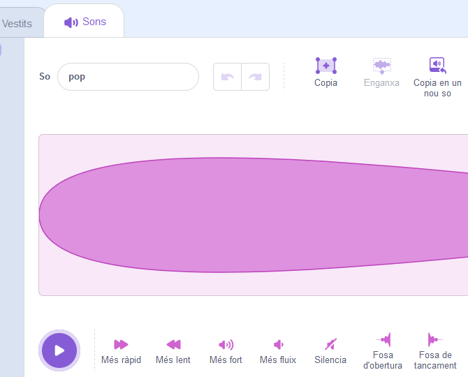
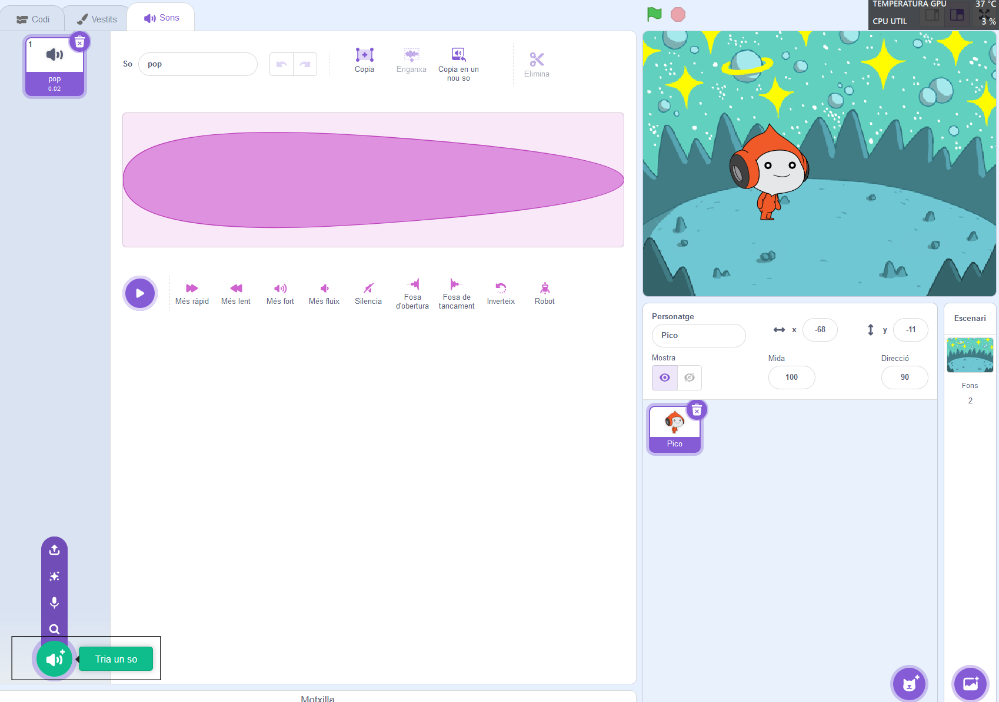
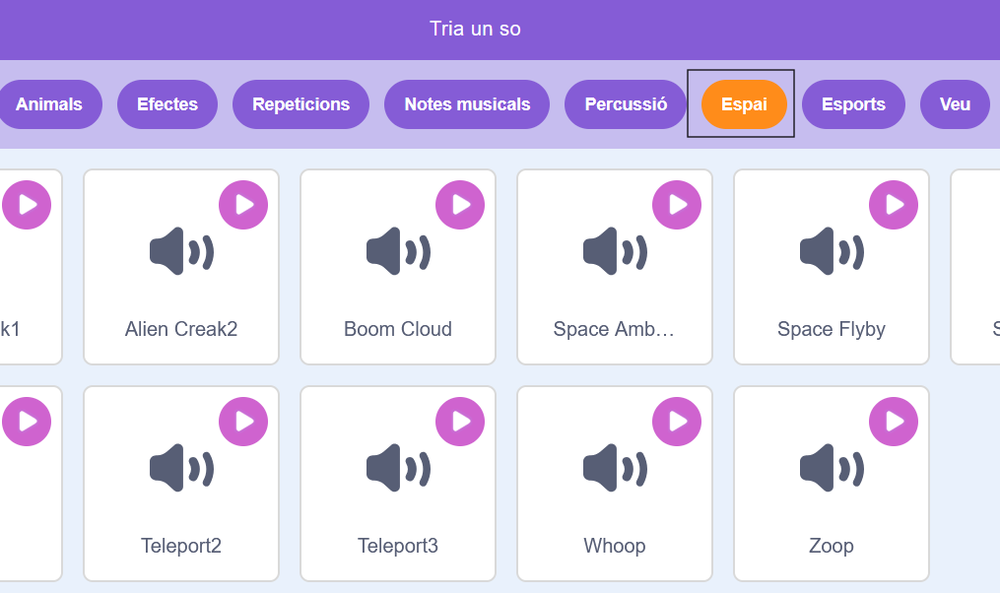
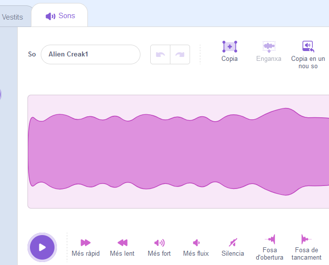
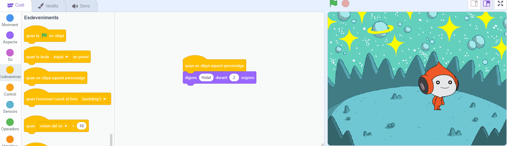
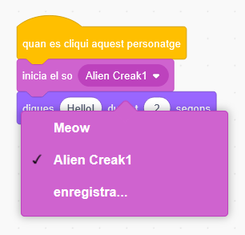

## En Pico reprodueix un so

<div style="display: flex; flex-wrap: wrap">
<div style="flex-basis: 200px; flex-grow: 1; margin-right: 15px;">
Una altra manera de comunicar-se és utilitzar el so.
</div>
<div>

{:width="300px"}

</div>
</div>

### Afegiu un so al personatge d'en Pico

--- task ---

Feu clic a la pestanya **So** per al personatge d'en **Pico** i trobareu un so **pop** . Feu clic a la icona **Reprodueix** per sentir el so **pop** .



**Depuració**: si no podeu sentir un so, comproveu que el so funcioni a l'ordinador o a la tauleta.

--- /task ---

--- task ---

Per escollir un nou so, fes clic en l'icona **Tria un so** i selecciona la categoria **Espai** o escriu `espai` en la caixa de cerca.






--- /task ---

--- task ---

Reprodueix uns quants sons diferents amb les icones **Reprodueix** . Un cop hàgiu trobat el so que voleu utilitzar, feu-hi clic per afegir-lo al vostre projecte.



--- /task ---

### Feu que en Pico parli quan feu clic (o toqueu)

--- task ---

Feu clic a la pestanya **Codi** . Al menú de blocs `So`{:class="block3sound"}, cerqueu el bloc `d'inici`{:class="block3sound"}.

Arrossegueu el bloc a l'àrea de codi, entre el `quan aquest personatge va fer clic al bloc`{:class="block3events"} i el `dir`{:class="block3looks"} bloc. S'obrirà un buit i el bloc encaixarà al seu lloc.



El teu codi hauria de ser així:


```blocks3
when this sprite clicked
+start sound [Alien Creak1 v] 
say [Hola!] for [2] seconds // para de parlar després de 2 segons
```

--- /task ---

### Prova el teu codi

--- task ---

Comproveu que el teu bloc `d'inici`{:class="block3sound"} tingui el so escollit. Si no ho fa, cal que feu clic al bloc de so `Reproduir so`{:class="block3sound"} i, a continuació, seleccioneu el so triat al menú desplegable.



--- /task ---

--- task ---

**Prova:** Feu clic al personatge d'en **Pico** i comproveu que apareix la bafarada i podeu sentir el so. Si no escoltes cap so, asegurat de haver afegit el bloc `Reproduir so`{:class="block3sound"} sota el bloc `quan fas clic al personatge`{:class="block3events"}.

--- /task ---

