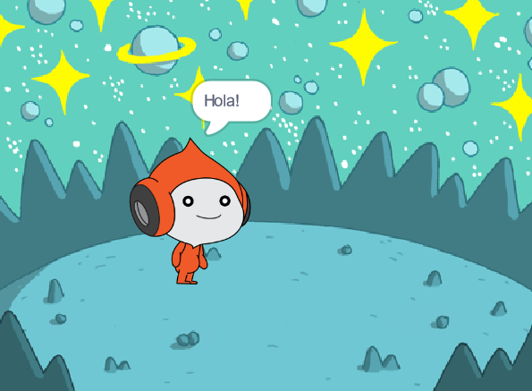
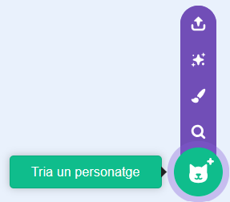
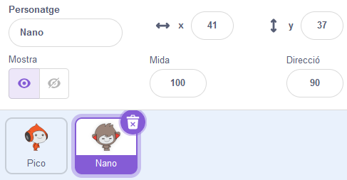
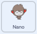
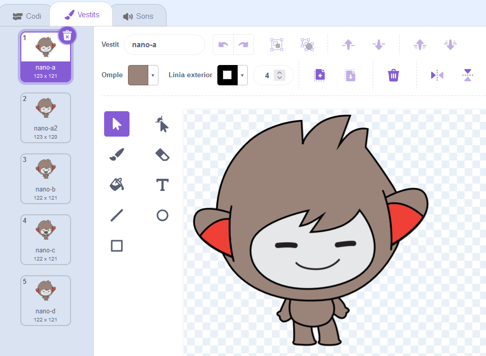
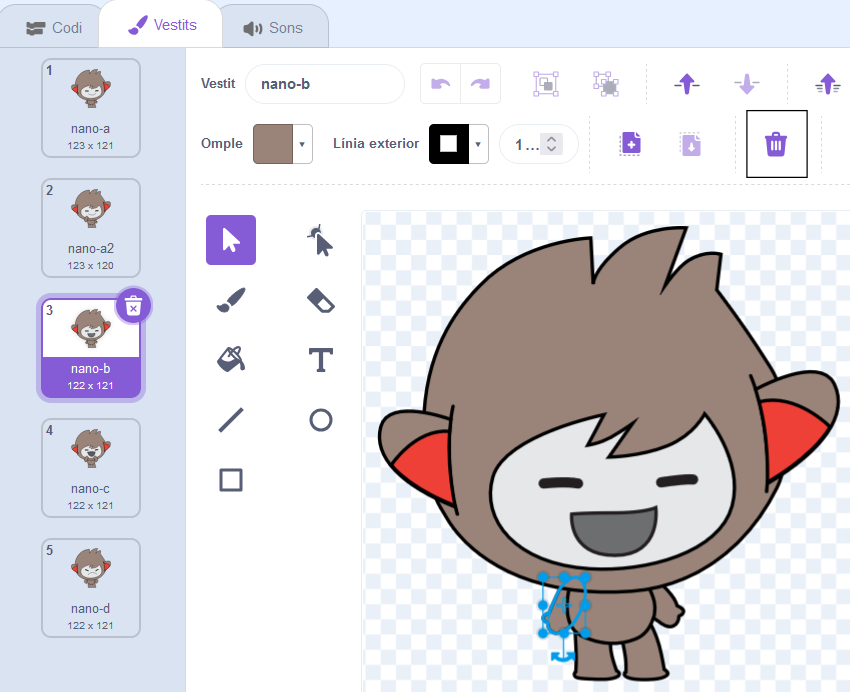
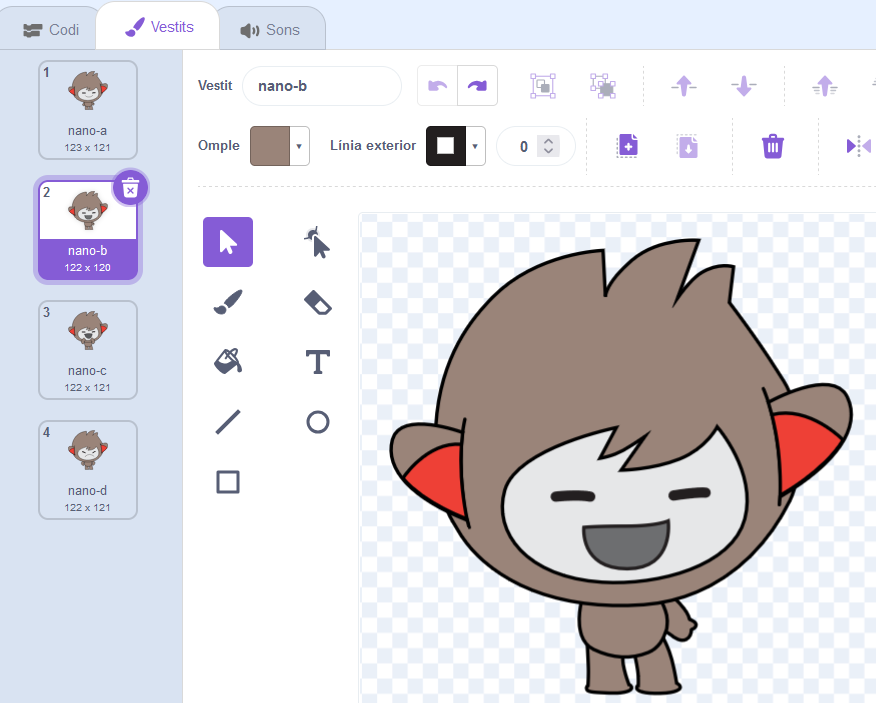
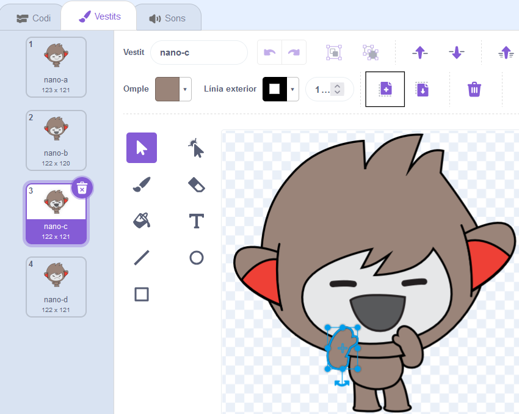
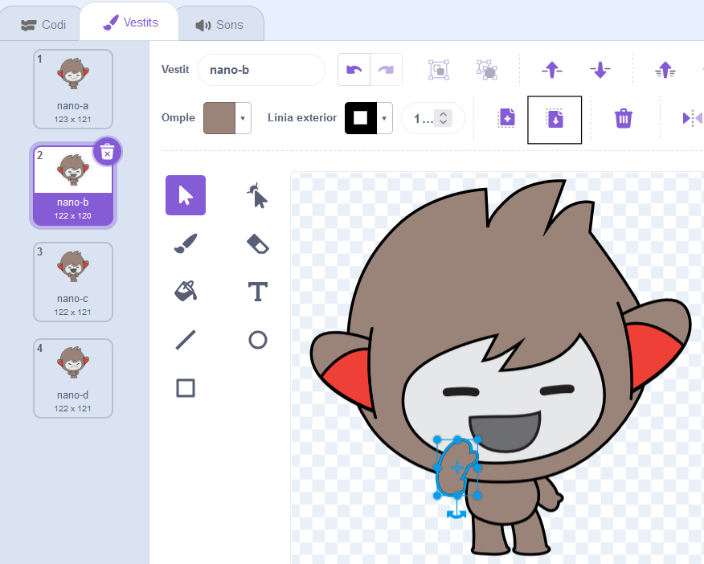

## En Nano canvia de vestit

<div style="display: flex; flex-wrap: wrap">
<div style="flex-basis: 200px; flex-grow: 1; margin-right: 15px;">

Fes que Nano cobri vida i és canvi els vestits.

Els personatges tenen vestits per canviar la seva aparença. Normalment són imatges lleugerament diferents del mateix personatge. Per animar personatges, tu pots canviar els seus vestits.

</div>
<div>

{:width="300px"}

</div>
</div>

### Nano signa "Gràcies!"

--- task ---

Afegeix el personatge d'en  **Nano**  al teu projecte des de la categoria  **Fantasia**.



--- /task ---

--- task ---

Assegureu-vos que el personatge d'en **Nano** estigui seleccionat a la llista de Personatges a sota de l'escenari.



Fes clic a  la pestanya de **Codi**  i afegeix codi per que el personatge d'en  **Nano** signi "Gràcies" fent servir el  `Canvi de vestit`{:class="block3looks"} i `esperar`{:class="block3control"}. Utilitzeu el menú desplegable per canviar entre `nano-b`{:class="block3looks"} i `nano-a`{:class="block3looks" }:



```blocks3
when this sprite clicked // when Nano is clicked
switch costume to [nano-b v] // Nano talking
wait (0.5) seconds // try 0.25 instead of 0.5
switch costume to [nano-a v] // Nano smiling
```
--- /task ---

**Consell:** Tots els blocs estan codificats per colors, així podras trobar el bloc `canvi de vestit`{:class="block3looks"} en  el bloc de menú `Aspecte`{:class="block3looks"} i el bloc d' `esperar`{:class="block3control"} en el bloc de menu de `Control`{:class="block3control"}.

--- task ---

**Test:** Click on the **Nano** sprite on the Stage and check that Nano's costume changes.

--- /task ---

### Nano uses sign language

<p style="border-left: solid; border-width:10px; border-color: #0faeb0; background-color: aliceblue; padding: 10px;">Millions of people use sign language to communicate. A common way to sign 'Thank you' is to place your fingers on your chin with your hand as flat as possible. You then move your hand forwards, away from your chin and slightly down. 
</p>

<!-- Add a video of someone signing -->

Nano will use sign language by switching costumes.

You can edit costumes for your sprites with the Paint editor. You will edit a costume of Nano to get them to sign "thank you".

--- task ---

Click on the **Costumes** tab to see the costumes for the **Nano** sprite:



--- /task ---

--- task ---

Click on the **nano-b** costume. Click on the arm on the left-hand side, and then click on **Delete**.



The costume should look like this:



--- /task ---

**Tip:** If you make a mistake in the Paint editor, you can click on **Undo**.


--- task ---

Go to the **nano-c** costume and click on the arm on the left-hand side, then click on **Copy**.



--- /task ---

--- task ---

Go back to the **nano-b** costume and click on **Paste**. The costume should look like this:



--- /task ---

--- task ---

**Test:** Click on the **Nano** sprite on the Stage and check that Nano's costume changes to the costume that you have edited.

--- /task ---

<p style="border-left: solid; border-width:10px; border-color: #0faeb0; background-color: aliceblue; padding: 10px;">You have learned how to sign "thank you". Next time you thank someone, why not use your new skill?
</p>

