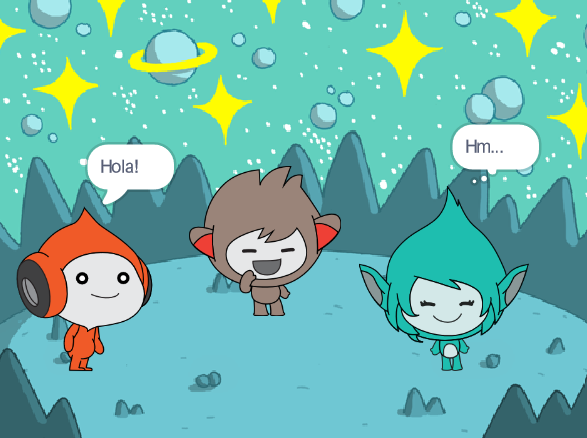

## La Giga canvia de color

<div style="display: flex; flex-wrap: wrap">
<div style="flex-basis: 200px; flex-grow: 1; margin-right: 15px;">
Els personatges també poden utilitzar bafarades i canviar de color per mostrar la seva personalitat. Fareu que Giga faci això.
</div>
<div>

{:width="300px"}

</div>
</div>

### Feu que la Giga canviï de color

--- task ---

Afegeix el personatge de la **Giga** .

Arrossegueu el personatge de la **Giga** cap a la part dreta de l'escenari.

--- /task ---

--- task ---

Assegureu-vos que teniu seleccionat el personatge de la  **Giga** a la llista de personatges que hi ha a sota de l'escenari. Afegiu aquest codi per fer que el personatge de la  **Giga** es comuniqui canviant de color:


```blocks3
when this sprite clicked
set [color v] effect to [0] // 0 is the starting colour
think [Hmm...] for [2] seconds 
clear graphic effects // back to the starting colour
```

--- /task ---

**Consell:** Feu clic al personatge de la llista de personatges a sota de l'escenari abans d'afegir o canviar codi, vestuari o so. Assegureu-vos que heu fet clic al personatge correcte.

--- task ---

Proveu diferents números des del `1` fins al `200` al ` per establir l'efecte de color al bloc `{:class="block3looks" } fins que trobeu el color que us agradi.

--- /task ---

--- task ---

Canvieu les paraules i el nombre de segons al bloc `pensa`{:class="block3looks"}.

--- /task ---

--- task ---

**Prova:** Feu clic al personatge de la **Giga** a l'escenari i comproveu que el personatge canvia de color i mostra una bombolla de pensament.

--- /task ---

