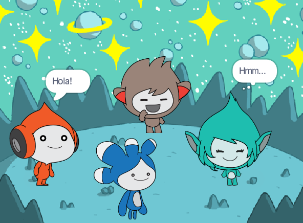

## Actualitza el teu projecte

<div style="display: flex; flex-wrap: wrap">
<div style="flex-basis: 200px; flex-grow: 1; margin-right: 15px;">
Afegiu el personatge de la **Tera** i utilitzeu qualsevol dels blocs que hàgiu après per donar vida al personatge de la **Tera**.
</div>
<div>

{:width="300px"}

</div>
</div>

També podeu utilitzar l'extensió Text a veu per fer que la **Tera** parli en veu alta:

[[[scratch3-text-to-speech]]]

La personalitat del personatge de la <0>Tera</0> ho pots triar a la teva elecció, així que diverteix-te fent servir les teves pròpies idees creatives.

```blocks3
when this sprite clicked

say [Hello!] for [2] seconds

say [Hello!]

say [] // hide speech bubble

think [Hmm...] for [2] seconds

switch costume to [tera-d v]

wait (1) seconds // 0.5 is half a second

set [color v] effect to [0] // number up to 200

clear graphic effects

play sound [pop v] until done

start sound [pop v]

speak [hello]
```

També podeu "reinventar" el projecte per fer els canvis que vulgueu. Podríeu canviar el fons i com es mouen els personatges, i fins i tot triar diferents personatges i donar-los vida.

**Consell:** Feu clic a un personatge de la llista de personatges a sota de l'escenari per canviar el codi, els vestits i el so d'aquest personatge.

--- collapse ---
---
títol: Projecte finalitzat
---

Podeu veure el projecte completat [aquí](https://scratch.mit.edu/projects/485673032/){:target="_blank"}.

--- /collapse ---

--- save ---
