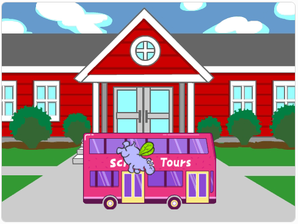

## Què ve després?

Si seguiu la ruta [Introducció a Scratch](https://projects.raspberrypi.org/ca-ES/pathways/scratch-intro), podeu passar al projecte [Agafa l'autobús](https://projects.raspberrypi.org/ca-ES/projects/catch-the-bus). En aquest projecte, codificaràs una animació amb personatges que han d'arribar a un autobús abans que surti.

--- print-only ---

--- /print-only ---

--- no-print ---

  <iframe allowtransparency="true" width="485" height="402" src="https://scratch.mit.edu/projects/embed/724160134/?autostart=false" frameborder="0"></iframe>

--- /no-print ---

Si voleu divertir-vos més explorant Scratch, podeu provar qualsevol [d'aquests projectes](https://projects.raspberrypi.org/ca-ES/projects?software%5B%5D=scratch&curriculum%5B%5D=%201).
