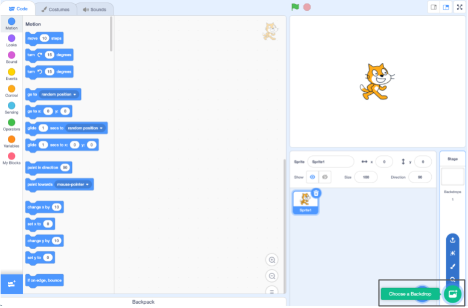
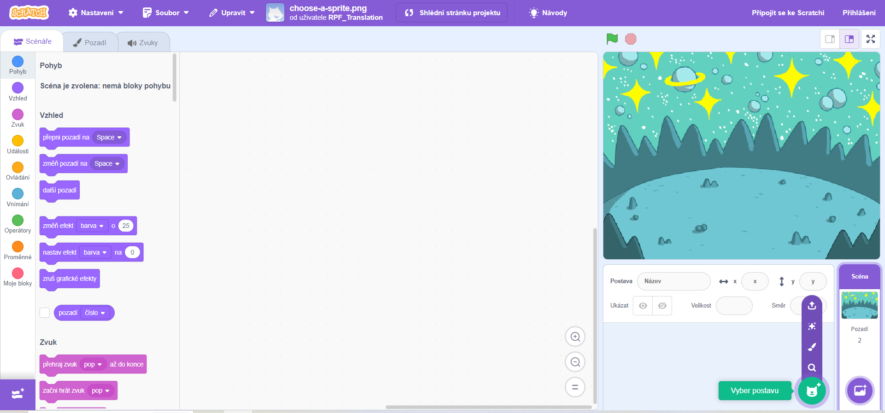

## Vytvoř si scénu

Nastav v projektu vesmírné pozadí a první postavu. 

{:width="300px"}

### Otevři úvodní projekt

--- task ---

Otevři [úvodní projekt Vesmírná řeč](https://scratch.mit.edu/projects/582213331/editor){:target="_blank"}. Scratch se otevře v nové záložce prohlížeče.

[[[working-offline]]]

--- /task ---

### Editor Scratch

### Přidej pozadí

Tvůj projekt se zobrazuje na **Scéně**. Pomocí **Pozadí** můžeš měnit vzhled Scény.

--- task ---

V panelu Scéna klikni (nebo na tabletu tapni) na **Vybrat pozadi**:

--- /task ---

--- task ---

Klikni na kategorii **Vesmír** nebo napiš do vyhledávacího políčka `space` (názvy pozadí jsou anglicky):

--- /task ---

V našem příkladu jsme si vybrali pozadí s názvem **Space**, ale můžeš si vybrat, kterékoli se ti líbí.

--- task ---

Klikni na vybrané pozadí a přidej ho do svého projektu. To by se teď mělo objevit na Scéně:

--- /task ---

### Přidej Postavu

Vidíš postavu, která už ve tvém projektu je? To je kocour Scratch.

--- task ---

Vymaž Postavu **Postava1** (kocour Scratche): vyber Postavu **Postava1** v seznamu Postav pod Scénou a klikni na ikonu **Vymazat**.

--- /task ---

--- task ---

Klikni na **Vyber postavu** v seznamu Postav:

--- /task ---

--- task ---

Vyber kategorii **Fantazie**. Klikni na postavu **Pico** a přidej ji do svého projektu.

--- /task ---

--- task ---

Vezmi postavu **Pico** a umísti ji do levé části Scény. Scéna by teď měla vypadat nějak takto:

--- /task ---

--- task ---

**Uložení**: Pokud jsi přihlášeny/á ke svému účtu ve Scratchi, klikni na zelené tlačítko Vytvoř si kopii. Tím si uložíš kopii tohoto projektu do svého účtu ve Scratchi.

Svůj projekt si pojmenuj v poli pro název projektu v horní části obrazovky.

**Tip:** Dávej projektům taková jména, abys poznal/a, o jaký projekt se jedná, až jej budeš někdy v budoucnu hledat.

Poté klikni na **Soubor** a **Uložit aktuální stav**.

Pokud nejsi online nebo nemáš ve Scratchi účet, můžeš kliknout na **Ulož do svého počítače** a svoji kopii projektu si uložit takto.

--- /task ---

