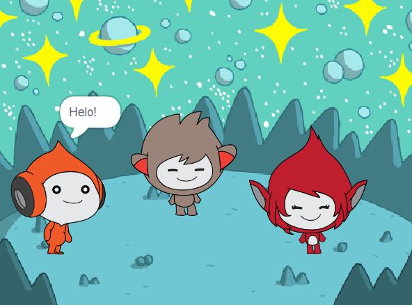

## What you will make

Yn y prosiect hwn, byddi di'n creu golygfa o’r gofod gyda chymeriadau sy’n defnyddio 'emoshluniau' i rannu eu meddyliau neu eu teimladau.

Mae **emoshluniau** yn ffordd o gyfleu personoliaeth cymeriad mewn gêm. Gallant ddefnyddio lleisiau, synau, symudiadau ac effeithiau graffeg, yn union fel yn Scratch. Wyt ti'n chwarae unrhyw gemau sy'n defnyddio emoshluniau?

Yn Scratch, gelwir cymeriadau a gwrthrychau yn **gorluniau**, ac maen nhw'n ymddangos ar y **Llwyfan**.
+ Ychwanegu corluniau a **chefnlen** i osod dy brosiect
+ Clicio ar gorluniau i wneud iddyn nhw gyfathrebu gan ddefnyddio blociau cod `Edrychiad`{:class="block3looks"} a `Sain`{:class="block3sound"}
+ Defnyddio'r **Golygydd paent** i newid **gwisg**

--- no-print --- --- task ---
### Rho gynnig arni

  
Click on each sprite to see what they do. 

What happens if you click on one sprite and then quickly click on another sprite?

  <iframe allowtransparency="true" width="485" height="402" src="https://scratch.mit.edu/projects/embed/485673032/?autostart=false" frameborder="0"></iframe>

--- /task --- --- /no-print ---

--- print-only ---

--- /print-only ---

