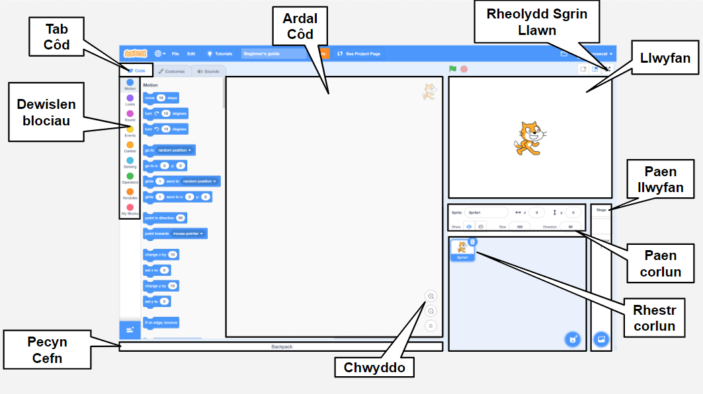
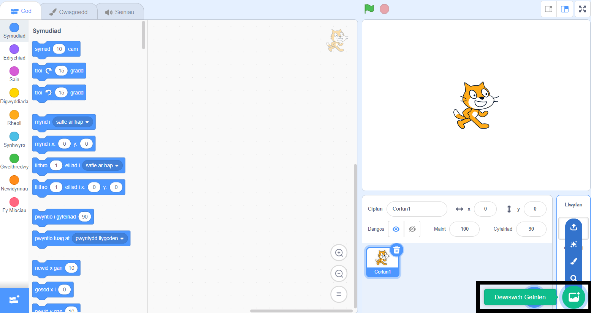
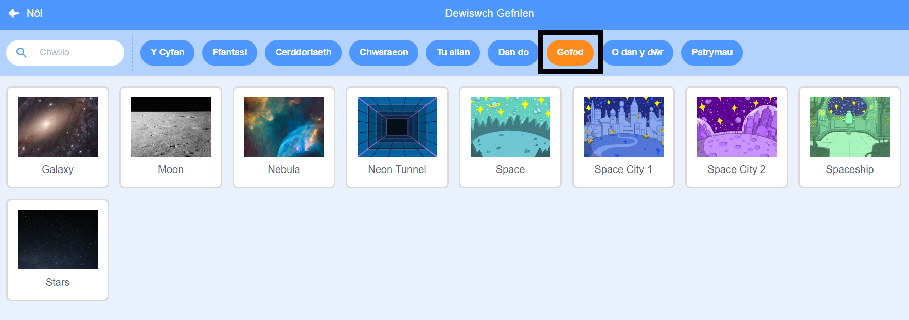
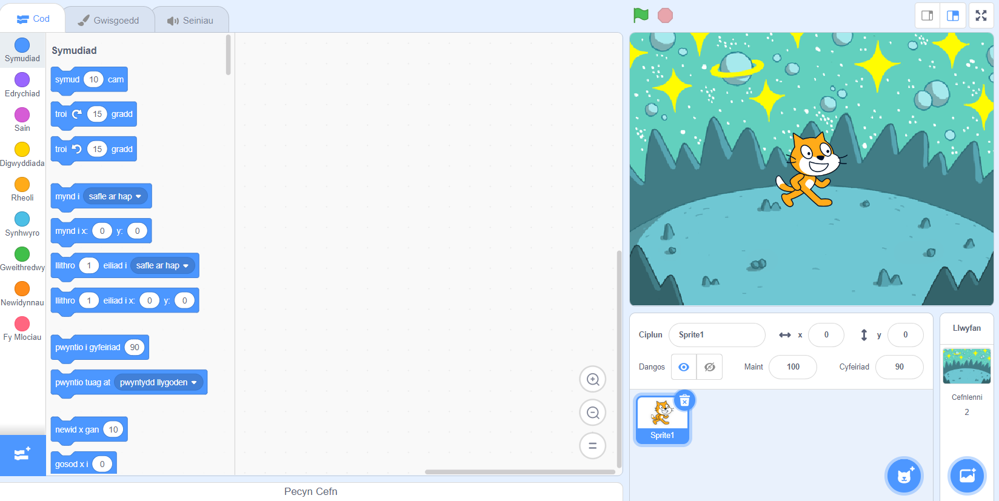
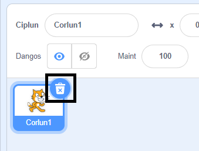
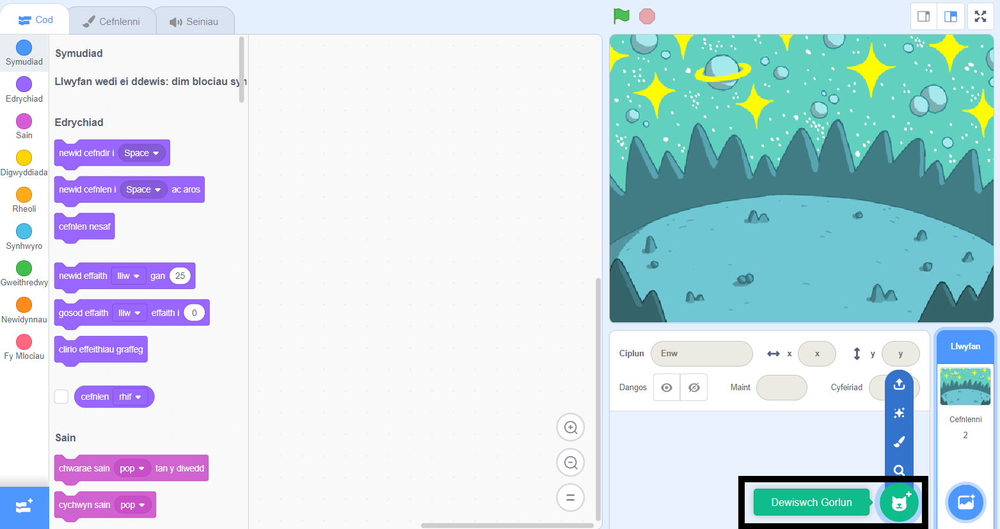
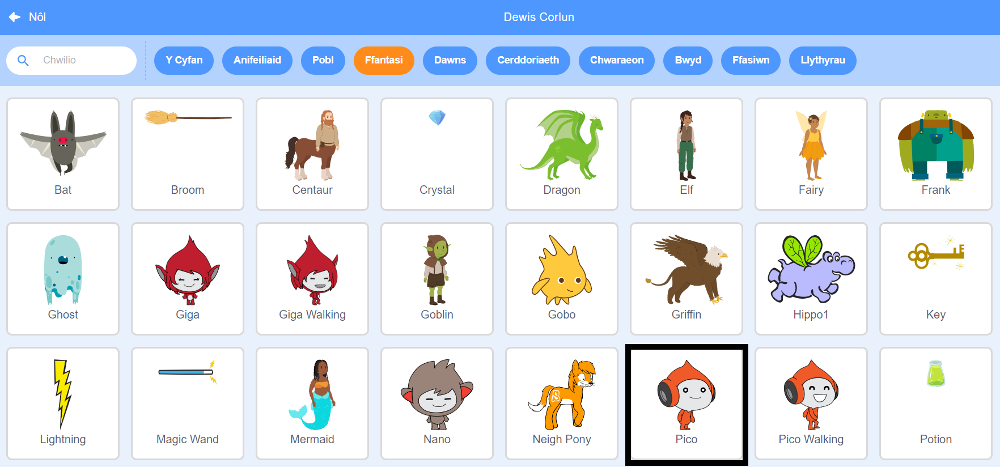
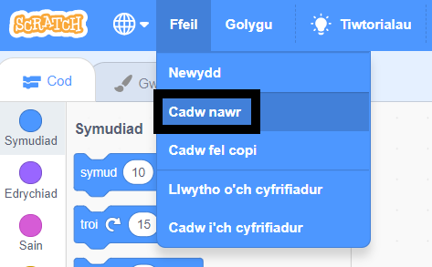

## Creu dy olygfa

Yn y cam hwn, byddi di'n gosod dy brosiect gyda chefnlen gofod a'r corlun cyntaf. 

{:width="300px"}

### Open the starter project

--- task ---

Agora'r [prosiect Sgwrs yn y Sêr](https://scratch.mit.edu/projects/582213331/editor){:target="_blank"}. Bydd Scratch yn agor mewn tab arall ar y porwr.

[[[working-offline]]]

--- /task ---

### The Scratch editor

### Add a backdrop

The **Stage** is where your project runs. A **backdrop** changes the way that the Stage looks.

--- task ---

Click (or on a tablet, tap) on **Choose a Backdrop** in the Stage pane:

--- /task ---

--- task ---

Click on the **Space** category or type `space` in the search box:

--- /task ---

In our example, we have chosen the **Space** backdrop, but choose the backdrop that you like the most.

--- task ---

Click on your chosen backdrop to add it to your project. The Stage should show the backdrop that you chose:

--- /task ---

### Add a Sprite

Can you see the sprite that is already included in your project? That is the Scratch Cat.

--- task ---

Delete the **Sprite1** (Scratch Cat) sprite: select the **Sprite1** sprite in the Sprite list below the Stage and click on the **Delete** icon.

--- /task ---

--- task ---

Click on **Choose a Sprite** in the Sprite list:

--- /task ---

--- task ---

Select the **Fantasy** category. Click on the **Pico** sprite to add them to your project.

--- /task ---

--- task ---

Drag the **Pico** sprite to position them on the left-hand side of the Stage. Your Stage should look something like this:

--- /task ---

--- task ---

**Save**: If you are signed in to your Scratch account, click on the green Remix button. This will save a copy of the project to your Scratch account.

Type the name of your project in the project name box at the top of the screen.

**Tip:** Give your projects helpful names so that you can easily find them when you have lots of projects.

**Awgrym:** Rho enwau defnyddiol i dy brosiectau fel bod modd dod o hyd iddyn nhw'n hawdd pan fydd gen ti lawer o brosiectau.

If you are not online or you do not have a Scratch account, you can click on **Save to your computer** to save a copy of your project.

--- /task ---

