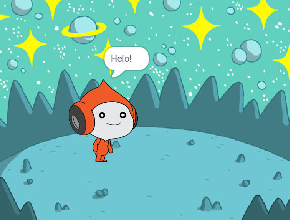
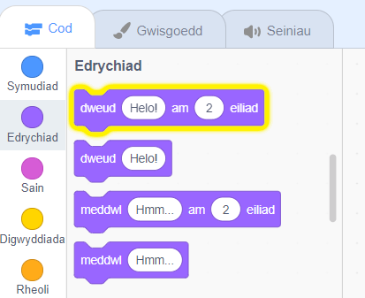
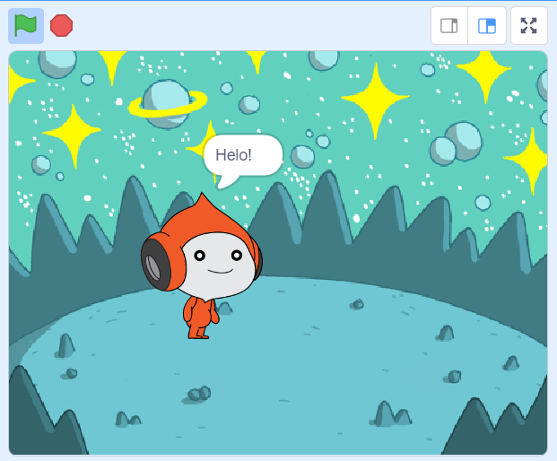
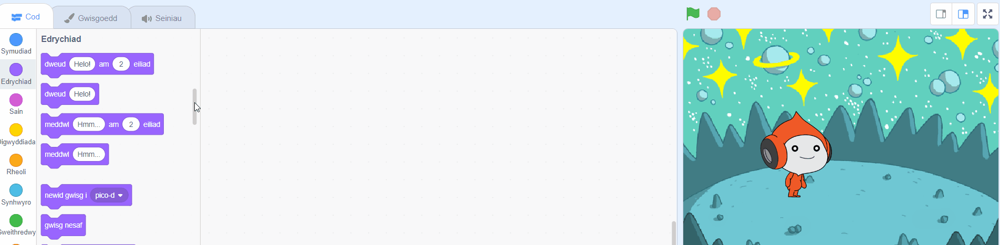
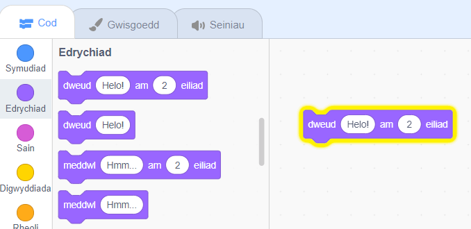
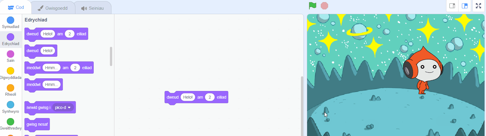
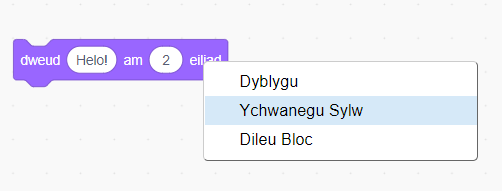

## Pico yn dweud helo

<div style="display: flex; flex-wrap: wrap">
<div style="flex-basis: 200px; flex-grow: 1; margin-right: 15px;">
Mae modd rhoi cod, gwisgoedd a seiniau i gorlun er mwyn newid y ffordd mae'n edrych a'r hyn mae'n ei wneud. 
  
Mae modd rhoi cod, gwisgoedd a seiniau i gorlun er mwyn newid y ffordd mae'n edrych a'r hyn mae'n ei wneud. 
  
Drwy ychwanegu blociau o god, bydd Pico yn ymateb gyda geiriau a seiniau wrth glicio ar y corlun.
</div>
<div>

{:width="300px"}

</div>
</div>

<p style="border-left: solid; border-width:10px; border-color: #0faeb0; background-color: aliceblue; padding: 10px;">
<span style="color: #0faeb0">**Emotes**</span> are a way of showing the personality of a character in a game. They can use speech, sounds, movement, and graphic effects, just like in Scratch. Do you play any games that use emotes?
</p>

### Use the say block

--- task ---

Agora'r ddewislen blociau `Edrychiad`{:class="block3looks"}.

Clicia ar y bloc `dweud`{:class="block3looks"} `Helo!` `am`{:class="block3looks"} `2` `eiliad`{:class="block3looks"}.



Bydd y corlun **Pico** yn agor swigen siarad am ddwy eiliad.



**Awgrym:** Mae blociau cod yn Scratch yn goleuo gydag amlinell melyn pan fyddan nhw ar waith.

--- /task ---

--- task ---

Drag the `say`{:class="block3looks"} `Hello!` `for`{:class="block3looks"} `2` `seconds`{:class="block3looks"} block to the Code area. Click on it again.





--- /task ---

### Make Pico talk when clicked (or tapped)

--- task ---

Drag a `when this sprite clicked`{:class="block3events"} block from the `Events`{:class="block3events"} blocks menu and connect it to the top of your `say`{:class="block3looks"} block in the Code area. The blocks will snap together.




```blocks3
+when this sprite clicked
say [Hello!] for [2] seconds // hide speech after 2 seconds
```

--- /task ---

### Code comments

```blocks3
say [Hello!] for [2] seconds // hide speech after 2 seconds
```
You will see comments in code examples. You don't need to add the comments when you add code to your project.

If you have time when you have finished your project, it is a good idea to add comments to your code so that it is easier to understand later. To add a comment, right-click (or on a tablet, tap and hold) on a block in the Code area and choose **Add Comment**.



### Test

--- task ---

**Test:** Click on the **Pico** sprite on the Stage and check that the speech bubble appears for two seconds. It is important to test your code to make sure that it does what you expect.

--- /task ---

--- task ---

You have already saved your project and given it a name. Scratch will now **automatically** save for you.

You can still click save if you like, just to make sure.

--- /task ---
