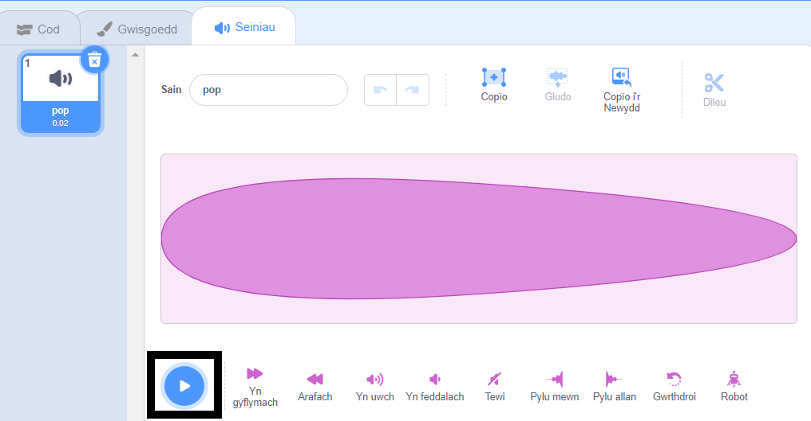
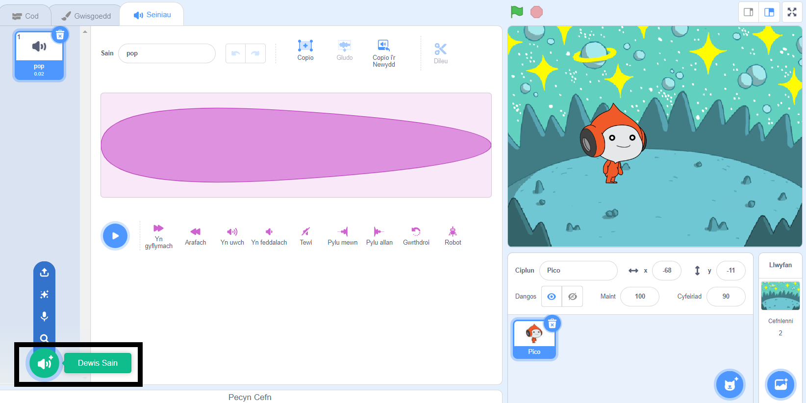
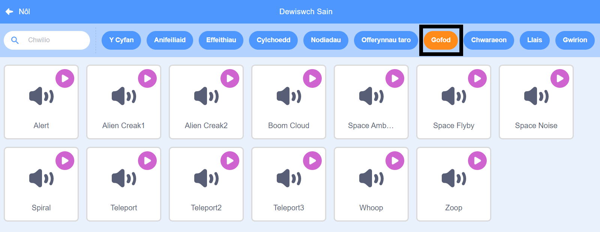
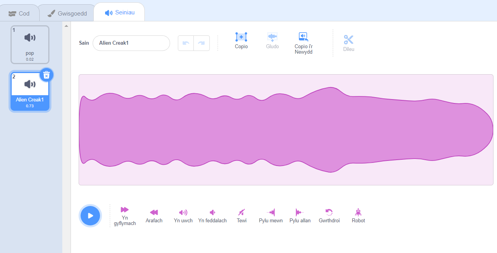
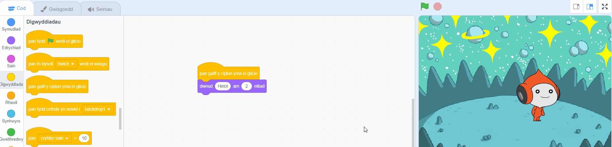
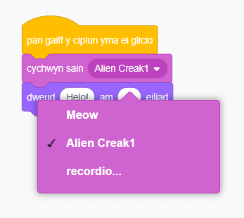

## Pico yn chwarae sain

<div style="display: flex; flex-wrap: wrap">
<div style="flex-basis: 200px; flex-grow: 1; margin-right: 15px;">
Ffordd arall o gyfathrebu yw defnyddio sain.
</div>
<div>

{:width="300px"}

</div>
</div>

--- task ---

Clicia'r tab **Seiniau** ar gyfer y corlun **Pico** ac fe weli di sain **pop**. Clicia'r eicon **Chwarae** i glywed y sain **pop**.



--- /task ---

Mae yna synau arallfydol gwych yn Scratch y gelli di eu hychwanegu at dy gorlun.

--- task ---

I ddewis sain newydd, clicia'r eicon **Dewis Sain** a dewis y categori **Gofod** neu deipio `space` yn y blwch chwilio.






--- /task ---

--- task ---

Chwaraea ychydig o seiniau gwahanol drwy ddefnyddio'r eiconau **Chwarae**. Ar ôl i ti ddod o hyd i'r sain rwyt ti am ei defnyddio, clicia arni i'w hychwanegu at dy brosiect.



--- /task ---

--- task ---

Clicia'r tab **Cod**. Yn y ddewislen blociau `Sain`{:class="block3sound"}, chwilia am y bloc `cychwyn sain`{:class="block3sound"}.

Llusga'r bloc i Ardal y Cod, rhwng y bloc `pan gaiff y corlun yma ei glicio`{:class="block3events"} a'r bloc `dweud`{:class="block3looks"}. Bydd bwlch yn agor a bydd y bloc yn snapio i'w le.



Dylai dy god edrych fel hyn:


```blocks3
when this sprite clicked
+start sound [Alien Creak1 v] 
say [Hello!] for [2] seconds // hide speech after 2 seconds
```

--- /task ---

--- task ---

Gwna'n siŵr bod dy floc `cychwyn sain`{:class="block3sound"} yn cynnwys y sain y gwnes di ei dewis. Os nad ydy dy sain yno, mae angen i ti glicio'r sain yn y bloc `cychwyn sain`{:class="block3sound"}, ac wedyn dewis y sain rwyt ti am ei gael o'r gwymplen.



--- /task ---

--- task ---

**Prawf:** Clicia'r corlun **Pico** a gwneud yn siŵr bod y swigen siarad yn ymddangos a dy fod yn gallu clywed y sain. Os nad wyt ti'n clywed y sain, gwna'n siŵr dy fod wedi ychwanegu'r bloc `cychwyn sain`{:class="block3sound"} o dan y bloc `pan gaiff y corlun yma ei glicio`{:class="block3events"}. Hefyd, gwiria fod y sain yn gweithio ar dy gyfrifiadur neu dabled.

--- /task ---

--- save ---

