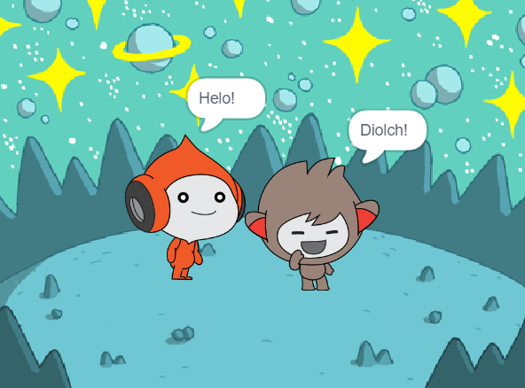
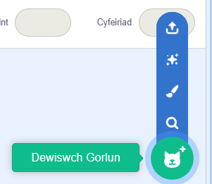
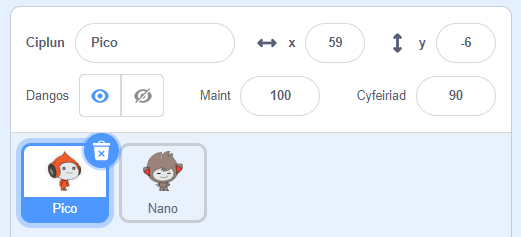
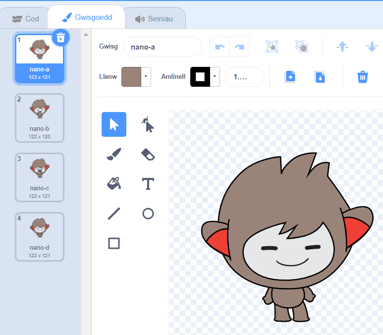
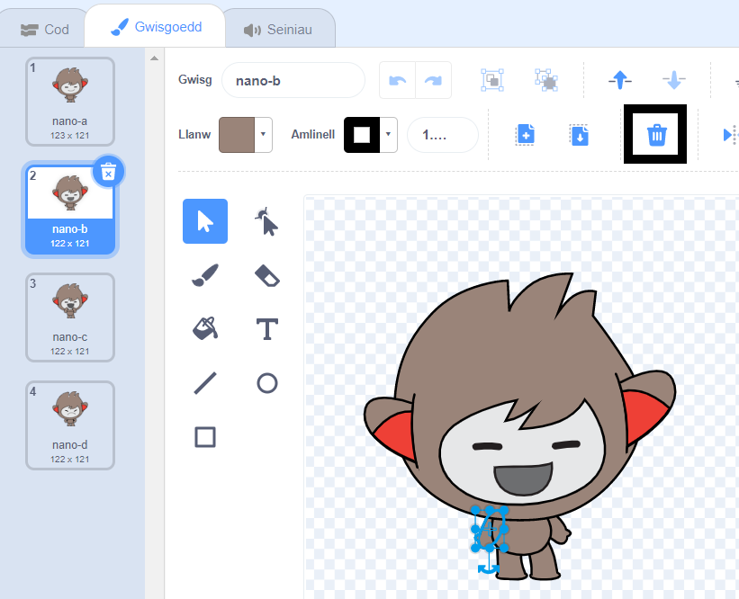
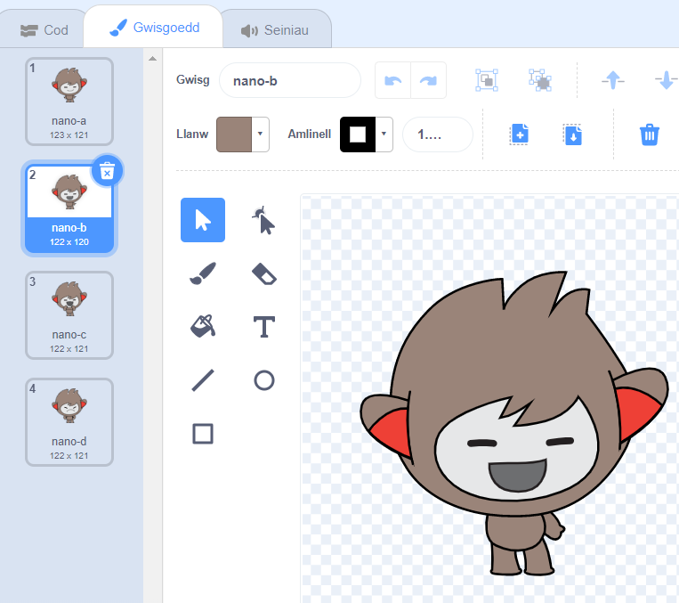
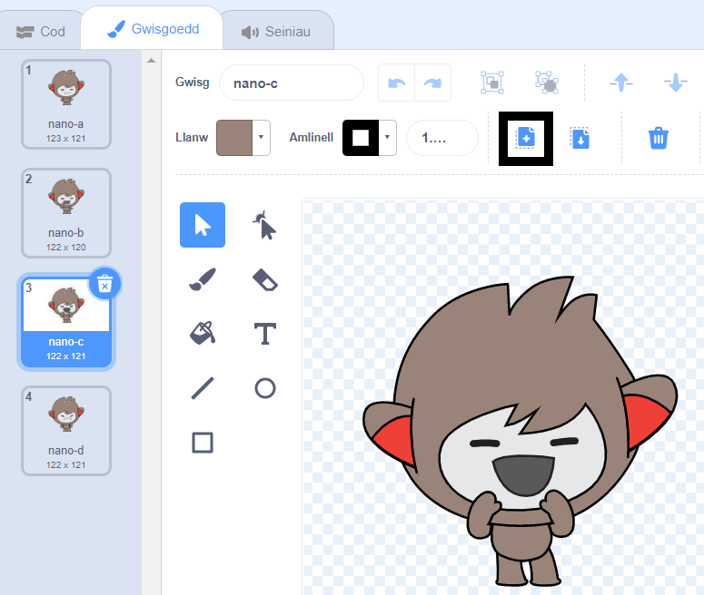
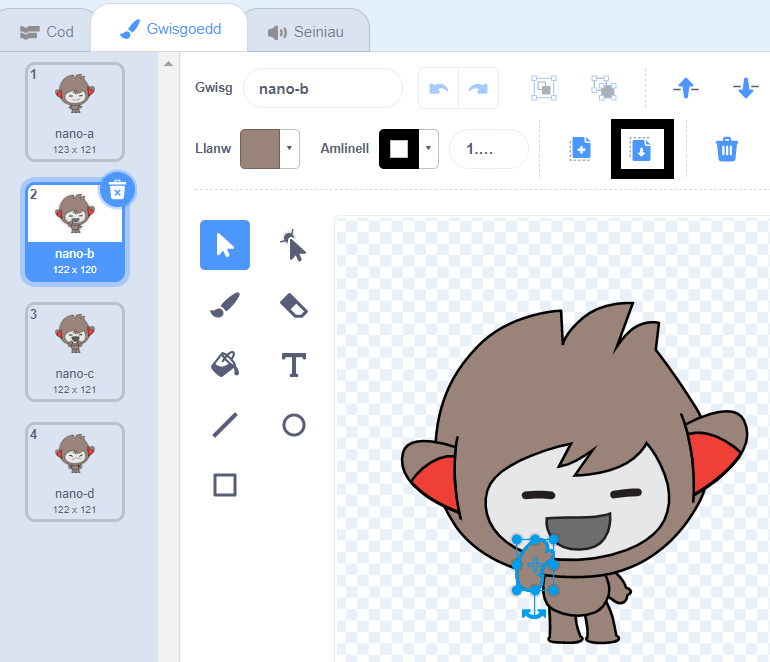

## Nano switches costume

<div style="display: flex; flex-wrap: wrap">
<div style="flex-basis: 200px; flex-grow: 1; margin-right: 15px;">

Get Nano to emote by switching **costumes**.

Mae gan gorluniau **wisgoedd** sy'n newid y ffordd maen nhw'n edrych. To animate a sprite, you can change its costume.

</div>
<div>

{:width="300px"}

</div>
</div>

### Nano signs "Thanks!"

--- task ---

Ychwanega gorlun **Nano** at dy brosiect o'r categori **Ffantasi**.



--- /task ---

--- task ---

Gwna'n siŵr dy fod wedi dewis corlun **Nano** yn rhestr y Corluniau o dan y Llwyfan.




Click on the **Code** tab and add a script to get the **Nano** sprite to sign 'Thanks' using `switch costume to`{:class="block3looks"} and `wait`{:class="block3control"}:


```blocks3
when this sprite clicked // when Nano is clicked
switch costume to [nano-b v] // Nano talking
wait (0.5) seconds // try 0.25 instead of 0.5
switch costume to [nano-a v] // Nano smiling
```
--- /task ---

**Tip:** All the blocks are colour-coded, so you will find the `switch costume to`{:class="block3looks"} block in the `Looks`{:class="block3looks"} blocks menu and the `wait`{:class="block3control"} block in the `Looks`{:class="block3control"} blocks menu.

--- task ---

**Test:** Click on the **Nano** sprite on the Stage and check that Nano's costume changes.

--- /task ---

### Nano yn defnyddio iaith arwyddion

<p style="border-left: solid; border-width:10px; border-color: #0faeb0; background-color: aliceblue; padding: 10px;">Mae miliynau o bobl yn defnyddio iaith arwyddion i gyfathrebu. A common way to sign 'Thank you' is to place your fingers on your chin with your hand as flat as possible. You then move your hand forwards, away from your chin and slightly down. 
</p>

<!-- Add a video of someone signing -->

Bydd Nano yn defnyddio iaith arwyddion drwy newid gwisgoedd.

Galli di olygu gwisgoedd dy gorluniau drwy ddefnyddio'r Golygydd paent. Byddi di'n golygu gwisg Nano er mwyn gwneud iddo arwyddo "diolch".

--- task ---

Clicia'r tab **Gwisgoedd** i weld gwisgoedd y corlun **Nano**:



--- /task ---

--- task ---

Clicia'r wisg **nano-b**. Clicia'r fraich ar yr ochr chwith, ac wedyn clicio **Dileu**.



Dylai'r wisg edrych fel hyn:



--- /task ---

**Awgrym:** Os byddi di'n gwneud camgymeriad yn y Golygydd paent, galli di glicio **Dad-wneud**.


--- task ---

Cer i'r wisg **nano-c** a chlicio'r fraich ar yr ochr chwith, ac wedyn clicio **Copïo**.



--- /task ---

--- task ---

Dos yn ôl i'r wisg **nano-b** a chlicio **Gludo**. Dylai'r wisg edrych fel hyn:



--- /task ---

--- task ---

**Prawf:** Clicia'r corlun **Nano** ar y Llwyfan a gwneud yn siŵr bod swigen siarad yn ymddangos a bod gwisg Nano yn newid i'r wisg rydych chi wedi'i golygu.

--- /task ---

<p style="border-left: solid; border-width:10px; border-color: #0faeb0; background-color: aliceblue; padding: 10px;">Rwyt ti wedi dysgu sut i arwyddo "diolch". Y tro nesaf y byddi di'n diolch i rywun, beth am ddefnyddio dy sgil newydd?
</p>

