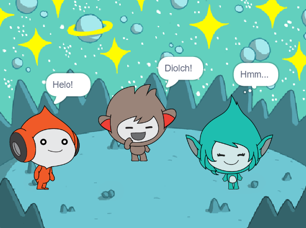

## Giga yn newid lliw

<div style="display: flex; flex-wrap: wrap">
<div style="flex-basis: 200px; flex-grow: 1; margin-right: 15px;">
Gall corluniau hefyd ddefnyddio swigod meddwl a newid eu lliw i gyfleu eu personoliaeth. Rwyt ti'n mynd i gael Giga i wneud hyn.
</div>
<div>

{:width="300px"}

</div>
</div>

### Make Giga change colour

--- task ---

Ychwanega'r corlun **Giga**.

Llusga'r corlun **Giga** i ochr dde y Llwyfan.

--- /task ---

--- task ---

Gwna'n siŵr dy fod wedi dewis y corlun **Giga** yn y rhestr o Gorluniau o dan y Llwyfan. Ychwanega'r cod yma i wneud i'r corlun **Giga** gyfathrebu drwy newid ei liw:


```blocks3
when this sprite clicked
set [color v] effect to [0] // 0 is the starting colour
think [Hmm...] for [2] seconds 
clear graphic effects // back to the starting colour
```

--- /task ---

**Awgrym:** Clicia ar y corlun yn y rhestr Corluniau o dan y Llwyfan cyn ychwanegu neu newid cod, gwisgoedd neu sain. Gwna'n siŵr dy fod di wedi clicio'r Corlun cywir.

--- task ---

Rho gynnig ar rifau gwahanol rhwng `1` a `200` yn y bloc `gosod effaith lliw i`{:class="block3looks"} hyd nes i ti weld lliw rwyt ti'n ei hoffi.

--- /task ---

--- task ---

Newidia'r geiriau a nifer yr eiliadau yn y bloc `meddwl`{:class="block3looks"}.

--- /task ---

--- task ---

**Prawf:** Clicia ar y corlun **Giga** ar y Llwyfan a gwneud yn siŵr bod y corlun yn newid ei liw ac yn dangos swigen meddwl.

--- /task ---

