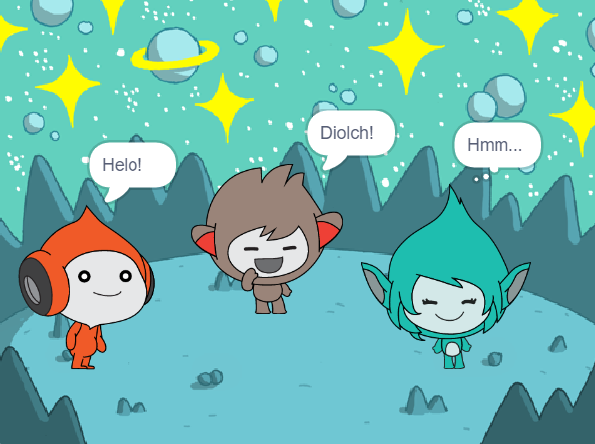

## Giga yn newid lliw

<div style="display: flex; flex-wrap: wrap">
<div style="flex-basis: 200px; flex-grow: 1; margin-right: 15px;">
Gall corluniau hefyd ddefnyddio swigod meddwl a newid eu lliw i gyfleu eu personoliaeth. Rwyt ti'n mynd i gael Giga i wneud hyn.
</div>
<div>

{:width="300px"}

</div>
</div>

> [!TASK]
>
> Ychwanega'r corlun **Giga**.
>
> Llusga'r corlun **Giga** i ochr dde y Llwyfan.

> [!TASK]
>
> Gwna'n siŵr dy fod wedi dewis y corlun **Giga** yn y rhestr o Gorluniau o dan y Llwyfan. Ychwanega'r cod yma i wneud i'r corlun **Giga** gyfathrebu drwy newid ei liw:
>
> 
>
> ```blocks3
> when this sprite clicked
> set [color v] effect to [0] // 0 yw'r lliw cychwynnol
> think [Hmm...] for [2] seconds
> clear graphic effects // mynd yn ôl i'r lliw cychwyn
> ```

**Awgrym:** Clicia ar y corlun yn y rhestr Corluniau o dan y Llwyfan cyn ychwanegu neu newid cod, gwisgoedd neu sain. Gwna'n siŵr dy fod di wedi clicio'r Corlun cywir.

> [!TASK]
>
> Rho gynnig ar rifau gwahanol rhwng `1` a `200` yn y bloc `gosod effaith lliw i`{:class="block3looks"} hyd nes i ti weld lliw rwyt ti'n ei hoffi.

> [!TASK]
>
> Newidia'r geiriau a nifer yr eiliadau yn y bloc `meddwl`{:class="block3looks"}.

> [!TASK]
>
> **Prawf:** Clicia ar y corlun **Giga** ar y Llwyfan a gwneud yn siŵr bod y corlun yn newid ei liw ac yn dangos swigen meddwl.

> [!SAVE]
