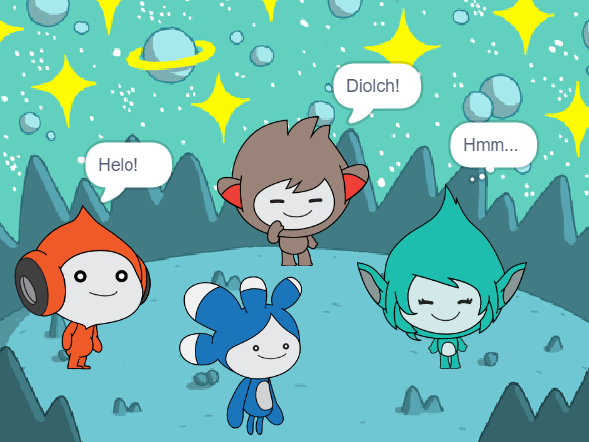

## Uwchraddio dy brosiect

<div style="display: flex; flex-wrap: wrap">
<div style="flex-basis: 200px; flex-grow: 1; margin-right: 15px;">
Ychwanega'r corlun **Tera** a defnyddio unrhyw un o'r blociau rwyt ti wedi dysgu amdanyn nhw i greu 'emoshlun' ar gyfer y corlun **Tera**.
</div>
<div>

{:width="300px"}

</div>
</div>

Dy ddewis di yw personoliaeth y corlun **Tera**, felly beth am gael hwyl wrth ddefnyddio dy syniadau creadigol dy hun.

```blocks3
when this sprite clicked

say [Hello!] for [2] seconds

say [Hello!]

say [] // hide speech bubble

think [Hmm...] for [2] seconds

switch costume to [tera-d v]

set [color v] effect to [0] // number up to 200

clear graphic effects

play sound [pop v] until done

start sound [pop v]
```

Galli di hefyd 'ailgymysgu' y prosiect i wneud unrhyw newidiadau hoffet ti. Gelli di newid y gefnlen, emoshluniau'r corluniau, a hyd yn oed dewis corluniau gwahanol a rhoi emoshluniau iddyn nhw.

**Awgrym:** Clicia gorlun yn rhestr y Corluniau sydd o dan y Llwyfan i newid cod, gwisgoedd a sain y corlun hwnnw.

--- collapse ---
---
title: Tystysgrif Sgwrs yn y Sêr
---

Da iawn! Rwyt ti wedi cwblhau'r prosiect Sgwrs yn y Sêr. Dyma [dystysgrif](https://drive.google.com/file/d/18xx4uNIyRSty_2ujHkGDzGwTgfSGC1AF/view?usp=sharing){:target="_blank"} i ddathlu dy sgiliau newydd. Llwytha gopi i lawr a'i agor i ychwanegu dy enw.

--- /collapse ---

--- collapse ---
---
teitl: Prosiect gorffenedig
---

Galli di weld y [prosiect wedi'i gwblhau yma](https://scratch.mit.edu/projects/485673032/){:target="_blank"}.

--- /collapse ---

--- save ---
