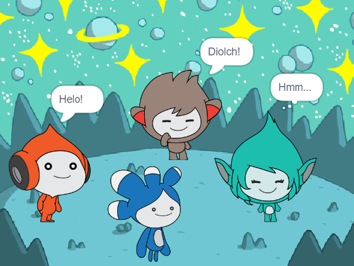

## Beth nesaf?

<div style="display: flex; flex-wrap: wrap">
<div style="flex-basis: 200px; flex-grow: 1; margin-right: 15px;">
Add the **Tera** sprite and use any of the blocks that you have learned about to make an 'emote' for the **Tera** sprite.
</div>
<div>

{:width="300px"}

</div>
</div>

Os wyt ti'n dilyn y llwybr [Cyflwyniad i Scratch](https://projects.raspberrypi.org/cy-GB/pathways/scratch-intro), gallet ti symud ymlaen i'r prosiect [Dal y bws](https://projects.raspberrypi.org/cy-GB/projects/catch-the-bus). Yn y prosiect yma, byddi di'n codio animeiddiad gyda chorluniau sy'n ceisio dal bws cyn iddo adael.

[[[scratch3-text-to-speech]]]

The **Tera** sprite's personality is your choice, so have fun using your own creative ideas.

```blocks3
when this sprite clicked

say [Hello!] for [2] seconds

say [Hello!]

say [] // hide speech bubble

think [Hmm...] for [2] seconds

switch costume to [tera-d v]

wait (1) seconds // 0.5 is half a second

set [color v] effect to [0] // number up to 200

clear graphic effects

play sound [pop v] until done

start sound [pop v]

speak [hello]
```

You can also 'remix' the project to make any changes you like. You could change the backdrop, and how the sprites emote, and even choose different sprites and give them emotes.

--- no-print ---

--- collapse ---
---
title: Completed project
---

Os wyt ti am gael mwy o hwyl wrth ddysgu Scratch, gallet ti roi cynnig ar unrhyw un o'r [prosiectau hyn](https://projects.raspberrypi.org/cy-GB/projects?software%5B%5D=scratch&curriculum%5B%5D=%201).

--- /collapse ---

--- save ---
