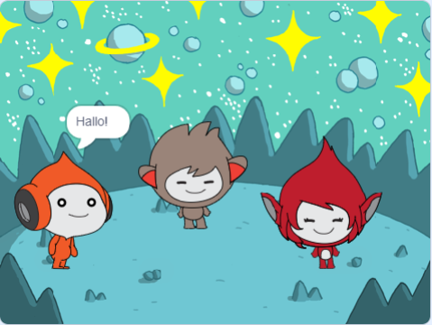

## Das wirst Du machen

Erstelle eine Weltraumszene mit Charakteren 👾, die „Emotionen“ zeigen, um ihre Gedanken oder Gefühle mitzuteilen.

In Scratch werden Charaktere und Objekte **Figuren** genannt und erscheinen auf der **Bühne**.

Du wirst:
+ Figuren und einen **Hintergrund** hinzufügen, um dein Projekt einzurichten
+ Figuren anklicken, um sie mithilfe der Codeblöcke `Looks`{:class="block3looks"} und `Sound`{:class="block3sound"} kommunizieren zu lassen
+ Den **Mal-Editor** verwenden, um ein **Kostüm** zu ändern

--- no-print --- --- task ---
### Spielen ▶️

  
Klicke auf jede Figur, um zu sehen, was sie tut. 

Was passiert, wenn Du auf eine Figur klickst und dann schnell auf ein andere Figur klickst?

  <iframe allowtransparency="true" width="485" height="402" src="https://scratch.mit.edu/projects/embed/485673032/?autostart=false" frameborder="0"></iframe>

--- /task --- --- /no-print ---

--- print-only ---

--- /print-only ---

