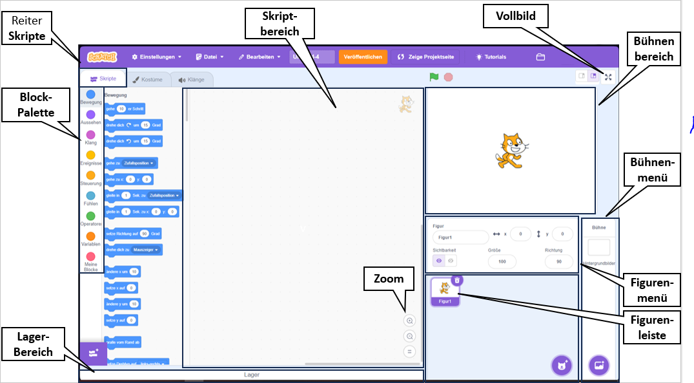
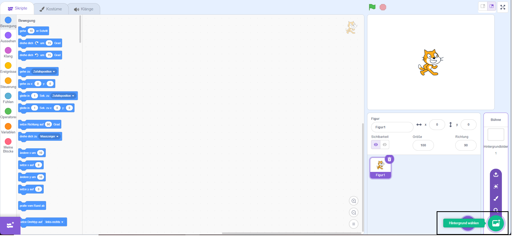
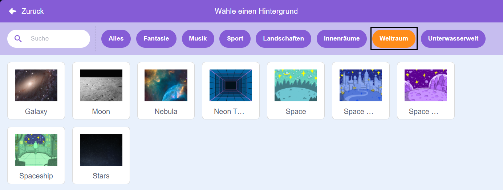
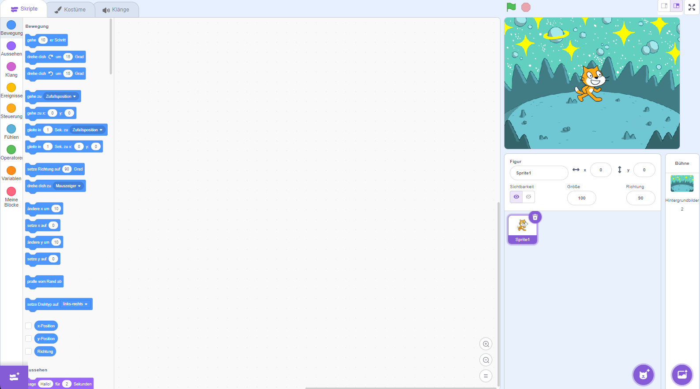
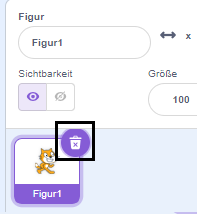
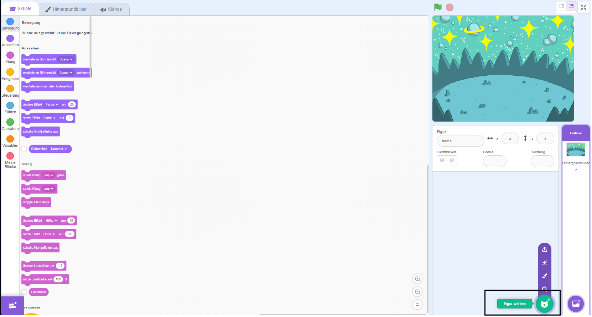
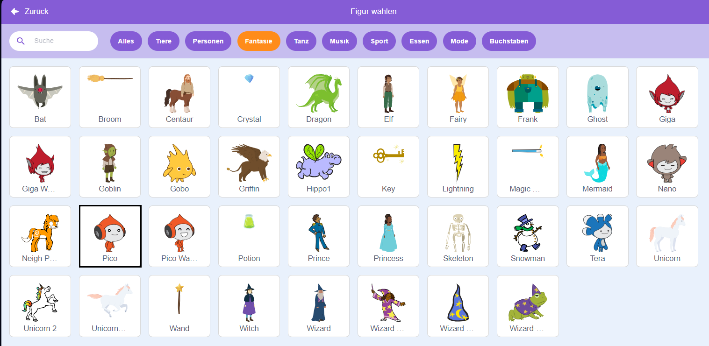
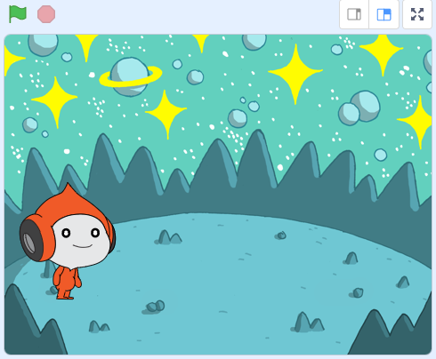
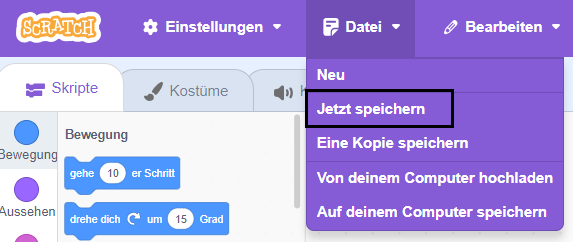

## Erstelle deine Szene

Richte dein Projekt mit einem Weltraumhintergrund und der ersten Figur ein. 

{:width="300px"}

### Öffne das Starterprojekt

--- task ---

Öffne das [Weltraumgespräch Starter-Projekt](https://scratch.mit.edu/projects/582213331/editor){:target="_blank"}. Scratch wird in einem anderen Tab im Browser geöffnet.

[[[working-offline]]]

--- /task ---

### Der Scratch-Editor

### Ein Hintergrundbild hinzufügen

Auf der **Bühne** wird dein Projekt ausgeführt. Ein **Hintergrund** ändert das Aussehen der Bühne.

--- task ---

Klicke (oder tippe auf einem Tablet) im Bühnenbereich auf **Hintergrund wählen**:

--- /task ---

--- task ---

Klicke auf die Kategorie **Weltraum** oder gib `Space` in das Suchfeld ein:

--- /task ---

In unserem Beispiel haben wir den Hintergrund **Space** gewählt, aber wähle den Hintergrund aus, der dir am besten gefällt.

--- task ---

Klicke auf den ausgewählten Hintergrund, um ihn deinem Projekt hinzuzufügen. Auf der Bühne sollte der von dir gewählte Hintergrund angezeigt werden:

--- /task ---

### Eine Figur hinzufügen

Kannst du die Figur sehen, die bereits in deinem Projekt enthalten ist? Das ist die Scratch Katze.

--- task ---

Lösche die Figur **Figur1** (Scratch Katze): Wähle die Figur **Figur1** in der Figuren-Liste unter der Bühne und klicke auf das **Löschen**-Symbol.

--- /task ---

--- task ---

Klicke auf **Figur wählen** in der Figuren-Liste:

--- /task ---

--- task ---

Wähle die Kategorie **Fantasie**. Klicke auf die **Pico**-Figur um sie zu deinem Projekt hinzuzufügen.

--- /task ---

--- task ---

Ziehe die **Pico** -Figur, um sie auf der linken Seite der Bühne zu positionieren. Deine Bühne sollte ungefähr so aussehen:

--- /task ---

--- task ---

**Speichern**: Wenn du bei deinem Scratch-Konto angemeldet bist, klicke auf die grüne Remix-Schaltfläche. Dadurch wird eine Kopie des Projekts in deinem Scratch-Konto gespeichert.

Gib den Namen deines Projekts in das Projektnamensfeld oben auf dem Bildschirm ein.

**Tipp:** Gib deinen Projekten aussagekräftige Namen, damit du sie leicht finden kannst, wenn du viele Projekte hast.

Um dein Projekt zu speichern, klickst du auf **Datei** und dann auf **Jetzt speichern**.

Wenn du nicht online bist oder kein Scratch-Konto hast, kannst du auf **„Auf deinem Computer speichern“** klicken, um eine Kopie deines Projekts zu speichern.

--- /task ---

