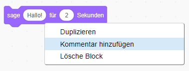

## Pico sagt "Hallo"

<div style="display: flex; flex-wrap: wrap">
<div style="flex-basis: 200px; flex-grow: 1; margin-right: 15px;">
Eine Figur kann Skripte, Kostüme und Klänge haben, um die Art wie es aussieht und was es tut zu ändern. 
  
Füge Codeblöcke hinzu, damit Pico Wörter und Töne ausgibt, wenn auf die Figur geklickt wird.
</div>
<div>

{:width="300px"}

</div>
</div>

<p style="border-left: solid; border-width:10px; border-color: #0faeb0; background-color: aliceblue; padding: 10px;">
<span style="color: #0faeb0">**Emotes**</span> sind eine Möglichkeit, die Persönlichkeit eines Charakters in einem Spiel zu zeigen. Sie können Sprache, Geräusche, Bewegungen und grafische Effekte verwenden, genau wie in Scratch. Spielst du Spiele, bei denen Emotes verwendet werden?
</p>

### Verwende den Sage-Block

--- task ---

Öffne das Blockmenü `Aussehen`{:class="block3looks"}.

Klicke auf einen `Sage`{:class="block3looks"} `Hallo!` `für`{:class="block3looks"} `2` `Sekunden`{:class="block3looks"} Block.


Die **Pico**-Figur wird für 2 Sekunden eine Sprechblase anzeigen.


**Tipp:** Codeblöcke in Scratch leuchten mit einer gelben Umrandung, wenn sie ausgeführt werden.

--- /task ---

--- task ---

Ziehe den `Sage`{:class="block3looks"} `Hallo!` `für`{:class="block3looks"} `2` `Sekunden`{:class="block3looks"} Block in den Skriptbereich. Klicke erneut darauf.


--- /task ---

### Lass Pico sprechen, wenn er angeklickt (oder angetippt) wird

--- task ---

Ziehe einen Block `Wenn diese Figur angeklickt wird`{:class="block3events"} aus dem Menü `Ereignisse`{:class="block3events"} und verbinde ihn oben mit dem `sage`{:class="block3looks"}-Block im Skriptbereich. Die Blöcke werden zusammenschnappen.


```blocks3
+when this sprite clicked
say [Hello!] for [2] seconds // hide speech after 2 seconds
```

--- /task ---

### Codekommentare

--- task ---

```blocks3
say [Hello!] for [2] seconds // hide speech after 2 seconds
```
Du wirst Kommentare in Codebeispielen sehen. Du musst keine Kommentare hinzufügen, wenn du deinem Projekt Code hinzufügst.

Wenn du nach Abschluss deines Projekts noch Zeit hast, ist es eine gute Idee, Kommentare zu deinem Code hinzuzufügen, damit er später leichter zu verstehen ist. Try adding a comment now. Right-click (or on a tablet, tap and hold) on a block in the Code area and choose **Add Comment**.



--- /task ---

### Test

--- task ---

**Test:** Klicke auf der Bühne auf die **Pico**-Figur und prüfe, ob die Sprechblase zwei Sekunden lang angezeigt wird. Es ist wichtig, deinen Code zu testen, um sicherzustellen, dass er das tut, was du erwartest.

--- /task ---

--- task ---

Du hast dein Projekt bereits gespeichert und ihm einen Namen gegeben. Scratch speichert jetzt **automatisch** für dich.

Du kannst zur Sicherheit immer noch auf Speichern klicken.

--- /task ---
