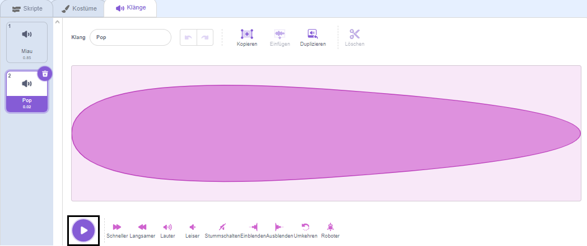
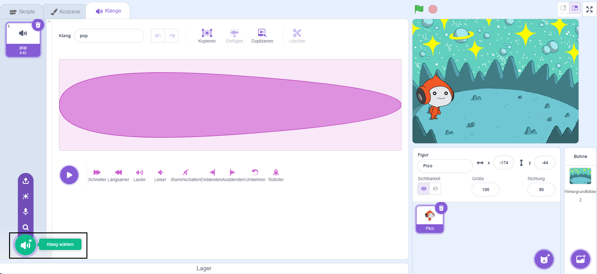
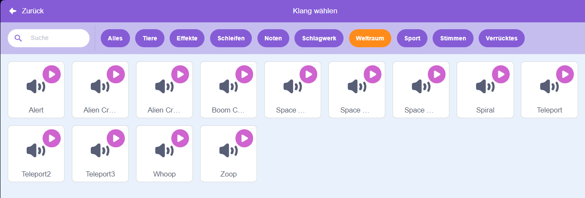
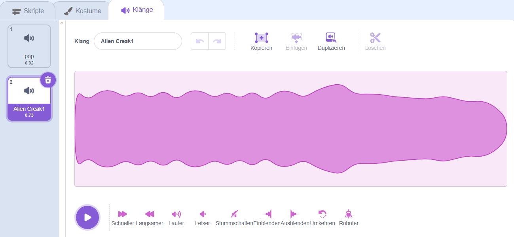
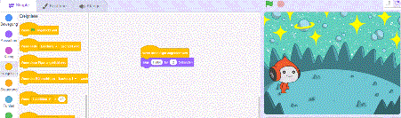
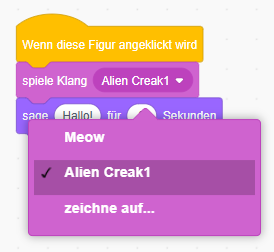

## Pico spielt einen Klang

<div style="display: flex; flex-wrap: wrap">
<div style="flex-basis: 200px; flex-grow: 1; margin-right: 15px;">
Eine andere Möglichkeit zur Kommunikation ist die Verwendung von Ton.
</div>
<div>

{:width="300px"}

</div>
</div>

### Einen Klang zur Pico-Figur hinzufügen

--- task ---

Klicke auf den Reiter **Klang** für die **Pico**-Figur und du wirst einen **pop**-Sound finden. Klicke auf das **Abspielen**-Symbol um den **pop**-Klang zu hören.



**Debuggen**: Wenn du keinen Klang hören kannst, prüfe ob der Ton auf deinem Computer oder Tablet funktioniert.

--- /task ---

--- task ---

Um einen neuen Klang auszuwählen, klicke auf das **Klang wählen**-Symbol und wähle die Kategorie **Weltraum** oder tippe `Weltraum` in die Suchleiste.






--- /task ---

--- task ---

Spiele ein paar verschiedene Klänge in dem du das **Abspielen**-Symbol benutzt. Sobald du den Klang gefunden hast, den du nutzen möchtest, klicke darauf und füge ihn deinem Projekt hinzu.



--- /task ---

### Den Klang abspielen, wenn angeklickt (oder angetippt)

--- task ---

Klicke auf den Reiter **Skripte**. Im `Klang`{:class="block3sound"} Blockmenü findest du den `Spiele Klang`{:class="block3sound"}-Block.

Ziehe den Block in den Skriptbereich zwischen den `Wenn diese Figur angeklickt wird`{:class="block3events"} Block und den `sage`{:class="block3looks"}-Block. Eine Lücke wird sich öffnen und der Block wird an den Platz einschnappen.



Dein Code sollte wie folgt aussehen:


```blocks3
when this sprite clicked
+start sound [Alien Creak1 v] 
say [Hello!] for [2] seconds // hide speech after 2 seconds
```

--- /task ---

### Teste deinen Code

--- task ---

Prüfe ob dein `Spiele Klang`{:class="block3sound"} -Block den korrekten Klang ausgewählt hat. Falls nicht, klicke auf den Klang in dem `Spiele Klang`{:class="block3sound"}-Block und wähle deinen gewählten Klang in dem Dropdown-Menü.



--- /task ---

--- task ---

**Test:** Klicke auf die **Pico**-Figur und prüfe, ob die Sprechblase erscheint und der Klang zu hören ist. Wenn du den Klang nicht hören kannst, stell sicher, dass du den `Spiele Klang`{:class="block3sound"}-Block unter den `Wenn diese Figur angeklickt wird`{:class="block3events"}-Block.

--- /task ---

