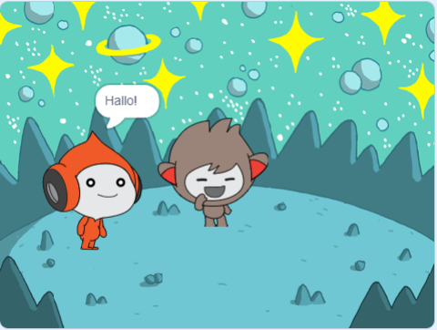
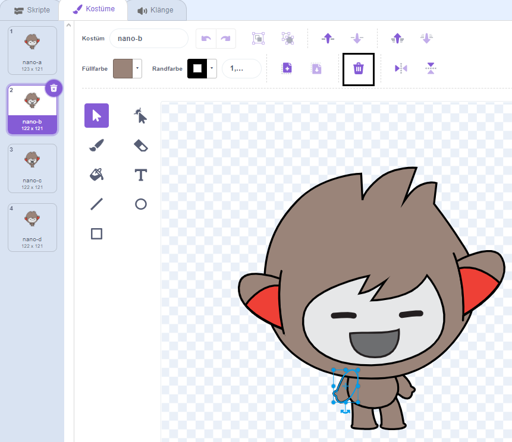
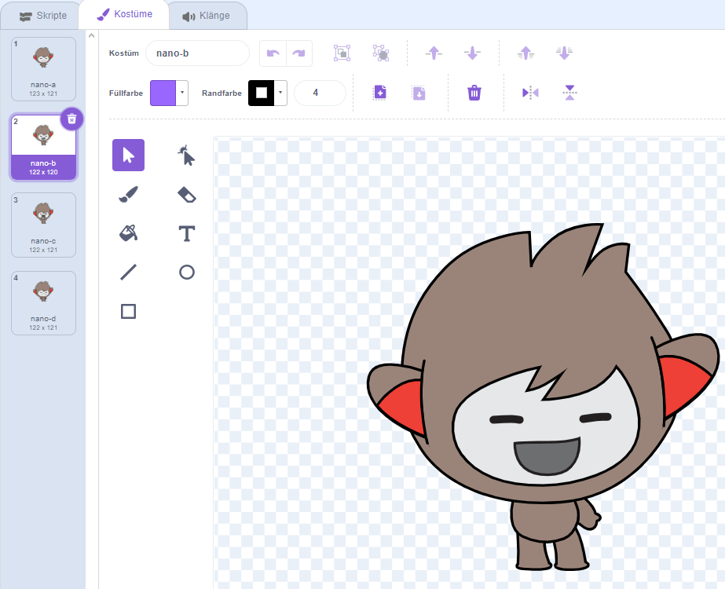
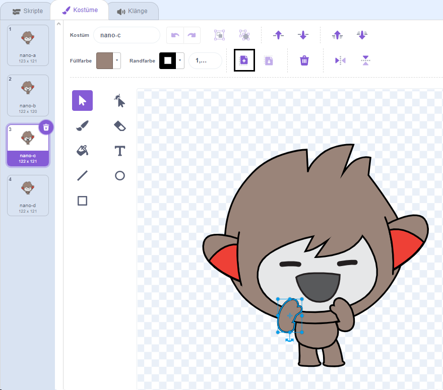
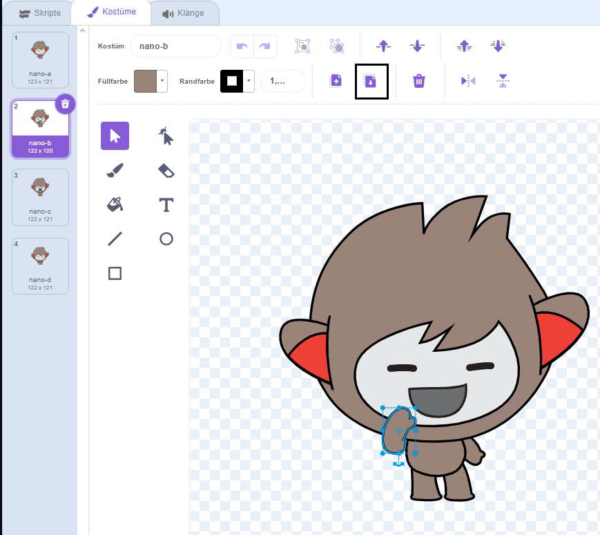

## Nano wechselt die Kostüme

<div style="display: flex; flex-wrap: wrap">
<div style="flex-basis: 200px; flex-grow: 1; margin-right: 15px;">

Bringe Nano dazu, Emotionen zu zeigen, indem er das **Kostüm** wechselt.

Figuren haben **Kostüme** um ihr Aussehen zu ändern. They are usually slightly different images of the same sprite. Um eine Figur zu animieren, kannst du ihr Kostüm ändern.

</div>
<div>

{:width="300px"}

</div>
</div>

### Nano sagt "Danke!"

--- task ---

Füge die **Nano**-Figur aus der Kategorie **Fantasie** zu deinem Projekt hinzu.


--- /task ---

--- task ---

Stelle sicher, dass die **Nano**-Figur ausgewählt ist in der Figurenliste unter der Bühne.


Click on the **Code** tab and add a script to get the **Nano** sprite to sign 'Thanks' using `switch costume to`{:class="block3looks"} and `wait`{:class="block3control"}. Use the drop down menu to switch between `nano-b`{:class="block3looks"} and `nano-a`{:class="block3looks"}:


```blocks3
when this sprite clicked // when Nano is clicked
switch costume to [nano-b v] // Nano talking
wait (0.5) seconds // try 0.25 instead of 0.5
switch costume to [nano-a v] // Nano smiling
```
--- /task ---

**Tipp:** Alle Blöcke sind farbcodiert. Du findest den Block `wechseln zu Kostüm`{:class="block3looks"} im Reiter `Aussehen`{:class="block3looks"} und den Block `warte`{:class="block3control"} Reiter `Steuerung`{:class="block3control"}.

--- task ---

**Test:** Klicke auf der Bühne auf die **Nano**-Figur und überprüfe, ob Nanos Kostüm wechselt.

--- /task ---

### Nano verwendet Gebärdensprache

<p style="border-left: solid; border-width:10px; border-color: #0faeb0; background-color: aliceblue; padding: 10px;">Millionen von Menschen nutzen Gebärdensprache zur Kommunikation. Ein typischer Weg um 'Danke' zu sagen ist es, die Finger mit möglichst flacher Hand auf dein Kinn zu legen. Dann bewegst du die Hand vorwärts, weg von deinem Kinn und leicht nach unten. 
</p>

<!-- Add a video of someone signing -->

Nano wird Gebärdensprache nutzen in dem er Kostüme wechselt.

Du kannst die Kostüme für deine Figuren ändern mit dem Paint Editor. Du wirst ein Kostüm von Nano ändern um ihn "Danke" sagen zu lassen.

--- task ---

Klicke auf den Reiter **Kostüme** um die Kostüme für die **Nano**-Figur zu sehen:


--- /task ---

--- task ---

Klicke auf das **nano-b**-Kostüm. Klicke auf den Arm auf der linken Seite und dann klicke auf **Löschen**.



Das Kostüm sollte wie folgt aussehen:



--- /task ---

**Tipp:** Sollte dir im Paint-Editor ein Fehler unterlaufen, kannst du auf **Rückgängig**klicken.


--- task ---

Gehe zum **nano-c** -Kostüm und klicke auf den Arm auf der linken Seite. Klicken Sie dann auf **Kopieren**.



--- /task ---

--- task ---

Geh zurück zum **nano-b**-Kostüm und klicke auf **Einfügen**. Das Kostüm sollte wie folgt aussehen:



--- /task ---

--- task ---

**Test:** Click on the **Nano** sprite on the Stage and check that Nano's costume changes to the costume that you have edited.

--- /task ---

<p style="border-left: solid; border-width:10px; border-color: #0faeb0; background-color: aliceblue; padding: 10px;">Du hast gelernt, "danke" in Gebärdensprache zu sagen. Das nächste Mal, wenn du dich bei jemandem bedankst, nutze doch deine neue Fähigkeit.
</p>

