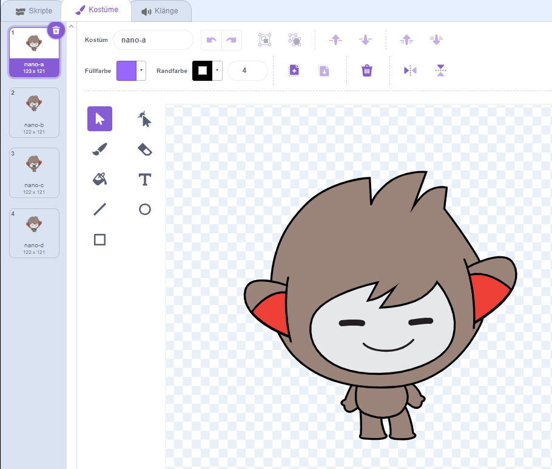

## Nano wechselt die Kostüme

<div style="display: flex; flex-wrap: wrap">
<div style="flex-basis: 200px; flex-grow: 1; margin-right: 15px;">

Bringe Nano dazu, Emotionen zu zeigen, indem er das **Kostüm** wechselt.

Figuren haben **Kostüme** um ihr Aussehen zu ändern. Normalerweise handelt es sich dabei um leicht unterschiedliche Bilder derselben Figur. Um eine Figur zu animieren, kannst du ihr Kostüm ändern.

</div>
<div>

{:width="300px"}

</div>
</div>

### Nano sagt "Danke!"

--- task ---

Füge die **Nano**-Figur aus der Kategorie **Fantasie** zu deinem Projekt hinzu.


--- /task ---

--- task ---

Stelle sicher, dass die **Nano**-Figur in der Figurenliste unter der Bühne ausgewählt ist.


Klicke auf den Reiter**Skripte** und füge ein Skript hinzu, damit die **Nano**-Figur 'Danke' sagt, indem du `wechsle zu Kostüm`{:class="block3looks"} `warte`{:class="block3control"} nutzt. Verwende das Dropdown-Menü, um zwischen `nano-b`{:class="block3looks"} und `nano-a`{:class="block3looks"} zu wechseln:


```blocks3
when this sprite clicked // when Nano is clicked
switch costume to [nano-b v] // Nano talking
wait (0.5) seconds // try 0.25 instead of 0.5
switch costume to [nano-a v] // Nano smiling
```
--- /task ---

**Tipp:** Alle Blöcke sind farbcodiert. Du findest den Block `wechseln zu Kostüm`{:class="block3looks"} im Reiter `Aussehen`{:class="block3looks"} und den Block `warte`{:class="block3control"} Reiter `Steuerung`{:class="block3control"}.

--- task ---

**Test:** Klicke auf der Bühne auf die **Nano**-Figur und überprüfe, ob Nanos Kostüm wechselt.

--- /task ---

### Nano verwendet Gebärdensprache

<p style="border-left: solid; border-width:10px; border-color: #0faeb0; background-color: aliceblue; padding: 10px;">Millionen von Menschen nutzen Gebärdensprache zur Kommunikation. Ein typischer Weg, um 'Danke' zu sagen ist, deine Finger mit möglichst flacher Hand auf dein Kinn zu legen. Dann bewegst du die Hand vorwärts, weg von deinem Kinn und leicht nach unten. 
</p>

<!-- Add a video of someone signing -->

Nano wird Gebärdensprache nutzen, indem er seine Kostüme wechselt.

Du kannst die Kostüme für deine Figuren mit dem Paint-Editor ändern. Du wirst ein Kostüm von Nano ändern um ihn "Danke" zeigen zu lassen.

--- task ---

Klicke auf den Reiter **Kostüme** um die Kostüme für die **Nano**-Figur zu sehen:



--- /task ---

--- task ---

Klicke auf das **nano-b**-Kostüm. Klicke auf den Arm auf der linken Seite und dann klicke auf **Löschen**.


Das Kostüm sollte wie folgt aussehen:


--- /task ---

**Tipp:** Sollte dir im Paint-Editor ein Fehler unterlaufen, kannst du auf **Rückgängig**klicken.


--- task ---

Gehe zum **nano-c** -Kostüm und klicke auf den Arm auf der linken Seite. Klicke dann auf **Kopieren**.


--- /task ---

--- task ---

Geh zurück zum **nano-b**-Kostüm und klicke auf **Einfügen**. Das Kostüm sollte wie folgt aussehen:


--- /task ---

--- task ---

**Test:** Klicke auf der Bühne auf die **Nano**-Figur und prüfe, ob die Sprechblase erscheint und Nanos Kostüm sich in das von dir gewünschte Kostüm ändert.

--- /task ---

<p style="border-left: solid; border-width:10px; border-color: #0faeb0; background-color: aliceblue; padding: 10px;">Du hast gelernt, "danke" in Gebärdensprache zu sagen. Das nächste Mal, wenn du dich bei jemandem bedankst, nutze doch deine neue Fähigkeit.
</p>

