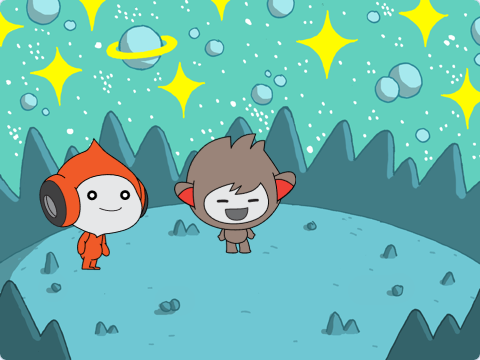
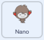

## Nano wechselt die Kostüme

<div style="display: flex; flex-wrap: wrap">
<div style="flex-basis: 200px; flex-grow: 1; margin-right: 15px;">

Bringe Nano dazu, Emotionen zu zeigen, indem er das **Kostüm** wechselt.

Figuren haben **Kostüme** um ihr Aussehen zu ändern. Normalerweise handelt es sich dabei um leicht unterschiedliche Bilder derselben Figur. Um eine Figur zu animieren, kannst du ihr Kostüm ändern.

</div>
<div>

{:width="300px"}

</div>
</div>

--- task ---

Füge die **Nano**-Figur aus der Kategorie **Fantasie** zu deinem Projekt hinzu.


--- /task ---

--- task ---

Stelle sicher, dass die **Nano**-Figur in der Figurenliste unter der Bühne ausgewählt ist.


Klicke auf den Reiter**Skripte** und füge ein Skript hinzu, damit die **Nano**-Figur 'Danke' sagt, indem du `wechsle zu Kostüm`{:class="block3looks"} `warte`{:class="block3control"} nutzt. Verwende das Dropdown-Menü, um zwischen `nano-b`{:class="block3looks"} und `nano-a`{:class="block3looks"} zu wechseln:



```blocks3
when this sprite clicked // wenn Nano angeklickt wird
switch costume to [nano-b v] // Nano redet
wait (0.5) seconds // versuche 0,25 statt 0,5
switch costume to [nano-a v] // Nano lächelt
```
--- /task ---

**Tipp:** Alle Blöcke sind farbcodiert. Du findest den Block `wechseln zu Kostüm`{:class="block3looks"} im Reiter `Aussehen`{:class="block3looks"} und den Block `warte`{:class="block3control"} Reiter `Steuerung`{:class="block3control"}.

--- task ---

**Test:** Klicke auf der Bühne auf die **Nano**-Figur und überprüfe, ob Nanos Kostüm wechselt.

--- /task ---
