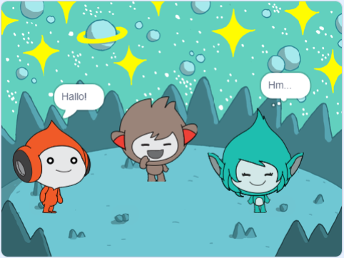

## Giga ändert die Farbe

<div style="display: flex; flex-wrap: wrap">
<div style="flex-basis: 200px; flex-grow: 1; margin-right: 15px;">
Figuren können auch Denkblasen verwenden und ihre Farbe ändern, um ihre Persönlichkeit zu zeigen. Du wirst Giga dazu bringen dies zu tun.
</div>
<div>

{:width="300px"}

</div>
</div>

### Giga ändert die Farbe

--- task ---

Füge die **Giga**-Figur hinzu.

Ziehe die **Giga**-Figur auf die rechte Seite der Bühne.

--- /task ---

--- task ---

Stelle sich, dass du die **Giga**-Figur in der Figurenliste unter der Bühne ausgewählt hast. Füge diesen Code zur **Giga**-Figur hinzu um sie über Farbänderungen kommunizieren zu lassen:


```blocks3
when this sprite clicked
set [color v] effect to [0] // 0 is the starting colour
think [Hmm...] for [2] seconds 
clear graphic effects // back to the starting colour
```

--- /task ---

**Tipp:** Klicke auf die Figur in der Figuren-Liste unter der Bühne, bevor du Code, Kostüme oder Klänge hinzufügst oder änderst. Stelle sicher, dass du auf die richtige Figur geklickt hast.

--- task ---

Probiere verschiedene Zahlen von `1` bis `200` im Block `setze Effekt Farbe auf`{:class="block3looks"} aus, bis du eine Farbe findest, die dir gefällt.

--- /task ---

--- task ---

Ändere die Wörter und Anzahl der Sekunden im `denke`{:class="block3looks"}-Block.

--- /task ---

--- task ---

**Test:** Klicke auf der Bühne auf die **Giga**-Figur und prüfe, ob die Figur die Farbe ändert und eine Gedankenblase anzeigt.

--- /task ---

