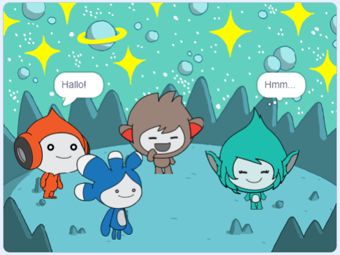

## Verbessere dein Projekt

<div style="display: flex; flex-wrap: wrap">
<div style="flex-basis: 200px; flex-grow: 1; margin-right: 15px;">
Füge die **Tera**-Figur hinzu und verwende einen der Blöcke, die du kennengelernt hast, um ein 'Emote' für die **Tera**-Figur zu erstellen.
</div>
<div>

{:width="300px"}

</div>
</div>

Du kannst auch die Text-zu-Sprache-Erweiterung verwenden, um **Tera** laut sprechen zu lassen:

[[[scratch3-text-to-speech]]]

Die Persönlichkeit **Tera**-Figur kannst du wählen, also hab Spaß beim Umsetzen deiner eigenen kreativen Ideen.

```blocks3
when this sprite clicked

say [Hallo!] for [2] seconds

say [Hallo!]

say [] // Sprechblase ausblenden

think [Hmm...] for [2] seconds

switch costume to [tera-d v]

wait (1) seconds // 0,5 ist eine halbe Sekunde

set [Farbe v] effect to [0] // Zahl bis 200

clear graphic effects

play sound [pop v] until done

start sound [pop v]

speak [hallo]
```

Du kannst das Projekt auch 'remixen', um die gewünschten Änderungen vorzunehmen. Du könntest den Hintergrund und die Art und Weise ändern, wie die Figuren Gefühle zeigen, und den verschiedene Figuren unterschiedliche Gefühle geben.

**Tipp:** Klicke auf eine Figur in der Figuren-Liste unter der Bühne, um den Code, die Kostüme und den Klang für diese Figur zu ändern.

--- collapse ---
---
title: Abgeschlossenes Projekt
---

Du findest das [abgeschlossene Projekt hier](https://scratch.mit.edu/projects/1081644565/){:target="_blank"}.

--- /collapse ---

--- save ---
