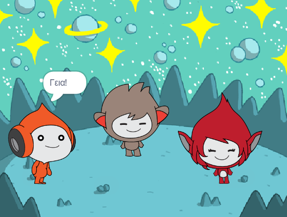

## Εισαγωγή

Σε αυτό το έργο, θα δημιουργήσεις μια διαστημική σκηνή με χαρακτήρες που «εκφράζονται» για να μοιραστούν τις σκέψεις ή τα συναισθήματά τους.

** Εκφράσεις ** είναι ένας τρόπος εμφάνισης της προσωπικότητας ενός χαρακτήρα σε ένα παιχνίδι. Μπορούν να χρησιμοποιήσουν ομιλία, ήχους, κίνηση και γραφικά εφέ, όπως ακριβώς και στο Scratch. Παίζεις παιχνίδια που χρησιμοποιούν εκφράσεις;

Στο Scratch, οι χαρακτήρες και τα πράγματα ονομάζονται **αντικείμενα** (sprites) και εμφανίζονται στην **Σκηνή**.

Θα χρειαστεί να:
+ Προσθέσεις αντικείμενα και ένα **υπόβαθρο** για να ρυθμίσεις το έργο σου
+ Κάνεις κλικ στα αντικείμενα για να τα κάνεις να επικοινωνούν χρησιμοποιώντας μπλοκ κώδικα `Όψεων`{:class="block3looks"} και `Ήχου`{:class="block3sound"}
+ Χρησιμοποιήσεις τον **Επεξεργαστή Ζωγραφική** για να αλλάξεις μια **ενδυμασία**

--- no-print --- --- task ---
### Δοκίμασέ το

  
Κάνε κλικ σε κάθε αντικείμενο για να δεις τι κάνει. 

Τι συμβαίνει εάν κάνεις κλικ σε ένα αντικείμενο και μετά κάνεις γρήγορα κλικ σε ένα άλλο αντικείμενο;

  <iframe allowtransparency="true" width="485" height="402" src="https://scratch.mit.edu/projects/embed/485673032/?autostart=false" frameborder="0"></iframe>

--- /task --- --- /no-print ---

--- print-only ---

--- /print-only ---

