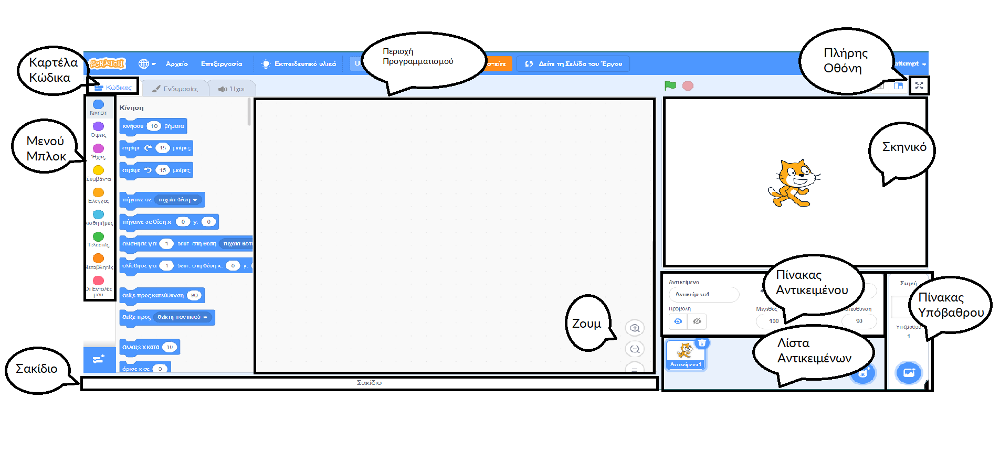
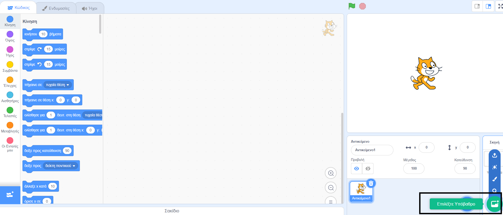
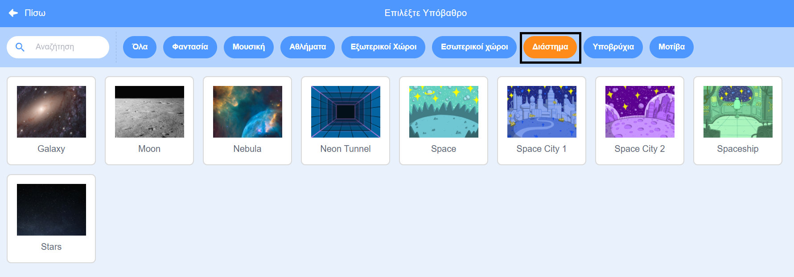
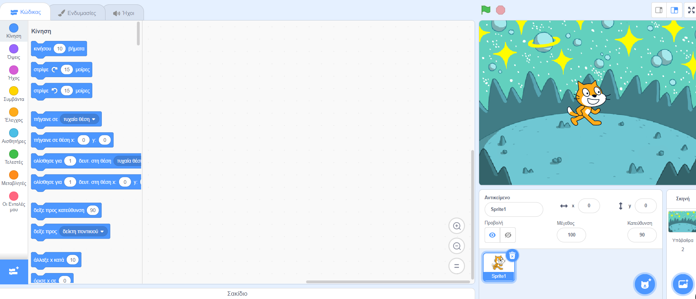
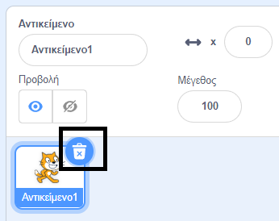
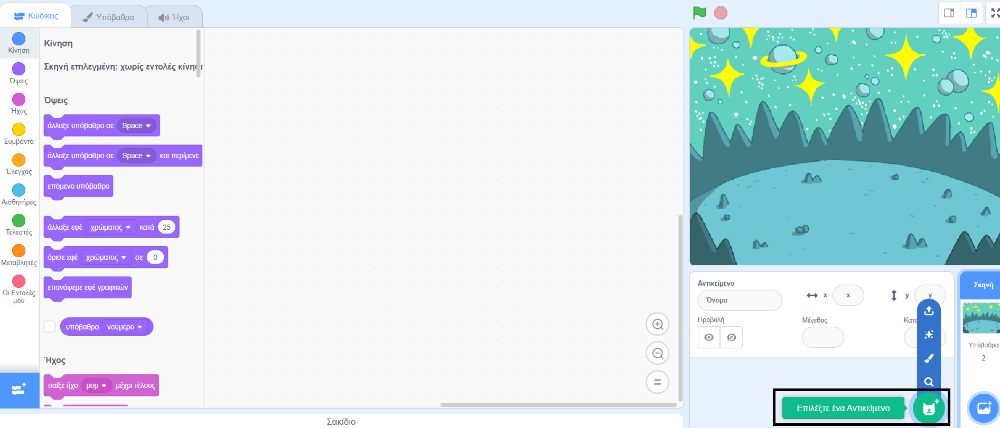
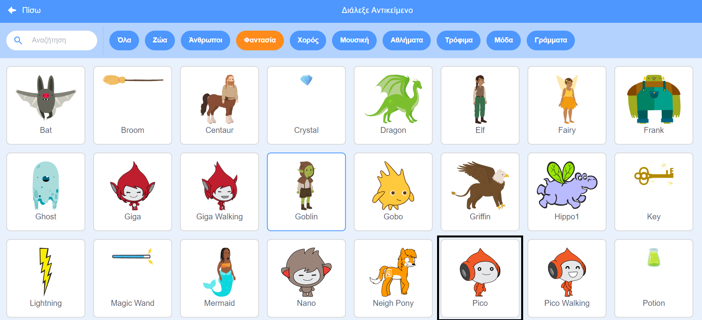
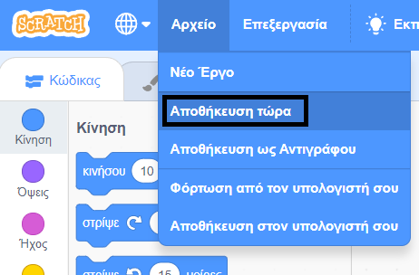

## Δημιούργησε την σκηνή σου

Σε αυτό το βήμα, θα ρυθμίσεις το έργο σου με ένα υπόβαθρο και το πρώτο αντικείμενο. 

{:width="300px"}

--- task ---

Ανοίξτε [το αρχικό έργο Ομιλία στο διάστημα](https://scratch.mit.edu/projects/582213331/editor){:target="_blank"}. Το Scratch θα ανοίξει σε νέα καρτέλα του φυλλομετρητή.

[[[working-offline]]]

--- /task ---

Ο επεξεργαστής Scratch μοιάζει έτσι:

Η **Σκηνή** είναι εκεί όπου εκτελείται το έργο σου. Το **υπόβαθρο** αλλάζει τον τρόπο με τον οποίο φαίνεται η Σκηνή.

--- task ---

Κάνε κλικ (ή σε tablet, πάτησε) στο **Επιλογή φόντου** στο παράθυρο Σκηνή:

--- /task ---

--- task ---

Κάνε κλικ στην κατηγορία **Διάστημα** ή εισάγετε την λέξη `space` στο πλαίσιο αναζήτησης:

--- /task ---

Στο παράδειγμά μας, έχουμε επιλέξει το υπόβαθρο **Space**, αλλά εσύ επίλεξε το υπόβαθρο που σου αρέσει περισσότερο.

--- task ---

Κάνε κλικ στο επιλεγμένο υπόβαθρο για να το προσθέσεις στο έργο σου. Η σκηνή πρέπει να δείχνει το υπόβαθρο που επέλεξες:

--- /task ---

Μπορείς να δεις το αντικείμενο που περιλαμβάνεται ήδη στο έργο σου; Αυτό είναι η Γάτα του Scratch.

--- task ---

Διάγραψε το αντικείμενο **Αντικείμενο1** (Γάτα του Scratch): επίλεξε το αντικείμενο **Αντικείμενο1** στη λίστα Αντικειμένων κάτω από την Σκηνή και κάνε κλικ στο εικονίδιο **Διαγραφή**.

--- /task ---

--- task ---

Κάνε κλικ στο **Επιλέξτε ένα Αντικείμενο** για να ανοίξεις τη Λίστα Αντικειμένων:

--- /task ---

--- task ---

Επίλεξε την κατηγορία **Φαντασία**. Κάνε κλικ στο αντικείμενο **Pico** για να το προσθέσεις στο έργο σου.

--- /task ---

--- task ---

Σύρε το αντικείμενο **Pico** για να το τοποθετήσεις στην αριστερή πλευρά της Σκηνής. Η Σκηνή σου θα πρέπει να μοιάζει κάπως έτσι:

--- /task ---

--- task ---

Εάν είσαι συνδεδεμένος στον λογαριασμό σου στο Scratch, κάνε κλικ στο πράσινο κουμπί Ανάμειξη. Αυτό θα αποθηκεύσει ένα αντίγραφο του έργου στον λογαριασμό σου στο Scratch.

Πληκτρολόγησε το όνομα του έργου σου στο πλαίσιο ονόματος έργου στο επάνω μέρος της οθόνης.

**Συμβουλή:** Δώσε στα έργα σου βοηθητικά ονόματα, ώστε να μπορείς εύκολα να τα βρεις όταν έχεις πολλά έργα.

Στη συνέχεια, κάνε κλικ στο **Αρχείο**, και στη συνέχεια στο **Αποθήκευση τώρα** για να αποθηκεύσεις το έργο σου.

Εάν δεν είσαι συνδεδεμένος ή δεν έχεις λογαριασμό στο Scratch, μπορείς να κάνεις κλικ στο **Αποθήκευση στον υπολογιστή σου** για να αποθηκεύσεις ένα αντίγραφο του έργου σου.

--- /task ---

