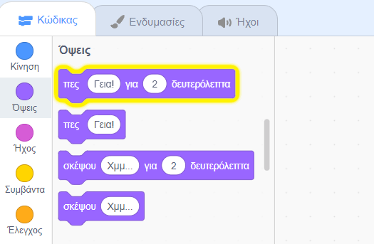
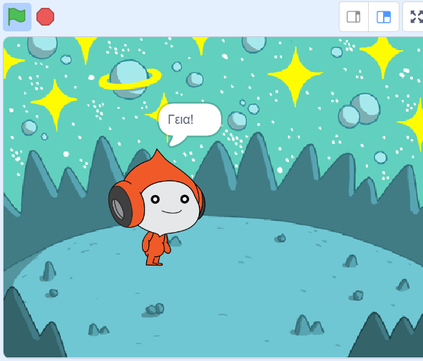
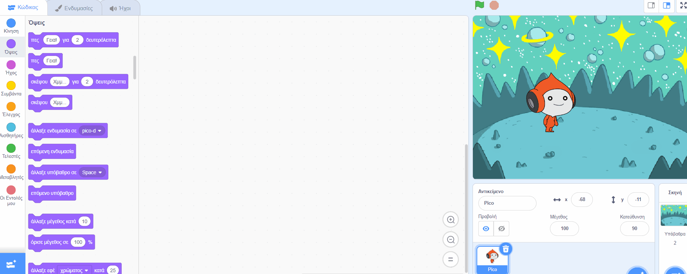
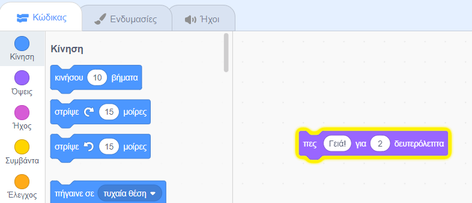
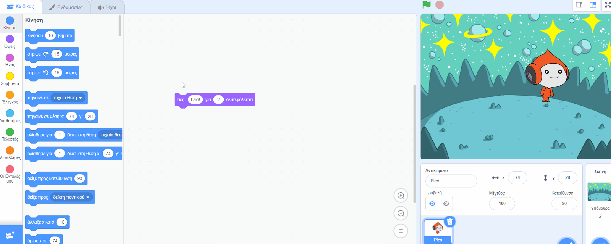
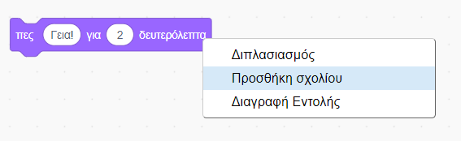

## Ο Pico λέει γεια

<div style="display: flex; flex-wrap: wrap">
<div style="flex-basis: 200px; flex-grow: 1; margin-right: 15px;">
Ένα αντικείμενο μπορεί να έχει κώδικα, ενδυμασίες και ήχους ανάλογα πώς μοιάζει και τι κάνει. 
  
Θα προσθέσεις μπλοκ κώδικα για να κάνεις τον Pico να εκφράζεται με λέξεις και ήχο όταν γίνεται κλικ στο αντικείμενο.
</div>
<div>

! [Το αντικείμενο Pico λέει, «Γεια!».](images/pico-step2.png){:width="300px"}

</div>
</div>

Για να χρησιμοποιήσεις τα μπλοκ, μπορείς να κάνεις κλικ σε αυτά στο μενού Μπλοκ.

--- task ---

Ανοίξτε το μενού μπλοκ `Όψεις`{:class="block3looks"}.

Κάνε κλικ στο μπλοκ `πες`{:class="block3looks"} `Γεια!` `για`{:class="block3looks"} `2` `δευτερόλεπτα`{:class="block3looks"}.



Το αντικείμενο **Pico** θα εμφανίσει ένα συννεφάκι ομιλίας για δύο δευτερόλεπτα.



**Συμβουλή:** Τα μπλοκ κώδικα στο Scratch λάμπουν με κίτρινο περίγραμμα όταν εκτελούνται.

--- /task ---

Μπορείς να σύρεις μπλοκ στην περιοχή Κώδικας και από εκεί μπορούν να χρησιμοποιηθούν.

--- task ---

Σύρε το μπλοκ `πες`{:class="block3looks"} `Γεια!` `για`{:class="block3looks"} `2` `δευτερόλεπτα`{:class="block3looks"} στην περιοχή Κώδικας. Κάνε κλικ σε αυτό ξανά.





--- /task ---

Τα μπλοκ μπορούν να συνδεθούν μαζί στην περιοχή Κώδικας για να εκτελούνται περισσότερα από ένα κάθε φορά. Τα συνδεδεμένα μπλοκ θα εκτελούνται με τη σειρά από πάνω προς τα κάτω.

--- task ---

Σύρε ένα μπλοκ `όταν γίνει κλικ σε αυτό το αντικείμενο`{:class="block3events"} από το μενού `Συμβάντα`{:class="block3events"} και σύνδεσέ το στην κορυφή των μπλοκ `πες`{:class="block3looks"} στην περιοχή Κώδικα. Τα μπλοκ θα κουμπώσουν μεταξύ τους.




```blocks3
+when this sprite clicked
say [Hello!] for [2] seconds // hide speech after 2 seconds
```

--- /task ---

Ένα σχόλιο είναι μια εξήγηση του τι κάνει ο κώδικάς σου.

```blocks3
say [Hello!] for [2] seconds // hide speech after 2 seconds
```
Θα δεις σχόλια σε παραδείγματα κώδικα. Δεν χρειάζεται να προσθέσεις τα σχόλια όταν προσθέτεις κώδικα στο έργο σου.

Εάν έχεις χρόνο όταν ολοκληρώσεις το έργο σου, είναι καλή ιδέα να προσθέσεις σχόλια στον κώδικά σου, ώστε να είναι πιο κατανοητός αργότερα. Για να προσθέσεις ένα σχόλιο, κάντε δεξί κλικ (ή σε tablet, πατήστε παρατεταμένα) σε ένα μπλοκ στην περιοχή Κώδικα και επίλεξε **Προσθήκη σχολίου**.



--- task ---

**Δοκιμή:** Κάνε κλικ στο αντικείμενο **Pico** στη Σκηνή και έλεγξε ότι το συννεφάκι ομιλίας εμφανίζεται για δύο δευτερόλεπτα. Είναι σημαντικό να δοκιμάσεις τον κώδικά σου για να βεβαιωθείς ότι κάνει αυτό που περιμένεις.

--- /task ---

--- save ---
