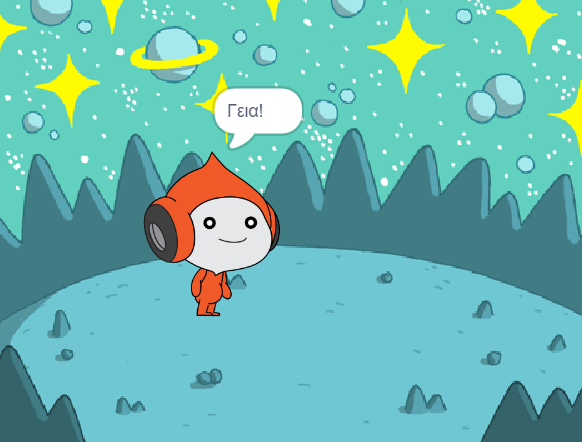

## Ο Pico λέει γεια

<div style="display: flex; flex-wrap: wrap">
<div style="flex-basis: 200px; flex-grow: 1; margin-right: 15px;">
Ένα αντικείμενο μπορεί να έχει κώδικα, ενδυμασίες και ήχους ανάλογα πώς μοιάζει και τι κάνει. 
  
Πρόσθεσε μπλοκ κώδικα για να κάνεις τον Pico να εκφράζει συναισθήματα με λέξεις και ήχο όταν γίνεται κλικ στο αντικείμενο.
</div>
<div>

{:width="300px"}

</div>
</div>

<p style="border-left: solid; border-width:10px; border-color: #0faeb0; background-color: aliceblue; padding: 10px;">
<span style="color: #0faeb0">**Εκφράσεις συναισθημάτων**</span> είναι ένας τρόπος εμφάνισης της προσωπικότητας ενός χαρακτήρα σε ένα παιχνίδι. Μπορούν να χρησιμοποιήσουν ομιλία, ήχους, κίνηση και γραφικά εφέ, όπως ακριβώς και στο Scratch. Παίζεις παιχνίδια που χρησιμοποιούν εκφράσεις συναισθημάτων;
</p>

### Χρησιμοποίησε το μπλοκ "πες"

--- task ---

Άνοιξε το μενού μπλοκ `Όψεις`{:class="block3looks"}.

Κάνε κλικ στο μπλοκ `πες`{:class="block3looks"} `Γεια!` `για`{:class="block3looks"} `2` `δευτερόλεπτα`{:class="block3looks"}.


Το αντικείμενο **Pico** θα εμφανίσει ένα συννεφάκι ομιλίας για δύο δευτερόλεπτα.


**Συμβουλή:** Τα μπλοκ κώδικα στο Scratch λάμπουν με κίτρινο περίγραμμα όταν εκτελούνται.

--- /task ---

--- task ---

Σύρε το μπλοκ `πες`{:class="block3looks"} `Γεια!` `για`{:class="block3looks"} `2` `δευτερόλεπτα`{:class="block3looks"} στην περιοχή Κώδικας. Κάνε κλικ σε αυτό ξανά.


--- /task ---

### Κάνε τον Pico να μιλάει όταν κάνεις κλικ (ή πατηθεί)

--- task ---

Σύρε ένα μπλοκ `όταν γίνει κλικ σε αυτό το αντικείμενο`{:class="block3events"} από το μενού `Συμβάντα`{:class="block3events"} και σύνδεσέ το στην κορυφή των μπλοκ `πες`{:class="block3looks"} στην περιοχή Κώδικα. Τα μπλοκ θα κουμπώσουν μεταξύ τους.


```blocks3
+when this sprite clicked
say [Γεια σου!] for [2] seconds // απόκρυψη ομιλίας μετά από 2 δευτερόλεπτα
```

--- /task ---

### Σχόλια κώδικα

```blocks3
say [Γεια σου!] for [2] seconds // απόκρυψη ομιλίας μετά από 2 δευτερόλεπτα
```
Θα δεις σχόλια στα παραδείγματα κώδικα. Δεν χρειάζεται να προσθέσεις τα σχόλια όταν προσθέτεις τον κώδικα στο έργο σου.

Εάν έχεις χρόνο όταν ολοκληρώσεις το έργο σου, είναι καλή ιδέα να προσθέσεις σχόλια στον κώδικά σου, ώστε να είναι πιο κατανοητός αργότερα. Για να προσθέσεις ένα σχόλιο, κάνε δεξί κλικ (ή σε tablet, πάτησε παρατεταμένα) σε ένα μπλοκ στην περιοχή Κώδικα και επίλεξε **Προσθήκη σχολίου**.


### Δοκιμή

--- task ---

**Δοκιμή:** Κάνε κλικ στο αντικείμενο **Pico** στη Σκηνή και έλεγξε ότι το συννεφάκι ομιλίας εμφανίζεται για δύο δευτερόλεπτα. Είναι σημαντικό να δοκιμάσεις τον κώδικά σου για να βεβαιωθείς ότι κάνει αυτό που περιμένεις.

--- /task ---

--- task ---

Έχεις ήδη αποθηκεύσει το έργο σου και του έχεις δώσει ένα όνομα. Το Scratch θα αποθηκεύσει **αυτόματα** για εσένα.

Μπορείς ωστόσο να κάνεις κλικ στην αποθήκευση αν θέλεις, απλώς για να βεβαιωθείς.

--- /task ---
