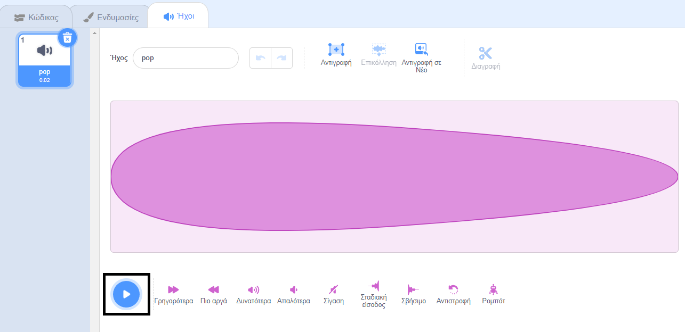
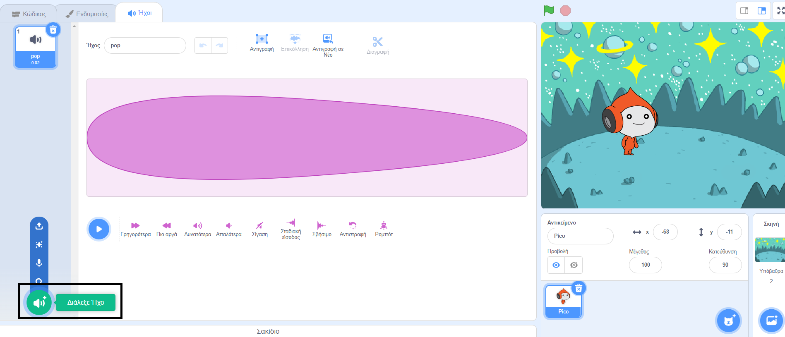
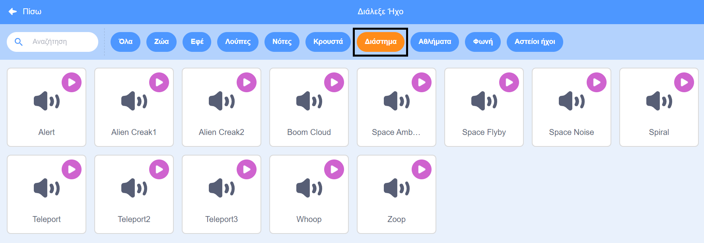
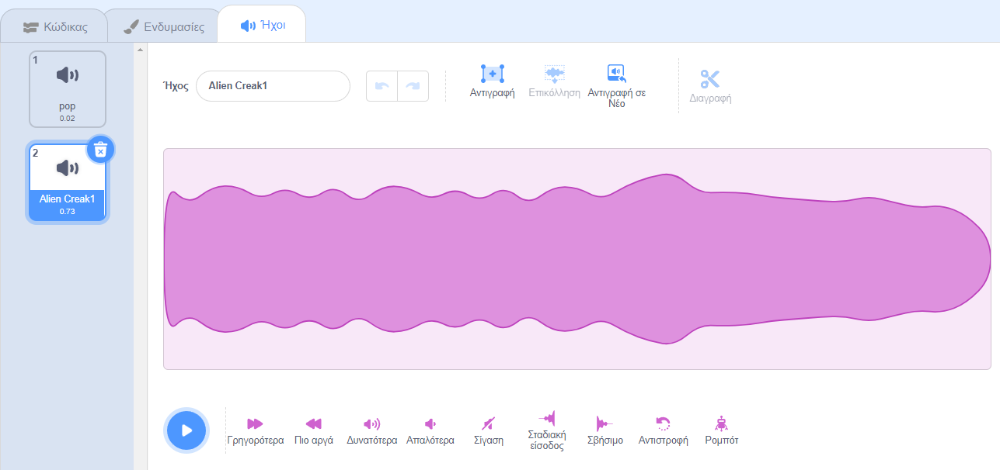
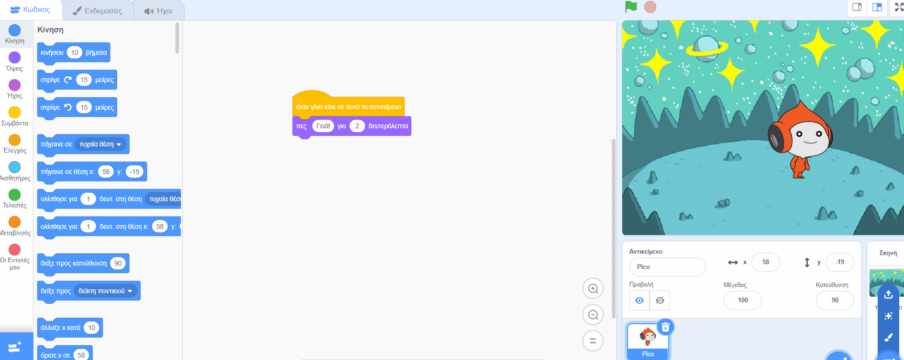
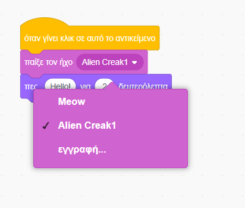

## Ο Pico παίζει έναν ήχο

<div style="display: flex; flex-wrap: wrap">
<div style="flex-basis: 200px; flex-grow: 1; margin-right: 15px;">
Ένας άλλος τρόπος επικοινωνίας είναι η χρήση ήχου.
</div>
<div>

! [Το αντικείμενο Pico λέει, «Γεια!».](images/pico-step2.png){:width="300px"}

</div>
</div>

--- task ---

Κάνε κλικ στην καρτέλα **Ήχοι** για το αντικείμενο **Pico** και θα βρεις έναν ήχο **pop**. Κάνε κλικ στο εικονίδιο **Αναπαραγωγή** για να ακούσεις τον ήχο **pop**.



--- /task ---

Υπάρχουν μερικοί φανταστικοί εξωγήινοι ήχοι στο Scratch που μπορείς να προσθέσεις στο αντικείμενό σου.

--- task ---

Για να επιλέξεις νέο ήχο, κάνε κλικ στο εικονίδιο **Διάλεξε Ήχο** και επίλεξε το **Διάστημα** ή πληκτρολόγησε `διάστημα` στο πλαίσιο αναζήτησης.






--- /task ---

--- task ---

Παίξε μερικούς διαφορετικούς ήχους χρησιμοποιώντας τα εικονίδια **Αναπαραγωγή**. Μόλις βρεις τον ήχο που θέλεις να χρησιμοποιήσεις, κάνε κλικ σε αυτόν για να τον προσθέσεις στο έργο σου.



--- /task ---

--- task ---

Κάνε κλικ στην καρτέλα **Κώδικας**. Στο μενού μπλοκ `Ήχος`{:class="block3sound"}, βρες το μπλοκ `παίξε τον ήχο`{:class="block3sound"}.

Σύρε το μπλοκ στην περιοχή Κώδικα, μεταξύ του μπλοκ `όταν γίνει κλικ σε αυτό το αντικείμενο`{:class="block3events"} και του μπλοκ `πες`{:class="block3looks"}. Θα ανοίξει ένα κενό και το μπλοκ θα κουμπώσει στη θέση του.



Ο κώδικας θα πρέπει να μοιάζει κάπως έτσι:


```blocks3
when this sprite clicked
+start sound [Alien Creak1 v] 
say [Hello!] for [2] seconds // hide speech after 2 seconds
```

--- /task ---

--- task ---

Βεβαιώσου ότι το μπλοκ `παίξε τον ήχο`{:class="block3sound"} περιέχει τον ήχο που έχεις επιλέξει. Εάν όχι, πρέπει να κάνεις κλικ στον ήχο στο μπλοκ `παίξε τον ήχο`{:class="block3sound"}, στη συνέχεια να επιλέξεις τον ήχο που έχεις επιλέξει στο αναπτυσσόμενο μενού.



--- /task ---

--- task ---

**Δοκιμή:** Κάνε κλικ στο αντικείμενο **Pico** και έλεγξε ότι εμφανίζεται το συννεφάκι ομιλίας και μπορείς να ακούσεις τον ήχο. Εάν δεν ακούς τον ήχο, βεβαιώσου ότι έχεις προσθέσει το μπλοκ `παίξε τον ήχο`{:class="block3sound"} κάτω από το μπλοκ `όταν γίνει κλικ σε αυτό το αντικείμενο`{:class="block3events"}. Επίσης, έλεγξε ότι ο ήχος λειτουργεί στον υπολογιστή ή το tablet σου.

--- /task ---

--- save ---

