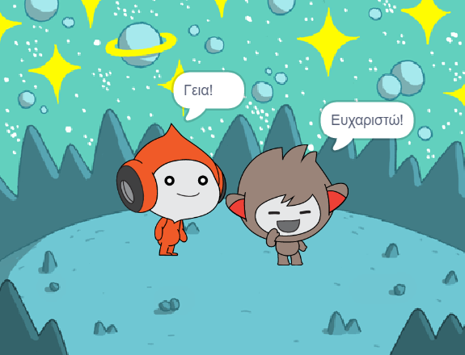
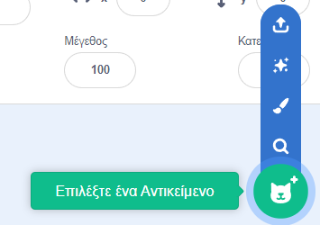
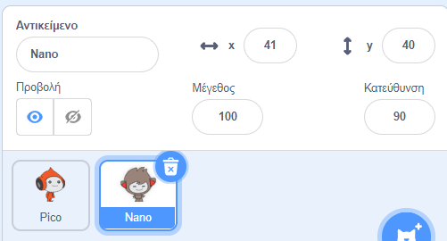
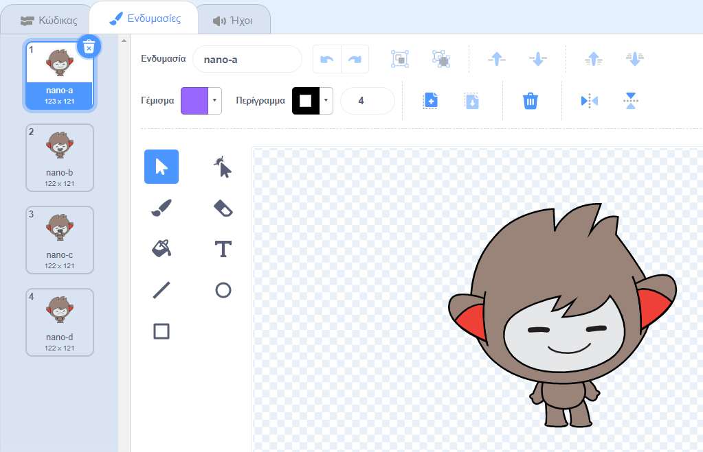
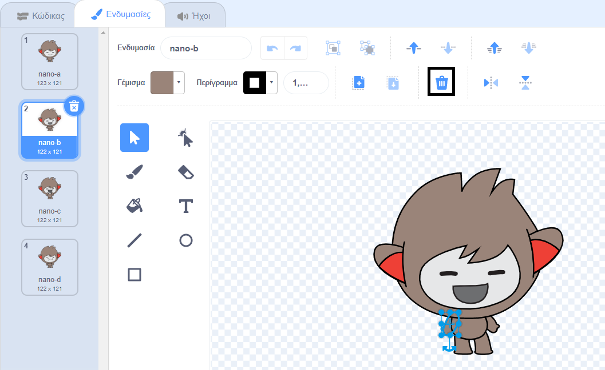
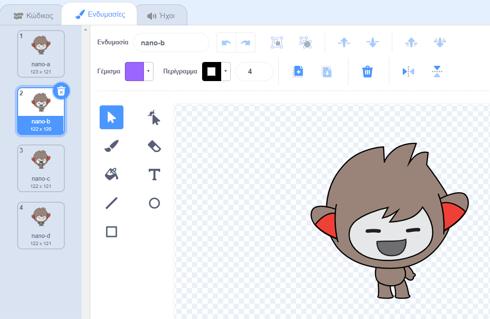
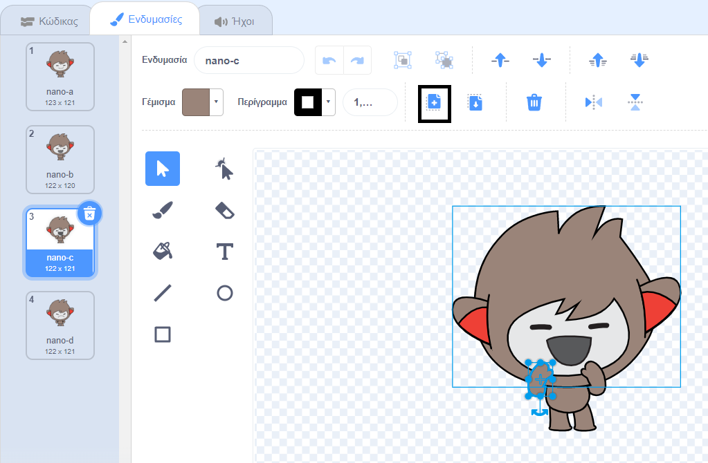
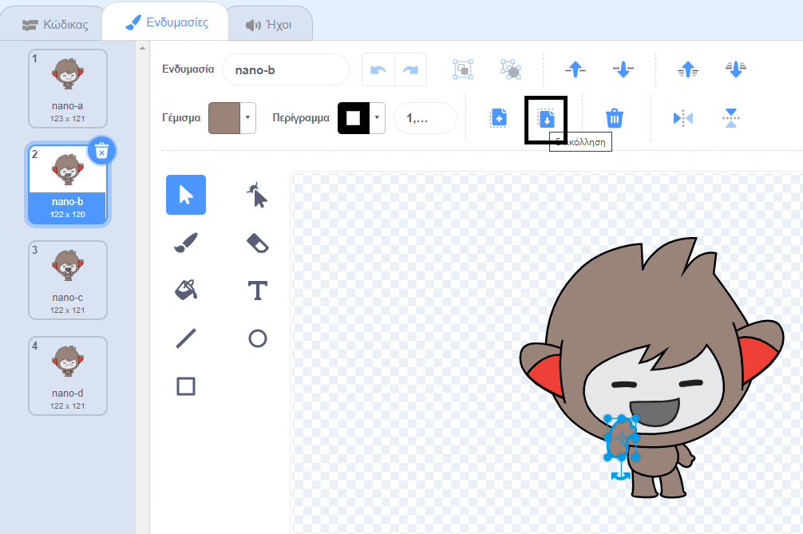

## Ο Nano αλλάζει ενδυμασίες

<div style="display: flex; flex-wrap: wrap">
<div style="flex-basis: 200px; flex-grow: 1; margin-right: 15px;">

Θα κάνεις τον Nano να εκφράσει συναισθήματα αλλάζοντας **ενδυμασίες**.

Τα αντικείμενα έχουν **ενδυμασίες** για να αλλάζουν την εμφάνισή τους. Συνήθως είναι ελαφρώς διαφορετικές εικόνες του ίδιου αντικειμένου. Για να ζωντανέψεις ένα αντικείμενο, μπορείς να αλλάξεις την ενδυμασία του.

</div>
<div>

{:width="300px"}

</div>
</div>

### Ο Nano λέει «Ευχαριστώ!»

--- task ---

Πρόσθεσε το αντικείμενο **Nano** στο έργο σου από την κατηγορία **Φαντασία**.



--- /task ---

--- task ---

Βεβαιώσου ότι το αντικείμενο **Nano** είναι επιλεγμένο στη λίστα Αντικειμένων κάτω από την Σκηνή.



Κάνε κλικ στην καρτέλα **Κώδικας** και πρόσθεσε script για να κάνεις το αντικείμενο **Nano** να `πει`{:class="block3looks"} `Ευχαριστώ!`. Χρησιμοποίησε το αναπτυσσόμενο μενού για εναλλαγή μεταξύ του `nano-b`{:class="block3looks"} και του `nano-a`{:class="block3looks"}:


```blocks3
όταν γίνει κλικ σε αυτό το αντικείμενο // όταν γίνει κλικ στον Nano
άλλαξε ενδυμασία σε [nano-b v] // ο Nano μιλάει
περίμενε (0.5) δευτερόλεπτα // δοκίμασε 0.25 αντί για 0.5
άλλαξε ενδυμασία σε [nano-a v] // ο Nano χαμογελάει
```
--- /task ---

**Συμβουλή:** Όλα τα μπλοκ είναι χρωματικά κωδικοποιημένα, επομένως θα βρεις το μπλοκ `άλλαξε ενδυμασία σε`{:class="block3looks"} στο μενού μπλοκ `Όψεις`{:class="block3looks"} και το μπλοκ `περίμενε`{:class="block3looks"} στο μενού μπλοκ `Έλεγχος`{:class="block3looks"}.

--- task ---

**Δοκιμή:** Κάνε κλικ στο αντικείμενο **Nano** στην Σκηνή και έλεγξε ότι εμφανίζεται το συννεφάκι ομιλίας και ότι αλλάζει το κοστούμι του Nano.

--- /task ---

### Ο Nano χρησιμοποιεί τη νοηματική γλώσσα

<p style="border-left: solid; border-width:10px; border-color: #0faeb0; background-color: aliceblue; padding: 10px;">Εκατομμύρια άνθρωποι χρησιμοποιούν τη νοηματική γλώσσα για να επικοινωνήσουν. Ένας συνηθισμένος τρόπος για να πεις «Ευχαριστώ» με νοήματα είναι να τοποθετήσεις τα δάχτυλά σου στο πηγούνι σου με το χέρι σου όσο πιο επίπεδο γίνεται. Στη συνέχεια μετακινείς το χέρι σου προς τα εμπρός, μακριά από το πηγούνι σου και ελαφρώς προς τα κάτω. 
</p>

<!-- Add a video of someone signing -->

Ο Nano θα χρησιμοποιήσει τη νοηματική γλώσσα αλλάζοντας ενδυμασίες.

Μπορείς να επεξεργαστείς ενδυμασίες για τα αντικείμενά σου με το πρόγραμμα επεξεργασίας Ζωγραφική. Θα επεξεργαστείς μια ενδυμασίατου Nano για να τον κάνεις να πει "ευχαριστώ".

--- task ---

Κάνε κλικ στην καρτέλα **Ενδυμασίες** για να δεις τις ενδυμασίες για το αντικείμενο **Nano**:



--- /task ---

--- task ---

Κάνε κλικ στην ενδυμασία **nano-b**. Κάνε κλικ στο χέρι στην αριστερή πλευρά και, στη συνέχεια, κάνε κλικ στο **Διαγραφή**.



Η ενδυμασία πρέπει να μοιάζει με αυτό:



--- /task ---

**Συμβουλή:** Εάν κάνεις λάθος στον επεξεργαστή Ζωγραφική, μπορείς να κάνεις κλικ στην επιλογή **Αναίρεση**.


--- task ---

Μετακινήσου στην ενδυμασία **nano-c** και κάνε κλικ στο χέρι στην αριστερή πλευρά και, στη συνέχεια, κάνε κλικ στο **Αντιγραφή**.



--- /task ---

--- task ---

Επίστρεψε στην ενδυμασία **nano-b** και κάνε κλικ στο **Επικόλληση**. Η ενδυμασία πρέπει να μοιάζει με αυτό:



--- /task ---

--- task ---

**Δοκιμή:** Κάνε κλικ στο αντικείμενο **Nano** στην Σκηνή και έλεγξε ότι εμφανίζεται το συννεφάκι ομιλίας και ότι η ενδυμασία του Nano αλλάζει με την ενδυμασία που έχεις επεξεργαστεί.

--- /task ---

<p style="border-left: solid; border-width:10px; border-color: #0faeb0; background-color: aliceblue; padding: 10px;">Έχεις μάθει πώς να λες «ευχαριστώ». Την επόμενη φορά που θα ευχαριστήσεις κάποιον, γιατί να μην χρησιμοποιήσεις τη νέα σου ικανότητα;
</p>

