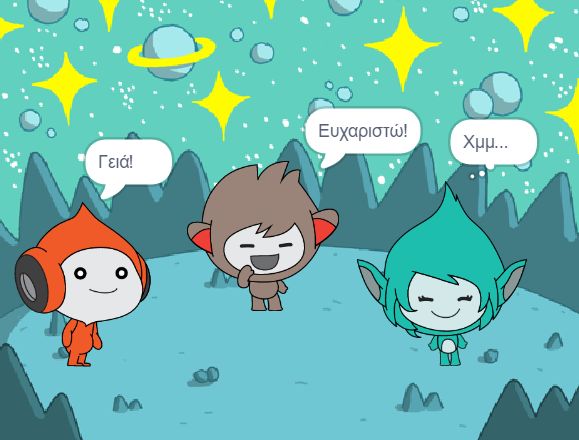
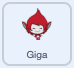

## Ο Giga αλλάζει χρώμα

<div style="display: flex; flex-wrap: wrap">
<div style="flex-basis: 200px; flex-grow: 1; margin-right: 15px;">
Τα αντικείμενα μπορούν επίσης να χρησιμοποιήσουν φυσαλίδες σκέψης και να αλλάξουν χρώματα για να δείξουν την προσωπικότητά τους. Θα βάλεις τον Giga να το κάνει αυτό.
</div>
<div>

{:width="300px"}

</div>
</div>

### Κάνε τον Giga να αλλάξει χρώμα

> [!TASK]
>
> Πρόσθεσε το αντικείμενο **Giga**.
>
> Σύρε το αντικείμενο **Giga** για να το τοποθετήσεις στην δεξιά πλευρά της Σκηνής.

> [!TASK]
>
> Βεβαιώσου ότι έχεις επιλέξει τον **Giga** στη λίστα Αντικειμένων κάτω από την Σκηνή. Πρόσθεσε αυτόν τον κώδικα για να κάνεις το αντικείμενο **Giga** να επικοινωνεί αλλάζοντας χρώμα:
>
> 
>
> ```blocks3
> when this sprite clicked
> set [color v] effect to [0] // Το 0 είναι το αρχικό χρώμα
> think [Χμ...] for [2] seconds
> clear graphic effects // επιστροφή στο αρχικό χρώμα
> ```

**Συμβουλή:** Κάνε κλικ στο αντικείμενο στη λίστα Αντικειμένων κάτω από τη Σκηνή πριν προσθέσεις ή αλλάξεις κώδικα, ενδυμασία ή ήχο. Βεβαιώσου ότι έχεις κάνει κλικ στο σωστό αντικείμενο.

> [!TASK]
>
> Δοκίμασε διαφορετικούς αριθμούς από `1` έως το `200` στο μπλοκ `όρισε εφέ χρώματος σε`{:class="block3looks"} μέχρι να βρεις ένα χρώμα που σου αρέσει.

> [!TASK]
>
> Άλλαξε τις λέξεις και τον αριθμό των δευτερολέπτων στο μπλοκ `σκέψου`{:class="block3looks"}.

> [!TASK]
>
> **Δοκιμή:** Κάνε κλικ στον **Giga** στην Σκηνή και έλεγξε ότι το αντικείμενο αλλάζει χρώμα και εμφανίζει ένα συννεφάκι σκέψης.
