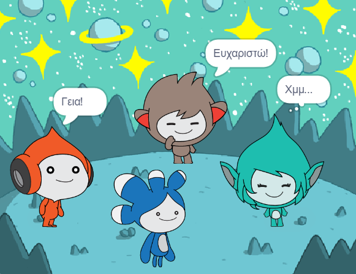

## Αναβάθμισε το έργο σου

<div style="display: flex; flex-wrap: wrap">
<div style="flex-basis: 200px; flex-grow: 1; margin-right: 15px;">
Πρόσθεσε το αντικείμενο **Tera** και χρησιμοποίησε οποιοδήποτε από τα μπλοκ που έχεις μάθει για να δημιουργήσεις μια «έκφραση» για το αντικείμενο **Tera**.
</div>
<div>

{:width="300px"}

</div>
</div>

Η προσωπικότητα του αντικειμένου **Tera** είναι δική σου επιλογή, οπότε διασκέδασε χρησιμοποιώντας τις δικές σου δημιουργικές ιδέες.

```blocks3
when this sprite clicked

say [Γεια σου!] for [2] seconds

say [Γεια σου!]

say [] // απόκρυψη του σύννεφου ομιλίας

think [Χμ...] for [2] seconds

switch costume to [tera-d v]

set [color v] effect to [0] // απόκρυψη του σύννεφου ομιλίας

clear graphic effects

play sound [pop v] until done

start sound [pop v]
```

Μπορείς επίσης να «αναμίξεις» το έργο για να κάνεις όποιες αλλαγές σου αρέσουν. Θα μπορούσες να αλλάξεις το υπόβαθρο και το πώς εκφράζονται τα αντικείμενα, ακόμη και να επιλέξεις διαφορετικά αντικείμενα και να τους δώσεις εκφράσεις.

**Συμβουλή:** Κάνε κλικ σε ένα αντικείμενο στη λίστα των Αντικειμένων κάτω από το Σκηνή για να αλλάξεις τον κώδικα, τις ενδυμασίες και τον ήχο για αυτό το αντικείμενο.

--- collapse ---
---
title: Πιστοποιητικό ομιλίας στο διάστημα
---

Πολύ καλά! Ολοκλήρωσες το έργο Ομιλία στο διάστημα. Εδώ είναι [ένα πιστοποιητικό](https://drive.google.com/file/d/18xx4uNIyRSty_2ujHkGDzGwTgfSGC1AF/view?usp=sharing){:target="_blank"} για να γιορτάσεις τις νέες σου δεξιότητες. Κατέβασε ένα αντίγραφο και άνοιξέ το για να προσθέσεις το όνομά σου.

--- /collapse ---

--- collapse ---
---
title: Ολοκληρωμένο έργο
---

Μπορείς να δεις [ολοκληρωμένο το έργο εδώ](https://scratch.mit.edu/projects/599522701/){:target="_blank"}.

--- /collapse ---

--- save ---
