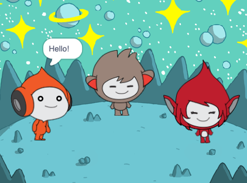

## What you will make

Create a space scene with characters 👾 that 'emote' to share their thoughts or feelings.

In Scratch, characters and objects are called **sprites**, and they appear on the **Stage**.

You will:

- Add sprites and a **backdrop** to set up your project
- Click on sprites to make them communicate using `Looks`{:class="block3looks"} and `Sound`{:class="block3sound"} code blocks
- Use the **Paint editor** to change a **costume**

> [!NOPRINT]
>
> > [!TASK]
> >
> > ### Play ▶️
> >
> > 

> > 
  
> > Click on each sprite to see what they do.
> >
> > What happens if you click on one sprite and then quickly click on another sprite?
> >
> > 

> > 

> >   <iframe allowtransparency="true" width="485" height="402" src="https://scratch.mit.edu/projects/embed/485673032/?autostart=false" frameborder="0"></iframe>
> > 

> > 

> [!PRINTONLY]
>
> 

> [!TASK]
>
> > [!HINT]
> >
> > ### Play ▶️
> >
> > 

> > 
  
> > Click on each sprite to see what they do.
> >
> > What happens if you click on one sprite and then quickly click on another sprite?
> >
> > 

> > 

> >   <iframe allowtransparency="true" width="485" height="402" src="https://scratch.mit.edu/projects/embed/485673032/?autostart=false" frameborder="0"></iframe>
> > 

> > 

