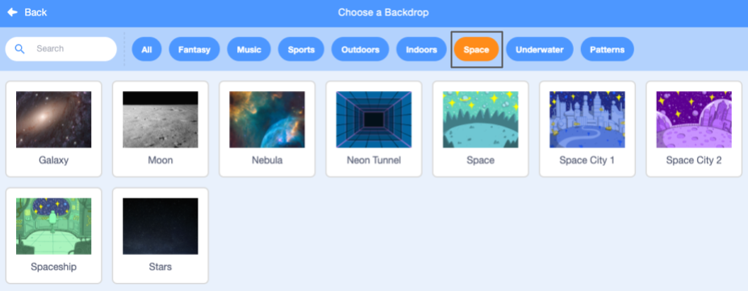

## Create your scene

You will set up your project with a space backdrop and the first sprite. 

--- task ---

Open a [new Scratch project](http://rpf.io/scratch-new){:target="_blank"}. Scratch will open in another browser tab.

--- collapse ---
---
title: Working offline
---
To set up Scratch for offline use visit [our Scratch guide](https://learning-admin.raspberrypi.org/en/projects/getting-started-scratch/1){:target="_blank"}.
--- /collapse ---
--- /task ---

The Scratch editor looks like this:

The **Stage** is where your project runs. A **backdrop** changes the way the stage looks.

--- task ---

Click (or tap, on a tablet) on **Choose a Backdrop** from the Stage pane:

--- /task ---

--- task ---

Click on the **Space** category:

--- /task ---

In our example we've chosen the **Space** backdrop but choose the one you like best.

--- task ---

Click on your chosen backdrop to add it to your project. Your Stage should show the backdrop you chose:

--- /task ---

Can you find a sprite that has already been included in your project? That's Scratch the cat.

--- task ---

Delete the cat **Sprite1** sprite by clicking the trash can in the Sprite list.

--- /task ---

--- task ---

Click on **Choose a Sprite** from the Sprite list.

--- /task ---

--- task ---

Select the **Fantasy** category. Click on the **Pico** sprite to add them to your project.

--- /task ---

--- task ---

Drag Pico to position them on the left side of the stage. Your stage should look something like this:

--- /task ---

--- task ---

Type your title into the project title box at the top of the screen.

**Tip:** Give your projects helpful names so that you can easily find them when you have lots of projects. 

Next, click on **File**, and then on **Save now** to save your project.

If you are not online or you do not have a Scratch account, you can click on **Save to your computer** to save a copy of your project.

--- /task ---

