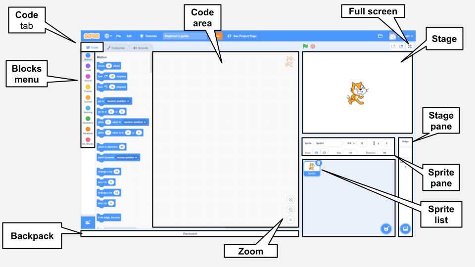

## Space scene

The Scratch editor looks like this:

--- task ---
Open a [new Scratch project](http://rpf.io/scratch-new){:target="_blank"}. Scratch will open in another browser tab. 

--- collapse ---
---
title: Working offline
---
To set up Scratch for offline use visit [our Scratch guide](https://learning-admin.raspberrypi.org/en/projects/getting-started-scratch/1){:target="_blank"}.
--- /collapse ---
--- /task ---

The **Stage** is where your project runs. A backdrop changes the way the stage looks.

--- task ---
Click (or tap) on **Choose a Backdrop** from the Stage pane:

--- /task ---

--- task ---
Click on the **Space** category:

--- /task ---

--- task ---
In our example we've chosen the **Space** backdrop but you can select the one you like best.

Click on your chosen backdrop to add it to your project. 

Your Stage should look like this:

--- /task ---

--- task ---
Can you find a sprite in your project? That's Scratch the cat. 

Delete the cat sprite by clicking the 'x' under the stage.

![Delete cat sprite][images/delete-sprite.png] 

--- /task ---

--- task ---
Select 'Choose a sprite' and pick the 'Fantasy' category. Click on the Pico sprite to add it to your project.

![Choose a sprite menu][images/choose-a-sprite.png] 

![Fantasy category with Pico][images/fantasy-pico.png] 

--- /task ---

--- task ---
Drag Pico to the left side of the stage position. Your stage should look something like this:

![Stage with chosen backdrop and Pico sprite positioned on the left][images/pico-on-stage.png] 

--- /task ---

--- task ---

Type the name of your program into the text box at the top of the screen, to give your program a name.

Next, click on File, and then on Save now to save your project.

If you are not online or you do not have a Scratch account, you can click on Save to your computer to save a copy of your project.

--- /task ---

--- save ---
