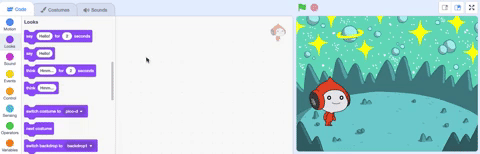
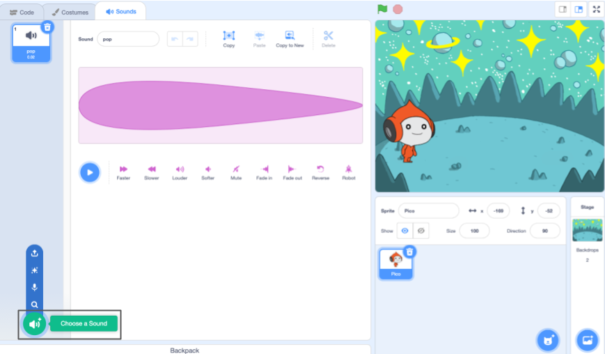
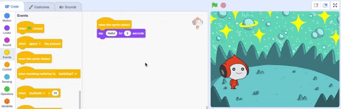

## The Pico sprite plays a sound

A sprite can have code, costumes, and sounds to change the way that it looks and what it does. You will add code blocks to make the **Pico** sprite emote with words and sound when the sprite is clicked.

<div style="display: flex; flex-wrap: wrap">
<div style="flex-basis: 200px; flex-grow: 1; margin-right: 15px;">
{:width="300px"}
</div>
</div>

To use blocks, you can click on them in the Blocks menu.

--- task ---

Open the `Looks`{:class="block3looks"} blocks menu. 

Click on a `say`{:class="block3looks"} `Hello!` `for`{:class="block3looks"} `2` `seconds`{:class="block3looks"} block.


The **Pico** sprite will show a speech bubble for two seconds.


**Tip:** Code blocks in Scratch glow with a yellow outline when they are running.

--- /task ---

You can drag blocks to the Code area, and they can be used from there.

--- task ---

Drag the `say`{:class="block3looks"} `Hello!` `for`{:class="block3looks"} `2` `seconds`{:class="block3looks"} block to the Code area. Click on it again.




--- /task ---

Blocks can be connected together in the Code area to run more than one at a time. Connected blocks will run in order from top to bottom.

--- task ---

Drag a `when this sprite clicked`{:class="block3events"} block from the `Events`{:class="block3events"} blocks menu and connect it to the top of your `say`{:class="block3looks"} block in the Code area. The blocks will snap together.


```blocks3
+when this sprite clicked
say [Hello!] for [2] secs // hide after 2 seconds
```

--- /task ---

<p style="border-left: solid; border-width:10px; border-color: #0faeb0; background-color: aliceblue; padding: 10px;">
A <span style="color: #0faeb0">**comment**</span> is an explanation of what your code does.
  
  ```blocks3
say [Hello!] for [2] secs // hide after 2 seconds
```
  
You will see comments in code examples. You don't need to add the comments when you add code to your project. (But if you have time at the end, it is a good idea to add comments to your code so that it is easier to understand later.)
</p>

--- task ---

**Test:** Click on the **Pico** sprite on the Stage to see the speech bubble show for two seconds. It is important to test your code to make sure that it does what you expect.

--- /task ---

Another way to communicate is to use sound.

--- task ---

Click on the **Sounds** tab for the **Pico** sprite and you will find a **pop** sound. Click the **Play** button to hear the **pop** sound.


--- /task ---

There are some fantastic alien sounds in Scratch that you can add to your sprite.

--- task ---

To choose a new sound, click the **Choose a Sound** button and select the **Space** category or type `space` in the search box.





--- /task ---

--- task ---

Play a few different sounds using the **Play** buttons. Once you have found the sound that you want to use, click on it to add it to your project.


--- /task ---

--- task ---

Click on the **Code** tab. In the `Sound`{:class="block3sound"} blocks menu, find the `start sound`{:class="block3sound"} block. 

Drag the block into the Code area between the `when this sprite clicked`{:class="block3events"} block and the `say`{:class="block3looks"} block. A gap will open up and the block will snap into place.



Your code should look like this:


```blocks3
when this sprite clicked
+start sound [Alien Creak1 v] 
say [Hello!] for [2] secs // hide after 2 seconds
```

--- /task ---

--- task ---

Check that your `start sound`{:class="block3sound"} block has your chosen sound in it. If it does not, you need to click on the sound in the `start sound`{:class="block3sound"} block then select your chosen sound from the drop-down menu.


--- /task ---

--- task ---

**Test:** Click on the **Pico** sprite to see the speech bubble and hear the sound. If you do not hear the sound, make sure that you have added the `start sound [Alien Creak1]`{:class="block3sound"} block under the `when this sprite clicked`{:class="block3events"} block. Also, check that the sound is working on your computer or tablet.

--- /task ---

--- save ---
